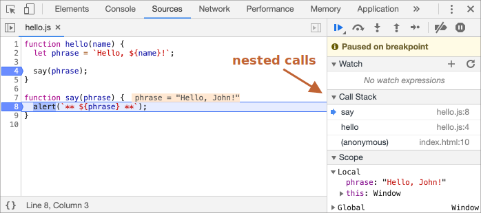

# Debugging in Chrome

Prima di scrivere codice più complesso, dovremmo parlare di debugging.

<<<<<<< HEAD
[Debugging](https://en.wikipedia.org/wiki/Debugging) è il processo che prevede di trovare e sistemare gli errori all'interno di uno script. Tutti i browser moderni e molti altri ambienti forniscono strumenti per il debugging -- degli speciali strumenti che rendono il debugging un operazione più semplice. Consentono anche di seguire l'esecuzione del codice passo per passo, per capire esattamente cosa sta accadendo..

Noi useremo Chrome, poiché è probabilmente il più ricco di caratteristiche sotto questo aspetto.
=======
[Debugging](https://en.wikipedia.org/wiki/Debugging) is the process of finding and fixing errors within a script. All modern browsers and most other environments support debugging tools -- a special UI in developer tools that makes debugging much easier. It also allows to trace the code step by step to see what exactly is going on.

We'll be using Chrome here, because it has enough features, most other browsers have a similar process.
>>>>>>> e4e6a50b5762dd5dc4c0f0c58f870c64be39dcfa

## Il pannello "sources" 

La tua versione di Chrome potrebbe essere differente, ma le funzioni principali dovrebbe essere molto simili.

- Apri la [pagina di esempio](debugging/index.html) in Chrome.
- Attiva gli strumenti da sviluppatore con `key:F12` (Mac: `key:Cmd+Opt+I`).
- Seleziona il pannello `sources`.

Questo è quello che dovreste vedere se è la prima volta che lo aprite:


<<<<<<< HEAD
Il bottone <span class="devtools" style="background-position:-168px -76px"></span> apre la barra laterale con i file.
=======
The toggler button <span class="devtools" style="background-position:-172px -98px"></span> opens the tab with files.
>>>>>>> e4e6a50b5762dd5dc4c0f0c58f870c64be39dcfa

Clicchiamoci sopra e selezioniamo `hello.js` dalla vista ad albero. Questo è quello che dovrebbe apparire:


<<<<<<< HEAD
Possiamo vedere tre zone:

1. La **zona Risorse** con la lista degli HTML, JavaScript, CSS e altri file, incluse le immagini che sono collegate alla pagina. Potrebbero apparire anche le estensioni di Chrome.
2. La **zona Sorgente** mostra il codice.
3. La **zona Informazione e controllo** utile per il debugging, la esplerermo meglio.

Ora puoi cliccare nuovamente lo stesso bottone <span class="devtools" style="background-position:-200px -76px"></span> per nascondere la lista risorse e dare più spazio al codice.
=======
The Sources panel has 3 parts:

1. The **File Navigator** pane lists HTML, JavaScript, CSS and other files, including images that are attached to the page. Chrome extensions may appear here too.
2. The **Code Editor** pane shows the source code.
3. The **JavaScript Debugging** pane is for debugging, we'll explore it soon.

Now you could click the same toggler <span class="devtools" style="background-position:-172px -122px"></span> again to hide the resources list and give the code some space.
>>>>>>> e4e6a50b5762dd5dc4c0f0c58f870c64be39dcfa

## Console

Se premiamo `key:Esc`, si apre una console in basso. Possiamo digitare comandi e premere `key:Enter` per eseguirli.

Dopo l'esecuzione dell'istruzione, il risultato viene mostrato sotto.

Ad esempio, `1+2` con risultato `3`, ed `hello("debugger")` non ritorna nulla, quindi il risultato è `undefined`:


## Breakpoint

Esaminiamo cosa sta succedendo nel codice della [pagina di esempio](debugging/index.html). In `hello.js`, cliccate nel numero della riga `4`. Si, cliccate proprio sopra il numero `4`, non dentro il codice.

Congratulazioni! Avete settato un breakpoint. Ora premete anche nella riga numero `8`.

Dovrebbe apparire qualcosa di simile (in blu dove avreste dovuto cliccare):


Un *breakpoint* è un punto del codice in cui il debugger si metterà in pausa automaticamente durante l'esecuzione del codice  JavaScript.

Mentre il codice è in pause, è possibile esaminare le variabili, eseguire comandi tramite la console etc. In altre parole, possiamo eseguire il debug.

Possiamo anche visualizzare la lista dei breakpoint nel pannello di destra. Questo pannello può risultare utile quando abbiamo più breakpoint in file diversi. Infatti ci consente di:
- Salatare rapidamente ad un breakpoint (cliccando sopra al nome del breakpoint che ci interessa).
- Disabilitare temporaneamente un breakpoint semplicemente togliendo la spunta.
- Rimuovere breakpoint cliccando con il tasto destro e selezionando Rimuovi.
- ...E molto altro.

```smart header="Breakpoint condizionali"
*Tasto destro* sul numero della riga ci consente di creare un breakpoint *condizionale*. Che viene attivato solo quando l'espressione fornita risulta vera.

Questa caratteristica risulta molto utile quando abbiamo bisogno di fermare il flusso di esecuzione per determinati valori di una variabile.
```

## Comando debugger

Possiamo mettere in pausa il codice anche utilizzando il comando `debugger`, come nell'esempio:

```js
function hello(name) {
  let phrase = `Hello, ${name}!`;

*!*
  debugger;  // <-- il debugger si ferma qui
*/!*

  say(phrase);
}
```

Questo risulta molto utile quando stiamo lavorando in un editor e non vogliamo passare alla finestra del browser, cercare il punto corretto nello script interessato e settare il breakpoint.


## Pausa per guardarsi attorno

Nel nostro esempio, `hello()` viene richiamato durante il caricamento della pagina, quindi il metodo più facile per attivare il debugger è ricaricare la pagina. Quindi premete `key:F5` (Windows, Linux) o `key:Cmd+R` (Mac).

Con il breakpoint impostato, l'esecuzione si fermerà alla quarta linea:


Ora aprite i menu a cascata (quelli con la freccetta accanto al nome). Vi consentiranno di esaminare lo stato corrente del codice:

1. **`Watch` -- mostra il valore corrente per ogni espressione.**

    Puoi cliccare su `+` e inserire un espressione. Il debugger ti mostrerà il suo valore ad ogni istante, che verrà automaticamente ricalcolato durante l'esecuzione.

2. **`Call Stack` -- mostra la catena delle chiamate annidate.**

    Attualmente il debugger si trova all'interno della chiamata `hello()`, chiamata da uno script interno a `index.html` (non ci sono funzioni qui, quindi viene definito "anonimo").

    Se premi su un elemento della pila, il debugger salterà al codice corrispondente, e potranno essere esaminate tutte le variabili.
3. **`Scope` -- variabili correnti.**

    `Local` mostra le variabili locali alla funzione. Potente anche vedere i valori evidenziati nel codice.

    `Global` mostra le variabili globali (fuori da tutte le funzioni).

    C'è anche la keyword `this`, che studieremo più avanti.

## Tracciamento dell'esecuzione

Ora è il momento di *tracciare* lo script.

<<<<<<< HEAD
Ci sono dei bottoni appositi nella parte superiore del pannello di destra. Proviamo ad attivarli.

<span class="devtools" style="background-position:-7px -76px"></span> -- continua l'esecuzione, tasto `key:F8`.
: Riprende l'esecuzione. Se non ci sono ulteriori breakpoint l'esecuzione continua e il debugger non avrà più il controllo.
=======
There are buttons for it at the top of the right panel. Let's engage them.
<!-- https://github.com/ChromeDevTools/devtools-frontend/blob/master/front_end/Images/src/largeIcons.svg -->
<span class="devtools" style="background-position:-146px -168px"></span> -- "Resume": continue the execution, hotkey `key:F8`.
: Resumes the execution. If there are no additional breakpoints, then the execution just continues and the debugger loses control.
>>>>>>> e4e6a50b5762dd5dc4c0f0c58f870c64be39dcfa

    Questo e quello che vedremo dopo aver cliccato:

    

    L'esecuzione è ripartita, ha incontrato un altro breakpoint dentro `say()` e si è fermato nuovamente. Diamo un'occhiata al "Call stack" sulla destra. E' stato incrementato con un ulteriore chiamata. Ora siamo all'interno di `say()`.

<<<<<<< HEAD
<span class="devtools" style="background-position:-137px -76px"></span> -- fa un singolo step (esegue il comando successivo), ma non *entra nella funzione*, tasto `key:F10`.
: Se lo clicchiamo ora, verrà mostrato `alert`. La cosa importante è che `alert` potrebbe essere una funzione qualsiasi, l'esecuzione farebbe "uno step oltre" comunque, saltando l'interno della funzione.

<span class="devtools" style="background-position:-72px -76px"></span> -- fai uno step, tasto `key:F11`.
: Lo stesso di quello precedente, ma fa "un passo all'interno" della funzione. Cliccando qui è possibile avanzare uno step alla volta tutte le azioni dello script.

<span class="devtools" style="background-position:-104px -76px"></span> -- continua l'esecuzione fino alla fine della funzione corrente, tasto `key:Shift+F11`.
: L'esecuzione si fermerà all'ultima linea della funzione corrente. Questa funzione è comoda quando entriamo per sbaglio in una funzione annidata usando <span class="devtools" style="background-position:-72px -76px"></span>, ma non siamo interessati, e vogliamo arrivare alla fine di questa il più velocemente possibile.

<span class="devtools" style="background-position:-7px -28px"></span> -- attiva/disattiva tutti i breakpoint.
: Questo bottone non influenza l'esecuzione. E' semplicemente un on/off per i breakpoint.

<span class="devtools" style="background-position:-264px -4px"></span> -- attiva/disattiva la pausa automatica in caso di errori.
: Quando attiva, e il pannello degli strumenti svilupattore è aperto, un errore nello script metterà automaticamente in pausa l'esecuzione. Cosi potremmo analizzare le variabili per capire cosa è andato storto. Quindi se il nostro script si blocca con un errore, possiamo aprire il debugger, attivare questa opzione e ricaricare la pagina per veder dove si blocca lo script e capirne il motivo.
=======
<span class="devtools" style="background-position:-200px -190px"></span> -- "Step": run the next command, hotkey `key:F9`.
: Run the next statement. If we click it now, `alert` will be shown.

    Clicking this again and again will step through all script statements one by one.

<span class="devtools" style="background-position:-62px -192px"></span> -- "Step over": run the next command, but *don't go into a function*, hotkey `key:F10`.
: Similar to the previous the "Step" command, but behaves differently if the next statement is a function call. That is: not a built-in, like `alert`, but a function of our own.

    The "Step" command goes into it and pauses the execution at its first line, while "Step over" executes the nested function call invisibly, skipping the function internals.

    The execution is then paused immediately after that function.

    That's good if we're not interested to see what happens inside the function call.

<span class="devtools" style="background-position:-4px -194px"></span> -- "Step into", hotkey `key:F11`.
: That's similar to "Step", but behaves differently in case of asynchronous function calls. If you're only starting to learn JavaScript, then you can ignore the difference, as we don't have asynchronous calls yet.

    For the future, just note that "Step" command ignores async actions, such as `setTimeout` (scheduled function call), that execute later. The "Step into" goes into their code, waiting for them if necessary. See [DevTools manual](https://developers.google.com/web/updates/2018/01/devtools#async) for more details.

<span class="devtools" style="background-position:-32px -194px"></span> -- "Step out": continue the execution till the end of the current function, hotkey `key:Shift+F11`.
: Continue the execution and stop it at the very last line of the current function. That's handy when we accidentally entered a nested call using <span class="devtools" style="background-position:-200px -190px"></span>, but it does not interest us, and we want to continue to its end as soon as possible.

<span class="devtools" style="background-position:-61px -74px"></span> -- enable/disable all breakpoints.
: That button does not move the execution. Just a mass on/off for breakpoints.

<span class="devtools" style="background-position:-90px -146px"></span> -- enable/disable automatic pause in case of an error.
: When enabled, and the developer tools is open, a script error automatically pauses the execution. Then we can analyze variables to see what went wrong. So if our script dies with an error, we can open debugger, enable this option and reload the page to see where it dies and what's the context at that moment.
>>>>>>> e4e6a50b5762dd5dc4c0f0c58f870c64be39dcfa

```smart header="Continua fino a qui"
Premendo tasto destro su una riga di codice si aprirà un menu con una bellissima opzione denominata  "Continua fino a qui".

Questa è molto utile quando vogliamo muoverci di più passi, ma siamo troppo pigri per impostare un breakpoint.
```

## Logging

Per stampare qualcosa sulla console, c'è una funzione `console.log`.

Ad  esempio, questo stamperà i valori da `0` a `4` sulla console:

```js run
// apri la console per vedere il messaggio
for (let i = 0; i < 5; i++) {
  console.log("value,", i);
}
```

Gli utenti normali non vedranno questo output poiché viene mostrato in console. Per vederlo dovrebbe aprire il menu Console degli strumenti sviluppatore, oppure premere  `key:Esc` mentre si trova in un altro tab: questo tasto aprirà la console nella parte inferiore della schermata.

Se abbiamo abbastanza log nel nostro codice, possiamo vedere cosa sta accadendo anche senza utilizzare il debugger.

## Riepilogo

<<<<<<< HEAD
Come abbiamo visto, ci sono tre diversi modi di metter in pausa uno script:
1. Un breakpoint.
2. L'istruzione `debugger`.
3. Un errore (solo se gli strumenti sviluppatore sono aperti ed è attivo il bottone <span class="devtools" style="background-position:-264px -4px"></span>)
=======
As we can see, there are three main ways to pause a script:
1. A breakpoint.
2. The `debugger` statements.
3. An error (if dev tools are open and the button <span class="devtools" style="background-position:-90px -146px"></span> is "on").
>>>>>>> e4e6a50b5762dd5dc4c0f0c58f870c64be39dcfa

Cosi possiamo esaminare le variabili e capire cosa è andato male durante l'esecuzione.

Ci sono veramente troppe opzioni negli strumenti da sviluppatore per coprirle qui. Il manuale completo è disponibile all'indirizzo <https://developers.google.com/web/tools/chrome-devtools>.

Le informazioni fornite da questo capitolo sono sufficienti per iniziare a fare un pò di debug, anche se più avanti, specialmente quando farete cose più avanzate, seguite il link sopra e consultate il manuale per ulteriori informazioni.

Ah, inoltre potete anche cliccare i vari bottoni negli strumenti da sviluppatore e vedere cosa succede. E' probabilmente il metodo più rapido per imparare tutto. Non dimenticate che molte opzini sono disponibili anche con il click del tasto destro!
