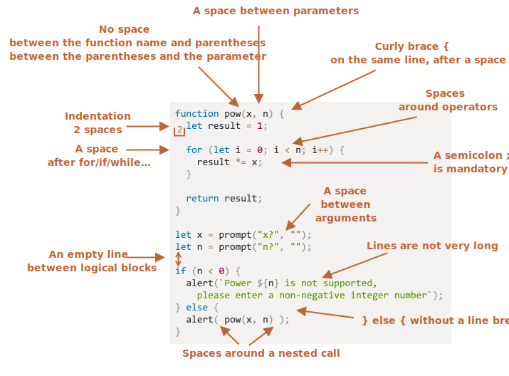

# Stile di programmazione

Il codice dovrebbe essere il più pulito e leggibile possibile.

La programmazione è come un arte -- dobbiamo essere in grado di programmare funzionalità complesse che siano allo stesso tempo correte e leggibili. Un corretto stile di programmazione aiuta molto in questo senso.

## Sintassi

Qui una lista di alcune regole da seguire (guardare sotto per maggiori dettagli):


<!--
```js
function pow(x, n) {
  let result = 1;

  for (let i = 0; i < n; i++) {
    result *= x;
  }

  return result;
}

let x = prompt("x?", "");
let n = prompt("n?", "");

if (n < 0) {
  alert(`Power ${n} is not supported,
    please enter a non-negative integer number`);
} else {
  alert( pow(x, n) );
}
```

-->

Adesso discutiamo le regole e le rispettive motivazioni nel dettaglio.

```warn header="Non ci sono delle regole obbligatorie"
Niente di quello che stiamo dicendo è scolpito sulla pietra. Sono solo delle preferenze, non dei dogmi religiosi.
```

### Parentesi graffe

In molti progetti JavaScript le parentesi graffe sono scritte seguendo lo stile "Egiziano" con la parentesi aperta nella stessa linea della keyword -- non in una nuova linea. Dovrebbe comunque esserci spazio prima della parentesi aperta, come in questo esempio:

```js
if (condition) {
  // fai questo
  // ...e questo
  // ...e questo
}
```

Un caso limite è un costrutto con una singola linea. Dovremmo comunque usare le parentesi? Se si come?

Qui ci sono un paio di varianti, cosi potete giudicare voi stessi:

1. 😠 I principianti spesso fanno questo. Sbagliato! Le parentesi graffe nono sono richieste:
    ```js
    if (n < 0) *!*{*/!*alert(`Power ${n} is not supported`);*!*}*/!*
    ```
2. 😠 Inserire l'istruzione su nuova riga senza parentesi. Non dovreste mai farlo, poiché rende molto semplice commettere errori nel caso si volesse aggiungere un'altra istruzione:
    ```js
    if (n < 0)
      alert(`Power ${n} is not supported`);
    ```
3. 😏 In una singola riga senza parantesi -- accettabile, se l'istruzione è semplice:
    ```js
    if (n < 0) alert(`Power ${n} is not supported`);
    ```
4. 😃 La variante migliore:
    ```js
    if (n < 0) {
      alert(`Power ${n} is not supported`);
    }
    ```

Per istruzioni molto brevi, è consentito scrivere su una sola riga, ad esempio `if (cond) return null`. Ma un blocco di codice risulta essere molto più leggibile.

### Lunghezza della riga

Nessuno ama leggere lunghe righe orizzontali di codice. Una buona norma è quella di dividere le righe più lunghe in righe più brevi.

Ad esempio:
```js
// i backtick consentono di dividere la stinga in più righe
let str = `
  ECMA International's TC39 is a group of JavaScript developers,
  implementers, academics, and more, collaborating with the community
  to maintain and evolve the definition of JavaScript.
`;
```

Invece, per le istruzioni `if`:

```js
if (
  id === 123 &&
  moonPhase === 'Waning Gibbous' &&
  zodiacSign === 'Libra'
) {
  letTheSorceryBegin();
}
```

La lunghezza massima dovrebbe essere accordata a livello di team. Solitamente tra gli 80-120 caratteri.

### Indentazione

Ci sono due tipi di indentazione:

- **Indentazione orizzontale: 2 o 4 spazi.**

    Un indentazione orizzontale è realizzata usando 2 o 4 spazi oppure il tasto "Tab". Quale scegliere è una guerra che dura da anni. Ad oggi gli spazi sono i più comuni.

    Un vantaggio degli spazi contro i tabs è che gli spazi permettono configurazioni più flessibili.

    Ad esempio, possiamo allineare gli argomenti con l'apertura della parentesi, come nell'esempio:

    ```js no-beautify
    show(parameters,
         aligned, // padding di 5 spazi a sinistra
         one,
         after,
         another
      ) {
      // ...
    }
    ```

- **Indentazione verticale: righe vuote per dividere il codice in blocchi logici.**

    Anche una singola funzione può essere divisa in più blocchi logici. Nell'esempio sotto, l'inizializzazione delle variabili, il corpo del ciclo e il ritorno del risultato sono divisi verticalmente:

    ```js
    function pow(x, n) {
      let result = 1;
      //              <--
      for (let i = 0; i < n; i++) {
        result *= x;
      }
      //              <--
      return result;
    }
    ```

    Inserire una nuova riga vuota aiuta a rendere il codice più leggibile. Non dovrebbero esserci più di nove righe di codice senza un indentazione verticale.

### Punto e virgola

Il punto e virgola dovrebbe essere presente alla fine di ogni istruzione, anche se non è obbligatorio.

Esistono linguaggi in cui il punto e virgola è realmente opzionale e può essere omesso. In JavaScript, esistono casi in cui un "a capo" non viene interpretato come un punto e virgola, lasciando quindi il codice vulnerabile agli errori.

Quando diventerete più maturi come programmatori, potreste scegliere lo stile senza punto e virgola [StandardJS](https://standardjs.com/). Fino a quel momento la scelta migliore è quella di inserirlo alla fine di ogni istruzione per evitare errori.

### Livelli di annidamento

Nel codice vanno evitati elevati livelli di annidamento.

Qualche volta torna utile la direttiva ["continue"](info:while-for#continue) per evitare annidamenti extra.

Ad esempio, invece che aggiungere un `if`:

```js
for (let i = 0; i < 10; i++) {
  if (cond) {
    ... // <- un ulteriore livello di annidamento
  }
}
```

Possiamo scriverlo come:

```js
for (let i = 0; i < 10; i++) {
  if (!cond) *!*continue*/!*;
  ...  // <- nessun ulteriore livello di annidamento
}
```

Una cosa simile può essere risolta con `if/else` e `return`.

Ad esempio, i due costrutti sotto sono identici.

Opzione 1:

```js
function pow(x, n) {
  if (n < 0) {
    alert("Negative 'n' not supported");
  } else {
    let result = 1;

    for (let i = 0; i < n; i++) {
      result *= x;
    }

    return result;
  }  
}
```

Opzione 2:

```js
function pow(x, n) {
  if (n < 0) {
    alert("Negative 'n' not supported");
    return;
  }

  let result = 1;

  for (let i = 0; i < n; i++) {
    result *= x;
  }

  return result;
}
```

La seconda opzione è molto più leggibile perché il "caso limite" `n < 0` viene gestito in anticipo. Dopo aver eseguito il controllo possiamo proseguire con il flusso principale senza doverci preoccupare di ulteriori casi di annidamento.

## Posizionamento delle funzioni

Se state scrivendo molte funzioni "ausiliarie", ci sono tre modi per organizzarle nel codice.

1. Dichiarare le funzioni sopra il codice che le utilizza:

    ```js
    // *!*dichiarazione di funzioni*/!*
    function createElement() {
      ...
    }

    function setHandler(elem) {
      ...
    }

    function walkAround() {
      ...
    }

    // *!*codice che le utilizza*/!*
    let elem = createElement();
    setHandler(elem);
    walkAround();
    ```
2. Prima il codice, poi le funzioni:

    ```js
    // *!*il codice che utilizza le funzioni*/!*
    let elem = createElement();
    setHandler(elem);
    walkAround();

    // --- *!*funzioni di supporto*/!* ---
    function createElement() {
      ...
    }

    function setHandler(elem) {
      ...
    }

    function walkAround() {
      ...
    }
    ```
3. Mix: una funzione viene dichiarata nel punto in cui viene utilizzata la prima volta.

Nella maggior parte dei casi si preferisce la seconda opzione.

Questo perché quando leggiamo il codice vogliamo prima di tutto sapere *cosa fa*. Mettendo prima il codice possiamo fornire queste informazioni. Successivamente, potrebbe non essere necessario leggere le funzioni, soprattutto se i loro nomi sono autodescrittivi.

## Style guide

Una style guide contiene regole generali riguardo a "come scrivere" il codice, ad esempio quali apici utilizzare, di quanti spazi indentare, quando andare a capo, e molti altri dettagli.

Quando tutti i membri del team utilizzano la stessa guida, il codice tende ad essere più uniforme.

Certamente un team può utilizzare la propria style guide, ma spesso non è necessario definirne una propria. Ce ne sono molte già pronte, scegliere una tra queste è generalmente la scelta migliore.

Alcune delle scelte più popolari:

- [Google JavaScript Style Guide](https://google.github.io/styleguide/jsguide.html)
- [Airbnb JavaScript Style Guide](https://github.com/airbnb/javascript)
- [Idiomatic.JS](https://github.com/rwaldron/idiomatic.js)
- [StandardJS](https://standardjs.com/)
- (e molte altre)

Se sei un nuovo sviluppatore, inizia con i consigli di questo capitolo. Quando avrai appreso bene lo stile potrai cercare quello che più ti appartiene.

## Linter

I linters sono strumenti che controllano automaticamente lo stile del codice e vi danno consigli su come sistemarlo.

La miglior cosa di questi strumenti è che il controllo dello stile in qualche occasione può rilevare dei bug, ad esempio degli errori di battitura nei nomi delle funzioni. Proprio per queste sue caratteristiche, installare un linter è fortemente consigliato anche se non avete intenzioni di rimanere fedeli ad uno particolare "stile di programmazione".

Alcuni fra i linter più conosciuti:

<<<<<<< HEAD
- [JSLint](http://www.jslint.com/) -- uno dei primi linter.
- [JSHint](http://www.jshint.com/) -- molte più opzioni di JSLint.
- [ESLint](http://eslint.org/) -- il più recente.

Tutti quelli elencati svolgono molto bene il lavoro. L'autore della guida utilizza [ESLint](http://eslint.org/).
=======
- [JSLint](https://www.jslint.com/) -- one of the first linters.
- [JSHint](https://jshint.com/) -- more settings than JSLint.
- [ESLint](https://eslint.org/) -- probably the newest one.

All of them can do the job. The author uses [ESLint](https://eslint.org/).
>>>>>>> a82915575863d33db6b892087975f84dea6cb425

Molti linter sono integrati negli editor più popolari: è sufficiente attivare il plugin e configurare lo stile desiderato.

Ad esempio, per poter utilizzare ESLint è sufficiente:

1. Installa [Node.js](https://nodejs.org/).
2. Installa ESLint con il comando `npm install -g eslint` (npm è un package manager di JavaScript).
3. Crea un file di configurazione e chiamalo `.eslintrc` nella root del tuo progetto JavaScript (la cartella che contiene tutti i file).
4. Installa/abilita il plugin per il tuo editor per integrare ESLint. La maggior parte degli editor ne possiede uno.

Qui un esempio di di un file `.eslintrc`:

```js
{
  "extends": "eslint:recommended",
  "env": {
    "browser": true,
    "node": true,
    "es6": true
  },
  "rules": {
    "no-console": 0,
    "indent": 2
  }
}
```

La direttiva `"extends"` indica che la configurazione è basata sulla lista dei setting "eslint:recommended". Dopodiché potremo specificare il nostro stile personale.

<<<<<<< HEAD
E' anche possibile scaricare un set di regole dal web ed estenderle a nostro piacimento. Vedi <http://eslint.org/docs/user-guide/getting-started> per maggiori dettagli riguardo l'installazione.
=======
It is also possible to download style rule sets from the web and extend them instead. See <https://eslint.org/docs/user-guide/getting-started> for more details about installation.
>>>>>>> a82915575863d33db6b892087975f84dea6cb425

Molti IDE hanno dei linter integrati, che sono comodi ma non sono editabili come ESLint.

## Riepilogo

Tutte le regole sintattiche descritte in questo capitolo (e nei riferimenti delle style guides) aiutano ad incrementare la leggibilità del codice, ma sono tutte contestabili.

Quando stiamo pensando a come scrivere codice "migliore", la domanda dovrebbe essere "Cosa rende il codice più leggibile e facile da capire?" e "Cosa può aiutarmi ad evitare gli errori?". Queste sono le principali cose da tenere a mente quando stiamo cercando di scegliere una style guide.

Conoscere gli stili più popolari vi consentirà di tenervi aggiornati con le ultime idee riguardo gli stili di programmazione e le best practices.
