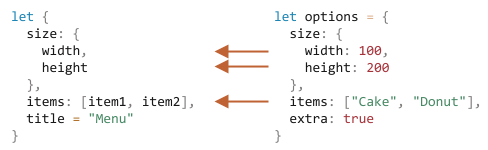

# Assegnamento di destrutturazione

Le due strutture dati più utilizzate in JavaScript sono `Object` e `Array`.

- Gli oggetti ci consentono di creare un'unica entità che memorizza elementi nel formato chiave-valore
- Gli array ci consentono di raccogliere elementi in elenchi ordinati.

<<<<<<< HEAD
A volte, quando li passiamo ad una funzione, potrebbe non essere necessario tutto l'oggetto/array, ma solo una parte di esso.
=======
Although, when we pass those to a function, it may need not be an object/array as a whole. It may need individual pieces.
>>>>>>> 0f748275e20a81700c8514f22a7cc80c4422d09c

*L'assegnamento di destrutturazione (Destructuring assignment)* è una speciale sintassi che ci consente di "spacchettare" oggetti o array in gruppi di variabili; questo a volte risulta molto conveniente.

La destrutturazione funziona alla grande anche con funzioni complesse che hanno molti parametri, valori predefiniti e così via. Presto lo vedremo.

## Destrutturazione di un array

Ecco un esempio di come un array viene destrutturato in variabili:

```js
// abbiamo un array con nome e cognome
let arr = ["John", "Smith"]

*!*
// assegnamento di destrutturazione
// imposta firstName = arr[0]
// e surname = arr[1]
let [firstName, surname] = arr;
*/!*

alert(firstName); // John
alert(surname);  // Smith
```

Ora possiamo lavorare con le variabili invece che con gli elementi dell'array.

Risulta utilissima se combinata con `split` o altri metodi che ritornano un array:

```js run
let [firstName, surname] = "John Smith".split(' ');
alert(firstName); // John
alert(surname);  // Smith
```

Come puoi vedere, la sintassi è semplice. Ci sono però molti dettagli peculiari. Vediamo altri esempi, per capirlo meglio.


````smart header="\"Destrutturazione\" non significa \"distruzione\"."
Viene chiamato "assegnamento di destrutturazione" perché "destruttura" copiando gli elementi all'interno di variabili. Ma l'array in sé non viene modificato.

E' solo un modo breve per scrivere:
```js
// let [firstName, surname] = arr;
let firstName = arr[0];
let surname = arr[1];
```
````

````smart header="Ignora gli elementi usando la virgola"

Gli elementi indesiderati dell'array possono essere ignorati tramite una virgola aggiuntiva:

```js run
*!*
// il secondo elemento non è necessario
let [firstName, , title] = ["Julius", "Caesar", "Consul", "of the Roman Republic"];
*/!*

alert( title ); // Consul
```

Nel codice sopra, il secondo elemento viene saltato, il terzo viene assegnato a `title`, il resto degli elementi vengono ignorati (visto che per loro non ci sono variabili).
````

````smart header="Funziona con qualsiasi iterabile alla destra"

... In realtà, possiamo utilizzarlo con qualsiasi iterabile, non solamente con un array:

```js
let [a, b, c] = "abc"; // ["a", "b", "c"]
let [one, two, three] = new Set([1, 2, 3]);
```

Funziona, perché internamente un'assegnazione di destrutturazione lavora iterando sul valore a destra. E' una specie di "zucchero sintattico" per chiamare `for..of` sul valore a destra di `=`, assegnandone i valori.
````

````smart header="Assegna a qualsiasi cosa ci sia dalla parte sinistra"

Possiamo inserire qualsiasi cosa "assegnabile" a sinistra.

Ad esempio, la proprietà di un oggetto:
```js run
let user = {};
[user.name, user.surname] = "John Smith".split(' ');

alert(user.name); // John
alert(user.surname); // Smith
```

````

````smart header="Eseguire cicli con .entries()"

Nel capitolo precedente abbiamo visto il metodo [Object.entries(obj)](mdn:js/Object/entries).

Possiamo utilizzarlo con la destrutturazione per eseguire cicli sulle coppie chiave/valore di un oggetto:

```js run
let user = {
  name: "John",
  age: 30
};

// ciclo su chiavi/valori
*!*
for (let [key, value] of Object.entries(user)) {
*/!*
  alert(`${key}:${value}`); // name:John, poi age:30
}
```

Un codice simile usando `Map` è più semplice, visto che è iterabile:


```js run
let user = new Map();
user.set("name", "John");
user.set("age", "30");

*!*
// Map itera le coppie [key, value], molto comodo per la destrutturazione
for (let [key, value] of user) {
*/!*
  alert(`${key}:${value}`); // name:John, then age:30
}
```
````


```smart header="Il trucco dello scambio di variabili"
c'è un trucco molto conosciuto per scambiare i valori di due variabili usando l'assegnamento di destrutturazione:


```js run
let guest = "Jane";
let admin = "Pete";

// Scambio dei valori: rende guest=Pete, admin=Jane
*!*
[guest, admin] = [admin, guest];
*/!*

alert(`${guest} ${admin}`); // Pete Jane (scambiati con successo!)
```

Nell'esempio creiamo un array temporaneo con due varibili e lo destrutturiamo immediatamente invertendo l'ordine delle variabili.
Nello stesso modo potremmo scambiare i valori di più variabili.


### L'operatore rest '...'

Di solito, se l'array è più lungo della lista a sinistra, gli elementi in eccesso vengono ignorati.

Ad esempio, qui vengono presi solo i primi 2 elementi, i restanti vengono semplicemente ignorati:

```js run
let [name1, name2] = ["Julius", "Caesar", "Consul", "of the Roman Republic"];

alert(name1); // Julius
alert(name2); // Caesar

// Gli elementi successivi non vengono assegnati

```

Se vogliamo ottenere anche tutto ciò che segue, possiamo aggiungere un altro parametro che raccoglie "il resto" utilizzando tre punti `" ... "`:

```js run
let [name1, name2, *!*...rest*/!*] = ["Julius", "Caesar", *!*"Consul", "of the Roman Republic"*/!*];

*!*
// rest è un array con gli elementi a destra, partendo dal terzo
alert(rest[0]); // Consul
alert(rest[1]); // of the Roman Republic
alert(rest.length); // 2
*/!*
```


La variabile `rest` è un array con i valori rimanenti dell'array a destra.

Possiamo utilizzare qualsiasi altro nome di variabile al posto di `rest`; è sufficiente accertarsi di inserire i tre punti prima del nome e di posizionarlo alla fine nell'assegnamento di destrutturazione.

```js run
let [name1, name2, *!*...titles*/!*] = ["Julius", "Caesar", "Consul", "of the Roman Republic"];
// now titles = ["Consul", "of the Roman Republic"]
```

### Valori di default

Se ci sono meno elementi nell'array delle variabili da assegnare, non ci sarà alcun errore. I valori assenti vengono considerati undefined:

```js run
*!*
let [firstName, surname] = [];
*/!*

alert(firstName); // undefined
alert(surname); // undefined
```

Se volessimo assegnare un nostro valore di "default", potremmo indicarlo con la sintassi `=`:

```js run
*!*
// valori di default
let [name = "Guest", surname = "Anonymous"] = ["Julius"];
*/!*

alert(name);    // Julius (dall'array)
alert(surname); // Anonymous (valore di default)
```

I valori di default possono essere anche espressioni complesse o chiamate a funzione. Verranno presi in considerazione solamente se non verrà fornito alcun valore.


Ad esempio, qui usiamo la funzione `prompt` per due defaults:


```js run
// viene eseguito solo il prompt per il cognome
let [name = prompt('name?'), surname = prompt('surname?')] = ["Julius"];

alert(name);    // Julius (dall'array)
alert(surname); // qualsiasi cosa provenga dal prompt
```

Attenzione: la funzione `prompt` verrà eseguita solo per il valore mancante (`surname`).

## Destrutturazione di oggetti

L'assegnamento di destrutturazione funziona anche con gli oggetti.

La sintassi è:

```js
let {var1, var2} = {var1:…, var2:…}
```

Abbiamo un oggetto alla destra dell'assegnazione, che vogliamo dividere in variabili. Nel lato sinistro abbiamo un "pattern" di proprietà corrispondenti. In questo semplice caso, abbiamo una lista di variabili raggruppate tra parentesi `{...}`.

Ad esempio:

```js run
let options = {
  title: "Menu",
  width: 100,
  height: 200
};

*!*
let {title, width, height} = options;
*/!*

alert(title);  // Menu
alert(width);  // 100
alert(height); // 200
```

Le proprietà `options.title`, `options.width` e `options.height` vengono assegnate alle variabili corrispondenti.

L'ordine non ha importanza. Questo codice funzionerebbe comunque:


```js
// cambiato l'ordine delle proprietà in let {...}
let {height, width, title} = { title: "Menu", height: 200, width: 100 }
```

Il pattern a sinistra potrebbe essere anche più complesso e specificare una mappatura tra proprietà e variabili.


Se volessimo assegnare una proprietà ad una variabile con un altro nome, ad esempio la proprietà `options.width` ad una variabile chiamata `w`, allora possiamo specificarlo con i due punti:


```js run
let options = {
  title: "Menu",
  width: 100,
  height: 200
};

*!*
// { sourceProperty: targetVariable }
let {width: w, height: h, title} = options;
*/!*

// width -> w
// height -> h
// title -> title

alert(title);  // Menu
alert(w);      // 100
alert(h);      // 200
```

I due punti specificano "cosa : va dove". Nell'esempio sopra la proprietà `width` va in `w`, la proprietà `height` va in `h`, e `title` viene assegnata ad una variabile con lo stesso nome.

Per delle potenziali proprietà mancanti possiamo impostare dei valori di default utilizzando `"="`, come nell'esempio:

```js run
let options = {
  title: "Menu"
};

*!*
let {width = 100, height = 200, title} = options;
*/!*

alert(title);  // Menu
alert(width);  // 100
alert(height); // 200
```

Proprio come nel caso degli array o dei parametri di funzione, i valori di default possono essere espressioni più complesse o chiamate a funzioni. Questi verranno valutati solo nel caso in cui il valore non verrà fornito.

Il codice richiederà tramite `prompt` la `width` (larghezza), ma non il `title` (titolo):

```js run
let options = {
  title: "Menu"
};

*!*
let {width = prompt("width?"), title = prompt("title?")} = options;
*/!*

alert(title);  // Menu
alert(width);  // (qualsiasi cosa arrivi dal prompt)
```

Possiamo anche combinare entrambi, i due punti e l'uguaglianza:

```js run
let options = {
  title: "Menu"
};

*!*
let {width: w = 100, height: h = 200, title} = options;
*/!*

alert(title);  // Menu
alert(w);      // 100
alert(h);      // 200
```

Se abbiamo un oggetto complesso con molte proprietà, possiamo estrarre solamente ciò che ci serve:

```js run
let options = {
  title: "Menu",
  width: 100,
  height: 200
};

// estraiamo solamente title come proprietà
let { title } = options;

alert(title); // Menu
```

### Il modello rest "..."

Cosa succede se l'oggetto possiede più proprietà delle variabili da noi fornite? Possiamo prenderne solamente alcune ed assegnare tutto ciò che avanza da un'altra parte?

La specifica per l'utilizzo dell'operatore rest `...`  fa quasi parte dello standard, ma molti browser non lo supportano ancora.

Appare cosi:

```js run
let options = {
  title: "Menu",
  height: 200,
  width: 100
};

*!*
// title = proprietà con il titolo
// rest = oggetto con il resto dei parametri
let {title, ...rest} = options;
*/!*

// ora title="Menu", rest={height: 200, width: 100}
alert(rest.height);  // 200
alert(rest.width);   // 100
```


````smart header="Catturare senza `let`"
Negli esempi sopra le variabili vengono dichiarate appena prima di essere assegnate: `let {…} = {…}`. Ovviamente, potremmo anche utilizzare delle variabili già esistenti. Ma c'è un tranello.

Questo non funzionerebbe:
```js run
let title, width, height;

// errore in questa riga
{title, width, height} = {title: "Menu", width: 200, height: 100};
```

Il problema è che JavaScript tratta `{...}` come un blocco di codice. Questo blocco di codice può essere utilizzato per raggruppare istruzioni, come nell'esempio:

```js run
{
  // un blocco di codice
  let message = "Hello";
  // ...
  alert( message );
}
```

Per informare JavaScript che non ci troviamo in un blocco di codice, possiamo raggruppare l'intera assegnazione tra parentesi `(...)`:

```js run
let title, width, height;

// ora funziona
*!*(*/!*{title, width, height} = {title: "Menu", width: 200, height: 100}*!*)*/!*;

alert( title ); // Menu
```
````

## Destrutturazione annidata

Se un oggetto o un array contiene altri oggetti o array, possiamo utilizzare sequenze (pattern) di estrazione più complesse per andare più in profondità con l'estrazione.

Nel codice sotto `options` possiede un ulteriore oggetto nella proprietà `size` ed un array nella proprietà `items`. Il pattern alla sinistra dell'assegnazione ha la stessa struttura:

```js run
let options = {
  size: {
    width: 100,
    height: 200
  },
  items: ["Cake", "Donut"],
  extra: true    // qualche extra che non destruttureremo
};

// destructuring assignment split in multiple lines for clarity
let {
  size: { // mettiamo size qui
    width,
    height
  },
  items: [item1, item2], // assegniamo gli items qui
  title = "Menu" // non presente nell'oggetto (viene utilizzato il valore di default)
} = options;

alert(title);  // Menu
alert(width);  // 100
alert(height); // 200
alert(item1);  // Cake
alert(item2);  // Donut
```

L'intero oggetto `options` ad eccezione di `extra`, il quale non viene menzionato, viene assegnato alle corrispondenti variabili.



Infine, abbiamo `width`, `height`, `item1`, `item2` e `title` che assumono il valore di default.

Nota che non ci sono variabili per `size` e `items`: prendiamo invece il loro contenuto. Questo accade spesso con l'assegnamento di destrutturazione. Abbiamo un oggetto complesso e vogliamo estrarre solamente ciò di cui abbiamo bisogno.

## Parametri di funzione intelligenti

Ci sono casi in cui una funzione può accettare più parametri, molti dei quali opzionali. Questo è vero specialmente per le interfacce utente. Immaginate una funzione che crea un menu. Può avere una larghezza, un'altezza, un titolo, una lista di elementi e molto altro.

Vediamo un pessimo modo per scrivere questo tipo di funzioni:

```js
function showMenu(title = "Untitled", width = 200, height = 100, items = []) {
  // ...
}
```

Nella vita reale, il problema è ricordarsi l'ordine degli argomenti. Solitamente gli IDE ci aiutano in questo, specialmente se il codice è ben documentato, eppure... Un ulteriore problema è quello di chiamare una funzione nel caso in cui molti parametri ci vadano bene di default.

Come qui?

```js
// undefined where default values are fine
showMenu("My Menu", undefined, undefined, ["Item1", "Item2"])
```

E' brutto a vedersi. E diventa illeggibile quando il numero di parametri aumenta.

La destrutturazione ci viene in soccorso!

Possiamo passare i parametri come un oggetto, e la funzione immediatamente lo destrutturizzerà in variabili:

```js run
// passiamo l'oggetto alla funzione
let options = {
  title: "My menu",
  items: ["Item1", "Item2"]
};

// ...e immediatamente lo distribuisce alle variabili
function showMenu(*!*{title = "Untitled", width = 200, height = 100, items = []}*/!*) {
  // title, items – presi da options,
  // width, height – valori di default
  alert( `${title} ${width} ${height}` ); // My Menu 200 100
  alert( items ); // Item1, Item2
}

showMenu(options);
```

Possiamo anche utilizzare una destrutturazione più complessa con oggetti annidati e diverse mappature:

```js run
let options = {
  title: "My menu",
  items: ["Item1", "Item2"]
};

*!*
function showMenu({
  title = "Untitled",
  width: w = 100,  // width va su w
  height: h = 200, // height va su h
  items: [item1, item2] // il primo elemento va su item1, il secondo su item2
}) {
*/!*
  alert( `${title} ${w} ${h}` ); // My Menu 100 200
  alert( item1 ); // Item1
  alert( item2 ); // Item2
}

showMenu(options);
```

La sintassi è la stessa dell'assegnamento di destrutturazione:
```js
function({
  incomingProperty: varName = defaultValue
  ...
})
```

Da notare che la destrutturazione presuppone che `showMenu()` abbia un argomento. Se vogliamo tutti i valori di default, allora dovremmo specificare un oggetto vuoto:

```js
showMenu({}); // ok, tutti i valori sono di default

showMenu(); // questo darà errore
```

Possiamo farlo ponendo `{}` come valore di default per l'intera destrutturazione:


```js run
// parametri semplificati per chiarezza
function showMenu(*!*{ title = "Menu", width = 100, height = 200 } = {}*/!*) {
  alert( `${title} ${width} ${height}` );
}

showMenu(); // Menu 100 200
```

Nel codice sopra, l'oggetto degli argomenti è `{}` di default, quindi ci sarà sempre qualcosa da destrutturare.

## Riepilogo

- L'assegnamento di destrutturazione ci consente di mappare un oggetto o un array passandolo a variabili.
- La sintassi per gli oggetti:
    ```js
    let {prop : varName = default, ...rest} = object
    ```

    Questo significa che la proprietà `prop` dovrebbe andare nella variabile `varName` e, se non esiste alcuna proprietà, allora verrà utilizzato il valore di `default`.

- La sintassi per gli array:

    ```js
    let [item1 = default, item2, ...rest] = array
    ```

    Il primo elemento va in `item1`; il secondo va in `item2`, tutti gli altri finiscono nell'array `rest`.

- Per casi più complessi, la parte sinistra deve possedere la stessa struttura di quella destra.
