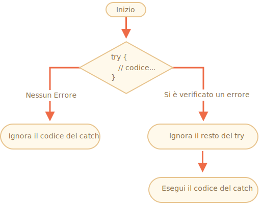

# Gestione degli errori, "try..catch"

Non importa quanto siamo bravi a programmare, a volte i nostri scripts contengono errori. Questo può accadere a causa di un nostro errore, un input da parte dell'utente inatteso, a una risposta sbagliata da parte del server e per un altro centinaio di ragioni.

Di solito, uno script "muore" (si ferma immediatamente) al verificarsi di un errore, stampandolo in console.

Ma esiste il construtto `try..catch` che permette di "catturare" gli errori e, anzichè farlo morire, ci permette di fare qualcosa di più ragionevole.

## La sintassi "try..catch"

Il construtto `try..catch` è composto da due blocchi principali: `try` e `catch`:

```js
try {

  // codice...

} catch (err) {

  // gestione dell'errore

}
```

Funziona in questo modo:

1. Per prima cosa, il codice all'interno del blocco `try {...}` viene eseguito.
2. Se non si verifica alcun errore, allora `catch(err)` viene ignorato: viene eseguito tutto il codice alll'interno del `try` e viene saltato quello all'interno del `catch`.
3. Se si verifica un errore, allora l'esecuzione del resto del codice all'interno del `try` viene interrotta, e si passa all'esecuzione del codice all'interno di `catch(err)`. La variabile `err` (può essere usato ogni nome) contiene un oggetto di tipo Error (Error Object) con i dettagli riguardo a cosa sia successo.



Quindi, un errore all'interno del blocco `try {…}` non ci ucciderà lo script: avremo la possibilità di gestirlo all'interno del blocco `catch`.

Vediamo degli esempi.

- Un esempio senza errori: saranno visualizzati `alert` `(1)` e `(2)`:

    ```js run
    try {

      alert('Inizio l\'esecuzione di try');  // *!*(1) <--*/!*

      // ...qui nessun errore

      alert('Fine dell\'esecuzione di try');   // *!*(2) <--*/!*

    } catch(err) {

      alert('Catch viene ignorato, dato che non ci sono errori'); // (3)

    }
    ```
- Un esempio con un errore: saranno visualizzati `(1)` e `(3)`:

    ```js run
    try {

      alert('Inizio l\'esecuzione di try');  // *!*(1) <--*/!*

    *!*
      lalala; // errore, variabile non definita!
    */!*

      alert('Fine dell\'esecuzione di try (mai raggiunta)');  // (2)

    } catch(err) {

      alert(`Si è verificato un errore!`); // *!*(3) <--*/!*

    }
    ```


````warn header="`try..catch` funziona solamente per gli errori che si verificano durante l'esecuzione (runtime errors)"
In modo che `try..catch` funzioni, il codice deve essere eseguibile. In altre parole, dev'essere un script JavaScript valido.

Non funzionerà se il codice è sintatticamente errato, per esempio se ha delle parentesi graffe non accoppiate:

```js run
try {
  {{{{{{{{{{{{
} catch(e) {
  alert("Il motore (engine) non riesce a interpretare il codice, esso non è valido");
}
```

Il motore di JavaScript dapprima legge il codice, dopodichè lo esegue. Gli errori che si presentano durante la fase di lettura vengono definiti "parse-time" e sono non recuperabili (unrecoverable) (dal codice stesso). Questo perchè il motore non riese a interpretare il codice.

Quindi, `try..catch` può solo gestire gli errori presenti in un codice comunque valido. Tali errori vengono chiamati "errori di runtime" (runtime errors) o, a volte, "eccezioni" (exceptions).
````


````warn header="`try..catch` funziona in maniera sincrona"
Se un'eccezione si verifica all'interno di codice "schedulato", come nel caso di `setTimeout`, allora `try..catch` non riesce ad intercettarlo:

```js run
try {
  setTimeout(function() {
    variabileNonDefinita; // script morirà qui
  }, 1000);
} catch (e) {
  alert( "non funziona" );
}
```

Questo accade perchè il codice all'interno della funzione sarà eseguito successivamente, quando il motore già interpretato il construtto `try..catch`.

Per intercettare un'eccezione all'interno di una funzione schedulata, `try..catch` dev'essere all'interno di tale funzione
```js run
setTimeout(function() {
  try {    
    variabileNonDefinita; // try..catch gestisce l'errore!
  } catch {
    alert( "qua c'è un errore!" );
  }
}, 1000);
```
````

## Oggetto di tipo Error (Error Object)

Quando un errore si verifica, JavaScript genera un oggetto contenente i dettagli al riguardo. L'oggetto è passato come argomento al `catch`:

```js
try {
  // ...
} catch(err) { // <-- "error object", potreste usare un'altra parola al posto di err
  // ...
}
```

Per tutti gli errori standard, incorporati, l'oggetto errore ha due proprietà principali:

`name`
: Il nome dell'errore. Ad esempio, per una variabile non definita sarà `"ReferenceError"`.

`message`
: Il messaggio testuale con i dettagli dell'errore.

Esistono altre proprietà non standard disponibili in diverse condizioni. Uno di quelli più largamente utilizzati e supportati è:

`stack`
: Lo stack alla chiamata corrente: una stringa con le informazioni inerenti la sequenza delle chiamate effettuate che hanno portato all'errore. Utile a scopo di debugging.

Ad esempio:

```js run untrusted
try {
*!*
  lalala; // errore, variabile non definita!
*/!*
} catch(err) {
  alert(err.name); // ReferenceError
  alert(err.message); // lalala non è definito
  alert(err.stack); // ReferenceError: lalala non è definito a (...call stack)

  // Può essere anche visualizzato nel suo compleso
  // L'errore è convertito in una stringa del tipo "name: message"
  alert(err); // ReferenceError: lalala non è definito
}
```

## associazione "catch" opzionale

[recent browser=new]

Se non abbiamo bisogno dei dettagli dell'errore, `catch` può ometterli:

```js
try {
  // ...
} catch { // <-- senza (err)
  // ...
}
```

## Usare "try..catch"

Esploriamo quindi l'uso di `try..catch` nella vita reale.

Come già sappiamo, JavaScript supporta il metodo [JSON.parse(str)](mdn:js/JSON/parse) per leggere le variabili codificate in JSON.

Generalmente è usato per decodificare i dati ricevuti attranerso la rete, dal server o da altri sorgenti.

Riceviamo essi e chiamiamo `JSON.parse` così:

```js run
let json = '{"name":"John", "age": 30}'; // dati dal server

*!*
let user = JSON.parse(json); // converto il testo che rappresenta un oggetto JS
*/!*

// ora user è un oggetto con delle proprietà
alert( user.name ); // John
alert( user.age );  // 30
```

Puoi trovare maggiori informazioni riguardo il JSON nel capitolo <info:json>.

**Se `json` è malformato, `JSON.parse` genererà un errore, quindi lo script "morirà".**

Dovremmo essere soddisfatti di questo? Ovviamente, no!

In questo modo, se qualcosa va storto, il visitatore non saprà mai perchè (a meno che non apra la console per sviluppatori). E in genere gli utenti non gradiscono affatto che qualche cosa sia andata storta senza avere alcun messaggio di errore.

Quindi usiamo `try..catch` per gestire l'errore:

```js run
let json = "{ bad json }";

try {

*!*
  let user = JSON.parse(json); // <-- si verifica un errore..
*/!*
  alert( user.name ); // non funziona

} catch (e) {
*!*
  // ...l'esecuzione prosegue qui
  alert( "Ci scusiamo, ma i dati contengono errori, proveromo a chiederli nuovamente." );
  alert( e.name );
  alert( e.message );
*/!*
}
```

Qui abbiamo utilizzato il blocco `catch` solamente per visualizzare un messaggio, ma possiamo fare molto altro: inviare una nuova richiesta al server, suggerire un'alternativa al visitatore, inviare le informazioni inerenti l'errore a un servizio di logging, ... Molto meglio che far semplicemente morire lo script.

## Usare i nostri errori personalizzati

Che succede se il `json` è sintatticamente corretto, ma non la proprietà richiesta `name`?

Tipo così:

```js run
let json = '{ "age": 30 }'; // dati incompleti

try {

  let user = JSON.parse(json); // <-- non ci sono errori
*!*
  alert( user.name ); // nessuna proprietà name!
*/!*

} catch (e) {
  alert( "non posso eseguire" );
}
```

Qui `JSON.parse` viene eseguito correttamente, ma l'assenza di `name` è per noi un errore.

Per unificare la gestione degli errori, useremo l'operatore `throw`.

### Operatore "Throw"

L'operatore `throw` serve a generare un errore.

La sintassi è:

```js
throw <error object>
```

Tecnicamente, possiamo usare qualsiasi cosa come oggetto errore (error object). Potrebbe essere una qualunque primitiva, come un numero (number) o una stringa (string), ma è meglio utilizzare un oggetto (object), preferibilmente con le proprietà `name` e `message` (per mantenere la compatibilità con gli errori già inclusi).

JavaScript ha già molti construttori integrati per errori generici: `Error`, `SyntaxError`, `ReferenceError`, `TypeError` e altri. Possiamo usarli per creare un oggetto errore.

La sintassi è:

```js
let error = new Error(message);
// or
let error = new SyntaxError(message);
let error = new ReferenceError(message);
// ...
```

Per gli errori integrati (non per qualunque oggetto, solo per gli errori), la proprietà `name` è esattamente il nome del construttore. E `message` è preso dall'argomento.

Ad esempio:

```js run
let error = new Error("Qualcosa è successo o_O");

alert(error.name); // Errore
alert(error.message); // Qualcosa è successo o_O
```

Vediamo quindi che errore viene genearato da `JSON.parse`:

```js run
try {
  JSON.parse("{ json errato o_O }");
} catch(e) {
*!*
  alert(e.name); // SyntaxError
*/!*
  alert(e.message); // Simobolo inaspettato (Unexpected token) o nel JSON alla posizione 0
}
```

Come possiamo vedere, è un `Errore di Sintassi` (SyntaxError).

Vediamo l'altro caso, in cui l'assenza di `name` è un errore, poichè gli utenti devono avere la proprietà `name`.

Quindi eseguiamo:

```js run
let json = '{ "age": 30 }'; // dati incompleti

try {

  let user = JSON.parse(json); // <-- nessun errore

  if (!user.name) {
*!*
    throw new SyntaxError("Dati incompleti: manca name"); // (*)
*/!*
  }

  alert( user.name );

} catch(e) {
  alert( "JSON Error: " + e.message ); // Errore JSON: dati incompleti (Incomplete data): manca name
}
```

Alla linea `(*)`, l'operatore `throw` genera un `SyntaxError` con il `message` fornito, allo stesso modo in cui lo genererebbe JavaScript. L'esecuzione di `try` si ferma immediatamente e il controllo passa direttamente all'interno di `catch`.

Quindi `catch` diventa un singolo posto per la gestione di tutti gli errori: sia per `JSON.parse` che per tutti gli altri casi.

## Rethrowing

Nel precedente esempio abbiamo usato `try..catch` per gestire i dati non corretti. Ma è possible che *un altro errore inaspettato* si verifichi all'interno del blocco `try {...}`? Come un errore di programmazione (variabile non definita) o qualcos'altro, non solo qualcosa come i "dati non corretti".

Come questo:

```js run
let json = '{ "age": 30 }'; // dati incompleti

try {
  user = JSON.parse(json); // <-- abbiamo dimenticato di inserire "let" prima di user

  // ...
} catch(err) {
  alert("JSON Error: " + err); // Errore JSON: ReferenceError: la variabile utente non è definita
  // (non c'è nessun errore JSON)
}
```

Ovviamente, tutto è possibile! I programmatori commettono errori. Anche nelle utility open source utilizzate da milioni di persone per decenni -- improvvisamente può essere scoperto un bug che porta a terribili hack.

Nel nostro caso, `try..catch` è pensato per intercettare errori per "dati non corretti". Ma per sua natura, `catch` prende *tutti* gli errori in `try`. Qui intercetta un errore inaspettato, tuttavia visualizza ugualmente il messaggio `"JSON Error"`. Questo è sbagliato e rende il debug del codice più difficoltoso.

Fortunatamente, possiamo individuare quale errore si è verificato, direttamente dalla proprietà `name`:

```js run
try {
  user = { /*...*/ };
} catch(e) {
*!*
  alert(e.name); // "ReferenceError" per aver tentato di accedere a una variabile non definita
*/!*
}
```

La regola è semplice:

**Catch dovrebbe processore solamente gli errori che riconosce e "rilanciare" (rethrow) tutti gli altri.**

La tecnica "rethrowing" può essere spiegata più in dettaglio come:

1. Catch intercetta tutti gli errori.
2. Nel blocco `catch(err) {...}` analizziamo l'oggetto errore (Object Error) `err`.
2. Se non sappiamo come gestirlo, allora ne usciermo con `throw err`.

Nel codice seguente, useremo rethrowing in modo che `catch` gestisca solamente un `SyntaxError`:

```js run
let json = '{ "age": 30 }'; // dati incompleti
try {

  let user = JSON.parse(json);

  if (!user.name) {
    throw new SyntaxError("Dati incompleti: manca la proprietà name");
  }

*!*
  blabla(); // errore inaspettato
*/!*

  alert( user.name );

} catch(e) {

*!*
  if (e.name == "SyntaxError") {
    alert( "JSON Error: " + e.message );
  } else {
    throw e; // rethrow (*)
  }
*/!*

}
```

Genereremo un errore nel blocco `catch` alla linea `(*)` "uscendo" dal `try..catch` e potermo catturare nuovamente quest'errore con un construtto `try..catch` più esterno (se esiste), altrimenti lo script morirà.

Quindi, attualmente il blocco `catch` gestisce solamente gli errori che conosce e per cui è stato istruito e "ignora" tutti gli altri.

Il seguente esempio dimostra come altri errori possono essere catturati da più livelli di `try..catch`:

```js run
function readData() {
  let json = '{ "age": 30 }';

  try {
    // ...
*!*
    blabla(); // errore!
*/!*
  } catch (e) {
    // ...
    if (e.name != 'SyntaxError') {
*!*
      throw e; // rethrow (non so come gsetirlo)
*/!*
    }
  }
}

try {
  readData();
} catch (e) {
*!*
  alert( "External catch got: " + e ); // catturato!
*/!*
}
```

In questo caso `readData` sa solamente come gestire un `SyntaxError`, mentre il `try..catch` più esterno sa come gestire tutto il resto.

## try..catch..finally

Aspetta, non è tutto.

Il construtto `try..catch` può avere una o più clausole: `finally`.

Se esiste, il codice all'interno delle clausole verrà eseguito in ogni caso:

- dopo `try`, se non si sono veriticati errori,
- dopo `catch`, se si sono verificati errori.

La sintassi estesa sarà più o meno così:

```js
*!*try*/!* {
   ... provo ad eseguire il codice ...
} *!*catch*/!*(e) {
   ... gestisco gli errori ...
} *!*finally*/!* {
   ... eseguo in ogni caso ...
}
```

Proviamo ad eseguire questo codice:

```js run
try {
  alert( 'try' );
  if (confirm('Vuoi generare un errore?')) BAD_CODE();
} catch (e) {
  alert( 'catch' );
} finally {
  alert( 'finally' );
}
```

Il codice ha due modi per terminare l'esecuzione:

1. Se si risponde "Sì" alla domanda "Vuoi generare un errore?", allora `try -> catch -> finally`.
2. Se si risponde "No", allora `try -> finally`.

La clausola `finally` è spesso utilizzata quando iniziamo a fare qualcosa e vogliamo che in ogni caso finalizzare il risultato.

Per esempio, vogliamo misurare il tempo che impiega una funzione di Fibonacci `fib(n)`. Naturalmente, dobbiamo iniziare la misurazione prima che essa venga eseguita e terminarla subito dopo. Ma cosa accade se si verifica un errore durante il richiamo della funzione? In particolare, l'implementazione di `fib(n)` nel codice che segue ritorna un errore in caso di numeri negativi o non interi.

La clausola `finally` è il posto migliore dove termicare la misurazione senza dover tener conto di cosa sia successo.

In questo caso `finally` garantisce la misurazione del tempo impiegato correttamente in entrambe le situazioni -- sia nel caso di un'esecuzione corretta di `fib` che nel caso si verifichi un errore in essa:

```js run
let num = +prompt("Inserire un numero positivo?", 35)

let diff, result;

function fib(n) {
  if (n < 0 || Math.trunc(n) != n) {
    throw new Error("Deve non essere negativo, oltre che intero.");
  }
  return n <= 1 ? n : fib(n - 1) + fib(n - 2);
}

let start = Date.now();

try {
  result = fib(num);
} catch (e) {
  result = 0;
*!*
} finally {
  diff = Date.now() - start;
}
*/!*

alert(result || "si è verificato un errore");

alert( `l'esecuzione è durata ${diff}ms` );
```

Possiamo verificare il codice eseguendelo e inserendo `35` al `prompt` -- verrà eseguito normalmente, `finally` dopo `try`. E se inseriamo `-1` -- ci sarà un errore immediato, e l'esecuzione durerà `0ms`. Entrambe le misurazioni saranno corrette.

In altre parola, la funzione potrà terminare con `return` o `throw`, non avrà alcuna importanza. La clausola `finally` verrà eseguita in ogni caso.


```smart header="Le variabili sono locali all'interno di `try..catch..finally`"
Presta attenzione al fatto che le variabili `result` e `diff` nel codice precedente sono dichiarate prima del `try..catch`.

Altrimenti, se dichiariamo `let` all'internod del blocco `try`, risulterà visibile solamente all'interno del blocco stesso.
```

````smart header="`finally` e `return`"
La clausola `finally` funziona indifferentemente da come si esce dal blocco `try..catch`. Questo include anche un esplicito `return`.

Nel codice seguente, c'è un `return` nel `try`. In questo caso, `finally` è eseguito giusto prima che il controllo passi al resto del codice.

```js run
function func() {

  try {
*!*
    return 1;
*/!*

  } catch (e) {
    /* ... */
  } finally {
*!*
    alert( 'finally' );
*/!*
  }
}

alert( func() ); // prima viene eseguito l'alert del finally, e successivamente questo qua
```
````

````smart header="`try..finally`"

Anche il construtto `try..finally`, senza la clausola `catch` può risultare utile. Lo useremo se non vogliamo gestire l'errore in questo momento (ignorandolo), ma vogliamo essere sicuri che il processo che abbiamo avviato sia finalizzato ugualmente.

```js
function func() {
  // iniziamo ad eseguire qualcosa che necessita di essere completata (come una misurazione)
  try {
    // ...
  } finally {
    // completo qualunque cosa sia accaduta
  }
}
```
Nel codice qui sopra, un errore all'interno di `try` vi farà uscire sempre fuori dal construtto, perchè non c'è `catch`. Ma `finally` verrà eseguito ugualmente prima che il flusso lascierà la funzione.
````

## Catch globale

```warn header="Strettamente legato all'ambiente di esecuzione"
Le informazioni all'interno di questa sezione non fanno parte strettamente di JavaScript.
```

Immaginiamo di incorrere in un errore fatale fuori dal `try..catch`, e lo script muore. Esattamente come un errore di programmazione, non è il massimo, se non un terribile risultato.

Esiste un modo per reagire a un situazione simile? Possiamo creare un log dell'errore, mostrare qualcosa all'utente (che normalmente non vede i messaggi di errore), ecc.

Non esiste nulla nelle specifiche, ma l'ambuente in genere ci viene incontro, poichè risulta veramente utile. Ad esempio, Node.js ha [`process.on("uncaughtException")`](https://nodejs.org/api/process.html#process_event_uncaughtexception) per questo. E nel browser possiamo assegnare una funzione alla proprietà speciale [window.onerror](mdn:api/GlobalEventHandlers/onerror), che verrà eseguita nel caso di un errore non catturato.

La sintassi:

```js
window.onerror = function(message, url, line, col, error) {
  // ...
};
```

`message`
: Messaggio di errore.

`url`
: Indirizzo URL dello script in cui si è verificato l'errore.

`line`, `col`
: Linea e colonna in cui si è verificato l'errore.

`error`
: L'oggetto errore (Error Object).

Ad esempio:

```html run untrusted refresh height=1
<script>
*!*
  window.onerror = function(message, url, line, col, error) {
    alert(`${message}\n At ${line}:${col} of ${url}`);
  };
*/!*

  function readData() {
    badFunc(); // Ops, qualcosa è andato storto!
  }

  readData();
</script>
```

Il ruolo del gestore globale `window.onerror` non è quello di risolvere l'esecuzione dello the script -- cosa probabilmente impossibile nel'eventualità di errori di programmazione, ma di inviare messaggi di errore agli sviluppatori.

Esistono anche dei web-services che forniscono servizi di error-logging, come <https://errorception.com> o <http://www.muscula.com>.

Funziona all'incirca così:

1. Ci registriamo al servizio e inseriamo il pezzo di codice JS (o lo URL allo script) che ci viene fornito.
2. Quindi lo script JS imposta una funzione personalizzata `window.onerror`.
3. Quando si verifica un errore, quest'ultimo invia una richiesta contenente i dettagli al servizio.
4. A questo punto noi possiamo autenticarci tramite l'interfaccia web del servizio e vedere gli errori.

## Riepilogo

Il construtto `try..catch` permette la gestione degli errori al momento dell'esecuzione. Letteralente permette di "provare" ("try") il codice e "catturare" ("catch") gli errori che si possono verificare.

La sintassi è:

```js
try {
  // esegui il codice
} catch(err) {
  // se un errore si presenta, passo qui
  // err è l'oggetto errore (object error)
} finally {
  // viene eseguito in ogni caso subito dopo try/catch
}
```

Sia la sezione `catch` che `finally` possono essere omesse, quindi i construtti brevi `try..catch` e `try..finally` sono ugualmente validi.

L'oggetto errore ha le seguenti proprietà:

- `message` -- il messaggio di errore "human-readable".
- `name` -- la stringa con il nome dell'errore (error constructor name).
- `stack` (non standard, ma ben supportato) -- lo stack al momento della creazione dell'errore.

Se un oggetto errore non è necessario, possiamo ometterlo usando `catch {` anzichè `catch(err) {`.

Possiamo anche generare un nostro errore personalizzato usando l'operatore `throw`. Tecnicamente, l'argomento di `throw` può essere qualunque cosa, ma in genere è un oggetto errore (object error) che estende la classe integrata `Error`. Puoi leggerne di più nel prossimo capitolo.

*Rethrowing* è un pattern veramente importante per la gestione degli errori: un blocco `catch` in genere si aspetta e gestisce un particolare tipo di errore, quindi dovrebbe "rilanciare" (rethrow) gli errori che non è in grado di gestire.

In ogni caso, se non abbiamo `try..catch`, molti ambienti permettono di impostare un gestore "globale" per intercettare gli errori che ci "buttano fuori". All'interno del browser c'è `window.onerror`.
