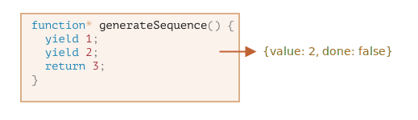

# I generatori

Le funzioni ritornano normalmente un solo valore (a volte non ritornano nulla).

I generatori possono ritornare ("yield") valori multipli, uno dopo l'altro, ogni volta che vengono invocati. Sono, di fatto, lo strumento ideale da utilizzare con gli [iteratori](info:iterable), dal momento che ci consentono di creare flussi di dati con facilità.

## Le funzioni generatrici

Per creare un generatore, abbiamo bisogno di uno specifico costrutto sintattico: `function*`, chiamato, appunto, "funzione generatrice".

Ecco un esempio:

```js
function* generateSequence() {
  yield 1;
  yield 2;
  return 3;
}
```

Le funzioni generatrici si comportano diversamente rispetto alle normali funzioni. Quando una generatrice viene invocata, di fatto, il codice al suo interno non viene eseguito, ma ritorna uno speciale oggetto, chiamato "oggetto generatore", che ne consente di gestire l'esecuzione.

Dai un'occhiata qua:

```js run
function* generateSequence() {
  yield 1;
  yield 2;
  return 3;
}

// "la funzione generatrice" crea un "oggetto generatore"
let generator = generateSequence();
*!*
alert(generator); // [object Generator]
*/!*
```

L'esecuzione del codice della funzione non &egrave; ancora iniziata:


Il metodo principale di un oggetto generatore &egrave; `next()`. Quando invocato, esegue le istruzioni in esso contenute fino alla prossima istruzione `yield <valore>` (`valore` pu&ograve; essere omesso, in tal caso sarà `undefined`). A questo punto l'esecuzione si arresta e il `valore` viene "ceduto" al codice esterno.

Il risultato dell'esecuzione di `next()` &egrave; sempre un oggetto con due propriet&agrave;:

- `value`: il valore che viene "ceduto".
- `done`: `true`, se il codice della funzione &egrave; stato eseguito completamente, altrimenti, `false`.

Ad esempio, qui andiamo a creare un generatore e otteniamo il primo valore "ceduto":

```js run
function* generateSequence() {
  yield 1;
  yield 2;
  return 3;
}

let generator = generateSequence();

*!*
let one = generator.next();
*/!*

alert(JSON.stringify(one)); // {value: 1, done: false}
```

A questo punto, abbiamo ottenuto solo il primo valore e l'esecuzione della funzione ha raggiunto la seconda riga:


Invochiamo ancora `generator.next()`. L'esecuzione del codice riprender&agrave; da dove si era fermata, fino a restituire il valore del prossimo `yield`:

```js
let two = generator.next();

alert(JSON.stringify(two)); // {value: 2, done: false}
```



Per finire, invocandolo nuovamente (`generator.next()`), si raggiunger&agrave; l'istruzione `return` che terminer&agrave; la funzione:

```js
let three = generator.next();

alert(JSON.stringify(three)); // {value: 3, *!*done: true*/!*}
```


A questo punto il generatore ha terminato. Possiamo vederlo dal risultato finale `done:true` e `value:3`.

Effettuare nuove chiamate a `generator.next()` non avrebbe pi&ugrave; senso. Se lo facciamo, otterremmo sempre lo stesso oggetto: `{done: true}`.

```smart header="`function* f(…)`or`function *f(…)`?"
Entrambe le sintassi sono corrette.

La prima, tuttavia, &egrave; la pi&ugrave; utilizzata, dal momento che &egrave; l'asterisco `*` a indicare che la funzione &egrave; una generatrice, non il nome. Per questo motivo ha pi&ugrave; senso accoppiare l'asterisco con la parola chiave `function`.

````

## I generatori sono iteratori

Come probabilmente avrai intuito dalla presenza del metodo `next()`, i generatori sono [iterabili](info:iterable).

Possiamo eseguire cicli sui valori ritornati utilizzando `for..of`:

```js run
function* generateSequence() {
  yield 1;
  yield 2;
  return 3;
}

let generator = generateSequence();

for(let value of generator) {
  alert(value); // 1, then 2
}
````

Non trovi che sia molto pi&ugrave; leggibile di `.next().value`?

...Nota bene: l'esempio precedente produrr&agrave; come risultato `1` e `2`, nulla pi&ugrave;. Il `3` non verr&agrave; preso in considerazione!

La spiegazione di questo comportamento sta nel fatto che `for..of` ignora l'ultimo `value` non appena la propriet&agrave; &egrave; `done: true`. Per questo motivo, se vogliamo che tutti i valori siano mostrati da `for..of`, dobbiamo ritornarli tramite `yield`:

```js run
function* generateSequence() {
  yield 1;
  yield 2;
*!*
  yield 3;
*/!*
}

let generator = generateSequence();

for(let value of generator) {
  alert(value); // 1, poi 2, poi 3
}
```

Dal momento che i generatori sono iteratori, possiamo usufruire di tutte le funzionalit&agrave; che ne derivano, per esempio lo "spread operator".

```js run
function* generateSequence() {
  yield 1;
  yield 2;
  yield 3;
}

let sequence = [0, ...generateSequence()];

alert(sequence); // 0, 1, 2, 3
```

Nell'esempio precedente `...generateSequence()` converte l'oggetto generatore iteratore in un array di elementi (puoi approfondire l'argomento relativo allo spread operator nel capitolo [](info:rest-parameters-spread-operator#spread-operator))

## Usare i generatori con gli iteratori

Tempo fa, nel capitolo [](info:iterable) abbiamo creato un oggetto iteratore `range` che ritorna valori `from..to` (da..a).

Ecco l'esempio, per rinfrescarci la memoria:

```js run
let range = {
  from: 1,
  to: 5,

  // for..of invoca questo metodo solo all'inizio
  [Symbol.iterator]() {
    // ...ritorna l'oggetto iteratore:
    // da qui in poi, for..of utilizzer&agrave; solo quell'oggetto per ottenere i valori successivi
    return {
      current: this.from,
      last: this.to,

      // next() viene invocata ad ogni iterazione fino alla fine del ciclo for..of
      next() {
        // dovrebbe ritornare il valore sotto forma di un oggett {done:..., value:...}
        if (this.current <= this.last) {
          return { done: false, value: this.current++ };
        } else {
          return { done: true };
        }
      },
    };
  },
};

// l'iterazione su range ritorna i numeri compresi tra range.from e range.to
alert([...range]); // 1,2,3,4,5
```

Possiamo usare una funzione generatrice come iteratore assegnandola a `Symbol.iterator`.

Ecco qui lo stesso `range`, ma in una forma pi&ugrave; compatta:

```js run
let range = {
  from: 1,
  to: 5,

  *[Symbol.iterator]() {
    // forma abbreviata di [Symbol.iterator]: function*()
    for (let value = this.from; value <= this.to; value++) {
      yield value;
    }
  },
};

alert([...range]); // 1,2,3,4,5
```

Il funzionamento &egrave; invariato dal momento che `range[Symbol.iterator]()` ora ritorna un generatore che &egrave; esattamente quello che `for..of` si aspetta:

- ha un metodo `.next()`
- il quale ritorna valori nella forma `{value: ..., done: true/false}`

Questa non &egrave; una coincidenza, ovviamente. I generatori sono stati aggiunti al linguaggio JavaScript tenendo a mente gli iteratori, per implementarli pi&ugrave; facilmente.

La variante con i generatori &egrave; molto pi&ugrave; concisa del codice originale di `range` ma mantiene le funzionalit&agrave; invariate.

```smart header="I generatori potrebbero generare valori per sempre"
Negli esempi precedenti abbiamo generato sequenze finite ma possiamo anche creare generatori che restituiscono valori infinitamente. Per esempio, una sequenza infinita di numeri pseudo-casuali.

Ci&ograve; richiederebbe sicuramente un `break` (o un `return`) nel `for..of` che utilizziamo per iterare su tale generatore, altrimenti il ciclo si ripeterebbe all'infinito bloccando l'esecuzione dell'applicazione.
```

## Composizione di generatori

La composizione dei generatori &egrave; una caratteristica particolare dei generatori che consente di "innestarli" l'uno nell'altro, in modo trasparente.

Per esempio, data una funzione che genera una sequenza di numeri:

```js
function* generateSequence(start, end) {
  for (let i = start; i <= end; i++) yield i;
}
```

Vogliamo usarla per generare una sequenza pi&ugrave; complessa:

- per prime le cifre `0..9` (con i codici carattere 48..57),
- seguite dalle lettere dell'alfabeto `a..z` (codici carattere 65..90)
- seguite dalle lettere maiuscole `A..Z` (codici carattere 97..122)

Possiamo usare questa sequenza, ad esempio, per creare password selezionandone i caratteri (potremmo anche aggiungere caratteri sintattici), ma generiamo la sequenza per ora.

In una normale funzione, per combinare i risultati di pi&ugrave; funzioni, dapprima invochiamo le funzioni, ne memorizziamo i risultati e, infine, li combiniamo.

Usando i generatori, c'&egrave; una sintassi speciale di `yield*` per "innestare" (comporre) un generatore all'interno di un altro.

Il generatore composto:

```js run
function* generateSequence(start, end) {
  for (let i = start; i <= end; i++) yield i;
}

function* generatePasswordCodes() {

*!*
  // 0..9
  yield* generateSequence(48, 57);

  // A..Z
  yield* generateSequence(65, 90);

  // a..z
  yield* generateSequence(97, 122);
*/!*

}

let str = '';

for(let code of generatePasswordCodes()) {
  str += String.fromCharCode(code);
}

alert(str); // 0..9A..Za..z
```

La direttiva `yield*` _delega_ l'esecuzione a un altro generatore. Con il termine _delega_ si intende che `yield* gen` itera sui valori del generatore `gen` e, in modo trasparente, inoltra i valori che restituisce verso l'esterno. Come se i valori fossero restituiti dal generatore pi&ugrave; esterno.

Il risultato &egrave; lo stesso che otterremmo mettendo in sequenza il codice dei generatori annidati:

```js run
function* generateSequence(start, end) {
  for (let i = start; i <= end; i++) yield i;
}

function* generateAlphaNum() {

*!*
  // yield* generateSequence(48, 57);
  for (let i = 48; i <= 57; i++) yield i;

  // yield* generateSequence(65, 90);
  for (let i = 65; i <= 90; i++) yield i;

  // yield* generateSequence(97, 122);
  for (let i = 97; i <= 122; i++) yield i;
*/!*

}

let str = '';

for(let code of generateAlphaNum()) {
  str += String.fromCharCode(code);
}

alert(str); // 0..9A..Za..z
```

La composizione dei generatori &egrave; un modo naturale di immettere il flusso di un generatore all'interno di un altro. Non viene utilizzata memoria aggiuntiva per memorizzare i valori intermedi.

## "yield" &egrave; una via a doppio senso

Finora i generatori sono assimilati agli iteratori, con una sintassi speciale per generare valori ma, di fatto, sono molto pi&ugrave; potenti e flessibili.

Questo perch&eacute; `yield` &egrave; una via a doppio senso: non solo ritorna il risultato verso l'esterno ma provvede anche a passare il valore all'interno del generatore.

Per fare questo, dovremmo invocare `generator.next(arg)` con un argomento. Tale argomento diventer&agrave; il risultato di `yield`.

Vediamo un esempio:

```js run
function* gen() {
*!*
  // Passa una domanda al codice esterno e attende una risposta
  let result = yield "2 + 2 = ?"; // (*)
*/!*

  alert(result);
}

let generator = gen();

let question = generator.next().value; // <-- yield ritorna il valore

generator.next(4); // --> pass il risultato al generatore
```


1. La prima invocazione di `generator.next()` &egrave; sempre senza argomento. Inizia l'esecuzione e ritorna il risultato della prima `yield "2+2=?"`. A questo punto il generatore si arresta (si ferma su quella riga).
2. Di seguito, come mostrato nella figura sopra, il risultato di `yield` va dentro alla variabile `question` nel codice all'esterno.
3. Quando eseguiamo `generator.next(4)`, il generatore riprende l'esecuzione e `4` finisce nel risultato: `let result = 4`.

Si noti che il codice all'esterno non deve per forza invocare `next(4)` immediatamente. Potrebbe impiegare del tempo, ma questo non &egrave; un problema: il generatore attender&agrave;.

Per esempio:

```js
// ripristina il generatore dopo un certo lasso di tempo
setTimeout(() => generator.next(4), 1000);
```

Come possiamo vedere, a differenza delle normali funzioni, un generatore e il codice che lo invoca possono scambiarsi risultati passando valori a `next/yield`.

Per rendere il tutto ancora pi&ugrave; evidente, ecco un altro esempio, con pi&ugrave; chiamate:

```js run
function* gen() {
  let ask1 = yield "2 + 2 = ?";

  alert(ask1); // 4

  let ask2 = yield "3 * 3 = ?";

  alert(ask2); // 9
}

let generator = gen();

alert(generator.next().value); // "2 + 2 = ?"

alert(generator.next(4).value); // "3 * 3 = ?"

alert(generator.next(9).done); // true
```

Illustrazione dell'esecuzione:


1. La prima `.next()` inizia l'esecuzione... raggiunge la prima `yield`.
2. Il risultato viene ritornato al codice esterno.
3. La seconda `.next(4)` passa `4` al generatore come risultato della prima `yield` e riprende l'esecuzione.
4. ...la seconda `yield` viene raggiunta e diventa il risultato della chiamata al generatore.
5. La terza `next(9)` passa `9` nel generatore come risultato della seconda `yield` e riprende l'esecuzione che raggiunge la fine della funzione, dunque, `done: true`.

&Egrave; un po' come una partita a "ping-pong". Ogni `next(value)` (escluso il primo), passa un valore al generatore. Questo valore diventa il risultato della `yield` corrente per poi ritornare il risultato della `yield` successiva.

## generator.throw

Come abbiamo visto negli esempi precedenti, il codice esterno pu&ograve; passare un valore all'interno del generatore, come risultato della `yield`.

...ma pu&ograve; anche passargli (throw) un errore. Ci&ograve; &egrave; naturale, dal momento che un errore &egrave; comunque un risultato.

Per passare un errore all'interno di una `yield`, dovremmo invocare `generator.throw(err)`. In questo caso, tale `err` risulta generato dalla riga contenente tale `yield`.

Nel prossimo esempio, la yield di `"2 + 2 = ?"` genera un errore:

```js run
function* gen() {
  try {
    let result = yield "2 + 2 = ?"; // (1)

    alert("The execution does not reach here, because the exception is thrown above");
  } catch(e) {
    alert(e); // shows the error
  }
}

let generator = gen();

let question = generator.next().value;

*!*
generator.throw(new Error("The answer is not found in my database")); // (2)
*/!*
```

L'errore, lanciato all'interno del generatore alla riga `(2)` genera un'eccezione alla riga `(1)` in corrispondenza della `yield`. Nell'esempio precedente `try..catch` gestisce l'errore e lo mostra.

Se non gestiamo l'errore, come accadrebbe con qualsiasi eccezione, quest'ultima andrebbe a causare un errore nel codice esterno.

La riga corrente del codice esterno &egrave; quella che contiene `generator.throw`, identificata da `(2)`. Possiamo, pertanto, gestire l'eccezione qui, come nell'esempio:

```js run
function* generate() {
  let result = yield "2 + 2 = ?"; // Errore in questa riga
}

let generator = generate();

let question = generator.next().value;

*!*
try {
  generator.throw(new Error("The answer is not found in my database"));
} catch(e) {
  alert(e); // mostra l'errore
}
*/!*
```

Se non gestiamo l'errore qui, come al solito, questo risalir&agrave; fino al codice pi&ugrave; esterno, se esistente, altrimenti far&agrave; fallire lo script.

<<<<<<< HEAD
## Riepilogo
=======
## generator.return

`generator.return(value)` finishes the generator execution and return the given `value`.

```js
function* gen() {
  yield 1;
  yield 2;
  yield 3;
}

const g = gen();

g.next();        // { value: 1, done: false }
g.return('foo'); // { value: "foo", done: true }
g.next();        // { value: undefined, done: true }
```

If we again use `generator.return()` in a completed generator, it will return that value again ([MDN](https://developer.mozilla.org/en-US/docs/Web/JavaScript/Reference/Global_Objects/Generator/return)).

Often we don't use it, as most of time we want to get all returning values, but it can be useful when we want to stop generator in a specific condition.

## Summary
>>>>>>> 3699f73b4ccb2a57ac5ef990d2687bf31ccf564c

- I generatori vengono creati tramite funzioni generatrici `function* f(…) {…}`.
- Solo nei generatori pu&ograve; esistere un operatore `yield`.
- Il codice esterno e il generatore possono interscambiare risultato tramite chiamate a `next/yield`.

Nel JavaScript moderno, i generatori vengono usati raramente ma a volte possono essere utili, dal momento che la loro capacit&agrave; di interscambiare dati con il codice all'esterno è alquanto unica. Sicuramente, sono un ottimo modo per creare degli iteratori.

Nel prossimo capitolo impareremo a usare i generatori asincroni, utilizzati per leggere flussi di dati generati in modo asincrono (per esempio, dati paginati ottenuti dalla rete) nei cicli `for await ... of`.

Questo &egrave; un caso d'uso molto importante, dal momento che nella programmazione web ci troviamo spesso a manipolare flussi di dati.
