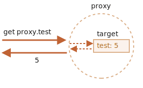

# Proxy e Reflect

Un oggetto `Proxy` racchiude un altro oggetto e ne intercetta le operazioni, come quelle di lettura/scrittura e molte altre, può eventualmente gestirle a modo suo, oppure, in maniera del tutto trasparente, lasciare che sia l'oggetto ad occuoparsene.

I proxy vengono utilizzati da molte librerie ed alcuni framework per browsers. Ne vedremo molte applicazioni pratiche in questo articolo.

## Proxy

La sintassi:

```js
let proxy = new Proxy(target, handler)
```

- `target` -- è l'oggetto da racchiudere, può essere qualsiasi cosa, anche funzioni.
- `handler` -- configurazione del proxy: un oggetto con "trappole", metodi che intercettano operazioni. Ad esempio una "trappola" `get` per la lettura di una proprietà di `target`, `set` per la scrittura di una prorietà di `target`, e così via.

Per le operazioni sul `proxy`, se c'è un "tappola" corrispondente in `handler`, allora questa verrà eseguita, e il proxy potrà gestirla, altrimenti l'operazione verrà eseguita su `target`.
Come primo esempio, creiamo un proxy senza "trappole":

```js run
let target = {};
let proxy = new Proxy(target, {}); // handler vuoto

proxy.test = 5; // scrittura su proxy (1)
alert(target.test); // 5, la proprietà si trova su target!

alert(proxy.test); // 5, possiamo leggerla anche dal proxy (2)

for(let key in proxy) alert(key); // test, l'iterazione funziona (3)
```

Poiché non ci sono "trappole", tutte le operazioni su `proxy` vengono inoltrate a `target`.

1. Un'operazione di scrittura `proxy.test=` imposta il valore su `target`.
2. Un'operazione di lettura `proxy.test` ritorna iil valore da `target`.
3. L'iterazione su `proxy` ritorna valori da `target`.

Come possiamo vedere, senza "trappole", `proxy` è solamente un contenitore per `target`.



`Proxy` è uno speciale "oggetto esotico". Non possiede proprietà proprie. Con un `handler` vuoto, le operazioni verranno automaticamente inoltrate a `target`.

Per attivare più funzionalità, aggiungiamo qualche "trappola".

Cosa possiamo intercettare?

Per molte operazioni sugli oggetti, esiste un cosidetto "metodo interno" nella specifiche JavaScript che ne descrive il funzionamento a basso livello. Ad esempio `[[Get]]`, il metodo interno per la lettura delle proprietà, e `[[Set]]`, il metodo interno per la scrittura delle proprietà, e così via. Questi metodi vengono utilizzati solamente nelle specifiche, non possiamo invocarli direttamente utilizzandone il nome.

Le trappole "proxy" intercettano le invocazioni di questi metodi. Queste vengono elencate nelle[specifiche Proxy](https://tc39.es/ecma262/#sec-proxy-object-internal-methods-and-internal-slots) e nella tabella sottostante.

Per ogni metodo interno, esiste una "trappola" in questa tabella: il nome del metodo che possiamo aggiungere al parametro `handler` del `new Proxy` per interecettare l'operazione:

| Metodo Interno | Handler | Innescato quando... |
|-----------------|----------------|-------------|
| `[[Get]]` | `get` | lettura di un proprietà |
| `[[Set]]` | `set` | scrittura di un proprietà |
| `[[HasProperty]]` | `has` | operatore `in` |
| `[[Delete]]` | `deleteProperty` | operatore `delete` |
| `[[Call]]` | `apply` | invocazione di funzione |
| `[[Construct]]` | `construct` | operatore `new` |
| `[[GetPrototypeOf]]` | `getPrototypeOf` | [Object.getPrototypeOf](mdn:/JavaScript/Reference/Global_Objects/Object/getPrototypeOf) |
| `[[SetPrototypeOf]]` | `setPrototypeOf` | [Object.setPrototypeOf](mdn:/JavaScript/Reference/Global_Objects/Object/setPrototypeOf) |
| `[[IsExtensible]]` | `isExtensible` | [Object.isExtensible](mdn:/JavaScript/Reference/Global_Objects/Object/isExtensible) |
| `[[PreventExtensions]]` | `preventExtensions` | [Object.preventExtensions](mdn:/JavaScript/Reference/Global_Objects/Object/preventExtensions) |
| `[[DefineOwnProperty]]` | `defineProperty` | [Object.defineProperty](mdn:/JavaScript/Reference/Global_Objects/Object/defineProperty), [Object.defineProperties](mdn:/JavaScript/Reference/Global_Objects/Object/defineProperties) |
| `[[GetOwnProperty]]` | `getOwnPropertyDescriptor` | [Object.getOwnPropertyDescriptor](mdn:/JavaScript/Reference/Global_Objects/Object/getOwnPropertyDescriptor), `for..in`, `Object.keys/values/entries` |
| `[[OwnPropertyKeys]]` | `ownKeys` | [Object.getOwnPropertyNames](mdn:/JavaScript/Reference/Global_Objects/Object/getOwnPropertyNames), [Object.getOwnPropertySymbols](mdn:/JavaScript/Reference/Global_Objects/Object/getOwnPropertySymbols), `for..in`, `Object.keys/values/entries` |

```warn header="Invarianti"
JavaScript applica alcune invarianti, ovvero condizioni che devono essere soddisfatte da metodi interni e "trappole".

Molte di quest sono per i valori di ritorno:
- `[[Set]]` deve tornare `true` se il valore è stato scritto con successo, altrimenti ritorna `false`.
- `[[Delete]]` deve tornare `true` se il valore è stato rimosso con successo, altrimenti ritorna `false`.
- ...E così via, vedremo più esempi sotto.

Esistono anche altre invarianti, come:
- `[[GetPrototypeOf]]`, applicata all'oggetto proxy, il quale deve ritornare lo stesso valore di `[[GetPrototypeOf]]` che sarebbe ritornato dall'oggetto target. In altre parole, la lettura del prototype del proxy deve sempre ritornare il prototype dell'oggetto target.

Le "trappole" possono intercettare queste operazioni, ma devono seguire le regole viste.

Le invaraianti assicurano che le funzionalità di linguaggio si comportino in maniera corretta e consistente. La lista completa delle invarianti è disponibile [nelle specifiche](https://tc39.es/ecma262/#sec-proxy-object-internal-methods-and-internal-slots). Probabilmente non le violerai, a meno ché tu non stia facendo qualcosa di strano.
```

Vediamo come funzionano con esempi pratici.

## Valore di default con la trappola "get"

La maggior parte delle "trappole" sono dedicate alla lettura/scrittura di proprietà.

Per intercettare la lettura, l'`handler` dovrebbe possedere un metodo `get(target, property, receiver)`.

Verrà innescato quando una proprietà verrà letta, con i seguenti argomenti:

- `target` -- è l'oggetto target, quello fornito come primo argomento a `new Proxy`,
- `property` -- nome della proprietà,
- `receiver` -- se la proprietà target è un getter, allora `receiver` sarà l'oggetto che verrà utilizzato come `this` in questa chiamata. Solitamente è l'oggetto `proxy` stesso (oppure un oggetto che eredita da esso, se stiamo ereditando dal proxy). Per ora non abbiamo bisogno di questo argomento, quindi lo analizzeremo nel dettagli più avanti.

Utilizziamo `get` per implementare i valore di default di un oggetto.

Costruiremo un array numerico che ritornerà `0` per valori inesistenti.

Soltiamente, quando si prova ad accedere ad una elemento non esistente di un array, si ottiene `undefined`, ma noi costruiremo un proxy di un array che ritorna `0` nel caso in cui la prorpietà non esistesse:

```js run
let numbers = [0, 1, 2];

numbers = new Proxy(numbers, {
  get(target, prop) {
    if (prop in target) {
      return target[prop];
    } else {
      return 0; // valore di default
    }
  }
});

*!*
alert( numbers[1] ); // 1
alert( numbers[123] ); // 0 (elemento non esistente)
*/!*
```

Come possiamo vedere, è molto semplice da fare con una "trappola" `get`.

Possiamo utilizzare un `Proxy` per implementare una logica per i valore i valori di "default".

Immaginiamo di avere un dizionario, contenente i termini e le rispettive traduzioni:

```js run
let dictionary = {
  'Hello': 'Hola',
  'Bye': 'Adiós'
};

alert( dictionary['Hello'] ); // Hola
alert( dictionary['Welcome'] ); // undefined
```

Attualmente, se non esiste un termine, la lettura dal `dictionary` ritorna `undefined`. Ma nella pratica, ritornare un termine non tradotto è generalmente meglio di `undefined`. Quindi facciamo in modo che ritorni il termine non tradotto piuttosto di `undefined`.

Per farlo, costruiremo un contenitore per `dictionary` con un proxy che interecetterà le operazioni di lettura:

```js run
let dictionary = {
  'Hello': 'Hola',
  'Bye': 'Adiós'
};

dictionary = new Proxy(dictionary, {
*!*
  get(target, phrase) { // interecetta la lettura di una proprietà dal dictionary
*/!*
    if (phrase in target) { // se è contenuto nel dictionary
      return target[phrase]; // ritorna la traduzione
    } else {
      // altrimenti, ritorna il termine non tradotto
      return phrase;
    }
  }
});

// Cerchiamo un termine casuale nel dictionary!
// Nel peggiore dei casi, questo non sarà tradotto.
alert( dictionary['Hello'] ); // Hola
*!*
alert( dictionary['Welcome to Proxy']); // BeWelcome to Proxy (nessuna traduzione)
*/!*
```

````smart
Da notare come il proxy sovrascrive la variabile:

```js
dictionary = new Proxy(dictionary, ...);
```

Il proxy dovrebbe rimpiazzare completamente il target ovunque. Nessuno dovrebbe più fare riferimento all'oggetto target una volta che questo ne è stato costruito un proxy. Altrimenti diventa molto facile commettere errori.
````

## Validazione con la trappola "set"

Ipotizziamo di volere un array di soli numeri. Se viene aggiunto un valore di un altro tipo, questo dovrebbe generare un errore.

La "trappola" `set` si innesca quando si accede in scrittura ad una proprietà.

`set(target, property, value, receiver)`:

- `target` -- rappresenta l'oggetto target, quello fornito come primo argomento a `new Proxy`,
- `property` -- il nome della proprietà,
- `value` -- il valore della proprietà,
- `receiver` -- similmente alla trappola `get`, ha importanza solamente per le proprietà di tipo setter.

La trappola `set` dovrebbe ritornare `true` se è stata imposta correttamete, `false` altrimenti (innescando `TypeError`).

Utilizziamola per validare un nuovo valore:

```js run
let numbers = [];

numbers = new Proxy(numbers, { // (*)
*!*
  set(target, prop, val) { // per intercettare la scrittura di proprietà
*/!*
    if (typeof val == 'number') {
      target[prop] = val;
      return true;
    } else {
      return false;
    }
  }
});

numbers.push(1); // aggiunta con successo
numbers.push(2); // aggiunta con successo
alert("Length is: " + numbers.length); // 2

*!*
numbers.push("test"); // TypeError ('set' di proxy ha ritornato false)
*/!*

alert("This line is never reached (error in the line above)");
```

Da notare: la funzionalità interna degli array integrati continuano a funzionare! I valori vengono aggiunti tramite `push`. La proprietà `length` viene auto-incrementata quando i valori vengono aggiunti. Il nostro proxy non rompe nulla.

Non dobbiamo sovrascrivere il metodo di aggiunta valori agli array come `push` e `unshift`, e così via, per aggiungere i controlli in questi casi, poiché questi internamente utilizzano operazioni di `[[Set]]` che verranno intercettate dal proxy.

In questo modo il codice rimane pulito e conciso.

```warn header="Non dimenticate di ritornare `true`"
Come detto sopra, vanno tenute in considerazione le invarianti.

Nel caso di `set`, questo deve ritornare `true` per scritture avvenute con successo.

Se ci dimentichiamo di farlo o ritorniamo qualsiasi altro valore, l'operazione innescherà `TypeError`.
```

## Iterazione con "ownKeys" e "getOwnPropertyDescriptor"

I cicli `Object.keys`, `for..in` e molti altri metodi che iterano sulle proprietà degli oggetti utilizzano il metodo interno `[[OwnPropertyKeys]]` (intercettate dalla trappola `ownKeys`) per ottenere la lista delle proprietà.

Questi metodi si distinguono per alcuni dettagli:
- `Object.getOwnPropertyNames(obj)` ritorna le chiavi non-symbol.
- `Object.getOwnPropertySymbols(obj)` ritorna le chiavi symbol.
- `Object.keys/values()` ritorna coppie keys/values non-symbol, con la flag `enumerable` (le flag  sono state spiegate nell'articolo <info:property-descriptors>).
- `for..in` cicla su chiavi non-symbol, con la flag `enumerable`, ed anche sullle chiavi del prototype.

...Ma tutti questi, incominciamo dalla stessa lista.

Nell'esempio sotto, utilizziamo la trappola `ownKeys` per far sì che `for..in` cicli su `user`, `Object.keys` e `Object.values`, saltando le proprietà il cui nome incomincia con un underscore `_`:

```js run
let user = {
  name: "John",
  age: 30,
  _password: "***"
};

user = new Proxy(user, {
*!*
  ownKeys(target) {
*/!*
    return Object.keys(target).filter(key => !key.startsWith('_'));
  }
});

// "ownKeys" filtra _password, saltandolo
for(let key in user) alert(key); // name, then: age

// abbiamo lo stesso effetto in questi meotodi:
alert( Object.keys(user) ); // name,age
alert( Object.values(user) ); // John,30
```

Finora, funziona.

Anche se, nel caso in cui ritornassimo una chiave che non esiste nell'oggetto, `Object.keys` non la elencherà:

```js run
let user = { };

user = new Proxy(user, {
*!*
  ownKeys(target) {
*/!*
    return ['a', 'b', 'c'];
  }
});

alert( Object.keys(user) ); // <empty>
```

Perché? La motivazione è semplice: `Object.keys` ritorna solamente le prorpietà con la flag `enumerable`. Per verificarlo, invoca il metodo interno `[[GetOwnProperty]]`su ogni proprietà per ottenere [i suoi descrittori](info:property-descriptors). E in questo caso, poiché non ci sono proprietà, i descrittori sono vuoti, non abbiamo alcuna flag `enumerable`, quindi questa verrà saltata.

Per far sì che `Object.keys` ritorni una proprietà, è necessario che, o questa esiste nell'oggetto con la flag `enumerable`, oppure possiamo intercettare l'invocazione di `[[GetOwnProperty]]` (tramite la trappola `getOwnPropertyDescriptor`), e ritornare un descrittore con `enumerable: true`.

Qui vediamo un esempio:

```js run
let user = { };

user = new Proxy(user, {
  ownKeys(target) { // invocata una volta per ottenere una lista delle proprietà
    return ['a', 'b', 'c'];
  },

  getOwnPropertyDescriptor(target, prop) { // invocata per ogni proprietà
    return {
      enumerable: true,
      configurable: true
      /* ...altre flag, tra cui "value:..." */
    };
  }

});

alert( Object.keys(user) ); // a, b, c
```

Ripetiamolo una volta ancora: è sufficiente intercettare `[[GetOwnProperty]]` se la proprietà non è presente nell'oggetto.

## Le proprietà protette da "deleteProperty" e altre trappole

Esiste una convenzione piuttosto diffusa, in cui le proprietà e i metodi il cui nome ha come suffisso un underscore `_`, sono da considerarsi interne. Non dovrebbero quindi essere accedute dall'esterno dell'oggetto.

Anche se riamane tecnicamente possibile accedervi:

```js run
let user = {
  name: "John",
  _password: "secret"
};

alert(user._password); // secret
```

Possiamo utilizzare un proxy per rendere inaccessibile le proprietà che iniziano con  `_`.

Avremo bisogno delle seguenti trappole:
- `get` per ritornare un errore nel tentativo di accedere a questa proprietà,
- `set` per ritornare un errore nel tentativo di scrittura,
- `deleteProperty` per ritornare un errore nel tentativo di rimozione,
- `ownKeys` per escludere le proprietà che iniziano con `_` da `for..in` ed altri metodi come `Object.keys`.

Vediamo il codice:

```js run
let user = {
  name: "John",
  _password: "***"
};

user = new Proxy(user, {
*!*
  get(target, prop) {
*/!*
    if (prop.startsWith('_')) {
      throw new Error("Access denied");
    }
    let value = target[prop];
    return (typeof value === 'function') ? value.bind(target) : value; // (*)
  },
*!*
  set(target, prop, val) { // per intercettare la scrittura delle proprietà
*/!*
    if (prop.startsWith('_')) {
      throw new Error("Access denied");
    } else {
      target[prop] = val;
      return true;
    }
  },
*!*
  deleteProperty(target, prop) { // per intercettare la rimozione delle proprietà
*/!*
    if (prop.startsWith('_')) {
      throw new Error("Access denied");
    } else {
      delete target[prop];
      return true;
    }
  },
*!*
  ownKeys(target) { // per intercettare lo scorrimento delle proprietà
*/!*
    return Object.keys(target).filter(key => !key.startsWith('_'));
  }
});

// "get" non consente di leggere _password
try {
  alert(user._password); // Errore: Access denied
} catch(e) { alert(e.message); }

// "set" non consente di scrivere _password
try {
  user._password = "test"; // Errore: Access denied
} catch(e) { alert(e.message); }

// "deleteProperty" non consente di rimuovere _password
try {
  delete user._password; // Errore: Access denied
} catch(e) { alert(e.message); }

// "ownKeys" rimuove _password dal ciclo
for(let key in user) alert(key); // name
```

Da notare un dettaglio importante nella trappola `get`, nella riga `(*)`:

```js
get(target, prop) {
  // ...
  let value = target[prop];
*!*
  return (typeof value === 'function') ? value.bind(target) : value; // (*)
*/!*
}
```

Perché abbiamo bisogno di una funzione per invocare `value.bind(target)`?

La motivazione è che i metodi dell'oggetto, come `user.checkPassword()`, devono essere in grado di accedere a `_password`:

```js
user = {
  // ...
  checkPassword(value) {
    // i metodi dell'oggetto devono essere in grado di leggere _password
    return value === this._password;
  }
}
```


A call to `user.checkPassword()` gets proxied `user` as `this` (the object before dot becomes `this`), so when it tries to access `this._password`, the `get` trap activates (it triggers on any property read) and throws an error.

So we bind the context of object methods to the original object, `target`, in the line `(*)`. Then their future calls will use `target` as `this`, without any traps.

That solution usually works, but isn't ideal, as a method may pass the unproxied object somewhere else, and then we'll get messed up: where's the original object, and where's the proxied one?

Besides, an object may be proxied multiple times (multiple proxies may add different "tweaks" to the object), and if we pass an unwrapped object to a method, there may be unexpected consequences.

So, such a proxy shouldn't be used everywhere.

```smart header="Private properties of a class"
Modern JavaScript engines natively support private properties in classes, prefixed with `#`. They are described in the article <info:private-protected-properties-methods>. No proxies required.

Such properties have their own issues though. In particular, they are not inherited.
```

## "In range" with "has" trap

Let's see more examples.

We have a range object:

```js
let range = {
  start: 1,
  end: 10
};
```

We'd like to use the `in` operator to check that a number is in `range`.

The `has` trap intercepts `in` calls.

`has(target, property)`

- `target` -- is the target object, passed as the first argument to `new Proxy`,
- `property` -- property name

Here's the demo:

```js run
let range = {
  start: 1,
  end: 10
};

range = new Proxy(range, {
*!*
  has(target, prop) {
*/!*
    return prop >= target.start && prop <= target.end;
  }
});

*!*
alert(5 in range); // true
alert(50 in range); // false
*/!*
```

Nice syntactic sugar, isn't it? And very simple to implement.

## Wrapping functions: "apply" [#proxy-apply]

We can wrap a proxy around a function as well.

The `apply(target, thisArg, args)` trap handles calling a proxy as function:

- `target` is the target object (function is an object in JavaScript),
- `thisArg` is the value of `this`.
- `args` is a list of arguments.

For example, let's recall `delay(f, ms)` decorator, that we did in the article <info:call-apply-decorators>.

In that article we did it without proxies. A call to `delay(f, ms)` returned a function that forwards all calls to `f` after `ms` milliseconds.

Here's the previous, function-based implementation:

```js run
function delay(f, ms) {
  // return a wrapper that passes the call to f after the timeout
  return function() { // (*)
    setTimeout(() => f.apply(this, arguments), ms);
  };
}

function sayHi(user) {
  alert(`Hello, ${user}!`);
}

// after this wrapping, calls to sayHi will be delayed for 3 seconds
sayHi = delay(sayHi, 3000);

sayHi("John"); // Hello, John! (after 3 seconds)
```

As we've seen already, that mostly works. The wrapper function `(*)` performs the call after the timeout.

But a wrapper function does not forward property read/write operations or anything else. After the wrapping, the access is lost to properties of the original functions, such as `name`, `length` and others:

```js run
function delay(f, ms) {
  return function() {
    setTimeout(() => f.apply(this, arguments), ms);
  };
}

function sayHi(user) {
  alert(`Hello, ${user}!`);
}

*!*
alert(sayHi.length); // 1 (function length is the arguments count in its declaration)
*/!*

sayHi = delay(sayHi, 3000);

*!*
alert(sayHi.length); // 0 (in the wrapper declaration, there are zero arguments)
*/!*
```

`Proxy` is much more powerful, as it forwards everything to the target object.

Let's use `Proxy` instead of a wrapping function:

```js run
function delay(f, ms) {
  return new Proxy(f, {
    apply(target, thisArg, args) {
      setTimeout(() => target.apply(thisArg, args), ms);
    }
  });
}

function sayHi(user) {
  alert(`Hello, ${user}!`);
}

sayHi = delay(sayHi, 3000);

*!*
alert(sayHi.length); // 1 (*) proxy forwards "get length" operation to the target
*/!*

sayHi("John"); // Hello, John! (after 3 seconds)
```

The result is the same, but now not only calls, but all operations on the proxy are forwarded to the original function. So `sayHi.length` is returned correctly after the wrapping in the line `(*)`.

We've got a "richer" wrapper.

Other traps exist: the full list is in the beginning of this article. Their usage pattern is similar to the above.

## Reflect

`Reflect` is a built-in object that simplifies creation of `Proxy`.

It was said previously that internal methods, such as `[[Get]]`, `[[Set]]` and others are specification-only, they can't be called directly.

The `Reflect` object makes that somewhat possible. Its methods are minimal wrappers around the internal methods.

Here are examples of operations and `Reflect` calls that do the same:

| Operation |  `Reflect` call | Internal method |
|-----------------|----------------|-------------|
| `obj[prop]` | `Reflect.get(obj, prop)` | `[[Get]]` |
| `obj[prop] = value` | `Reflect.set(obj, prop, value)` | `[[Set]]` |
| `delete obj[prop]` | `Reflect.deleteProperty(obj, prop)` | `[[Delete]]` |
| `new F(value)` | `Reflect.construct(F, value)` | `[[Construct]]` |
| ... | ... | ... |

For example:

```js run
let user = {};

Reflect.set(user, 'name', 'John');

alert(user.name); // John
```

In particular, `Reflect` allows us to call operators (`new`, `delete`...) as functions (`Reflect.construct`, `Reflect.deleteProperty`, ...). That's an interesting capability, but here another thing is important.

**For every internal method, trappable by `Proxy`, there's a corresponding method in `Reflect`, with the same name and arguments as the `Proxy` trap.**

So we can use `Reflect` to forward an operation to the original object.

In this example, both traps `get` and `set` transparently (as if they didn't exist) forward reading/writing operations to the object, showing a message:

```js run
let user = {
  name: "John",
};

user = new Proxy(user, {
  get(target, prop, receiver) {
    alert(`GET ${prop}`);
*!*
    return Reflect.get(target, prop, receiver); // (1)
*/!*
  },
  set(target, prop, val, receiver) {
    alert(`SET ${prop}=${val}`);
*!*
    return Reflect.set(target, prop, val, receiver); // (2)
*/!*
  }
});

let name = user.name; // shows "GET name"
user.name = "Pete"; // shows "SET name=Pete"
```

Here:

- `Reflect.get` reads an object property.
- `Reflect.set` writes an object property and returns `true` if successful, `false` otherwise.

That is, everything's simple: if a trap wants to forward the call to the object, it's enough to call `Reflect.<method>` with the same arguments.

In most cases we can do the same without `Reflect`, for instance, reading a property `Reflect.get(target, prop, receiver)` can be replaced by `target[prop]`. There are important nuances though.

### Proxying a getter

Let's see an example that demonstrates why `Reflect.get` is better. And we'll also see why `get/set` have the third argument `receiver`, that we didn't use before.

We have an object `user` with `_name` property and a getter for it.

Here's a proxy around it:

```js run
let user = {
  _name: "Guest",
  get name() {
    return this._name;
  }
};

*!*
let userProxy = new Proxy(user, {
  get(target, prop, receiver) {
    return target[prop];
  }
});
*/!*

alert(userProxy.name); // Guest
```

The `get` trap is "transparent" here, it returns the original property, and doesn't do anything else. That's enough for our example.

Everything seems to be all right. But let's make the example a little bit more complex.

After inheriting another object `admin` from `user`, we can observe the incorrect behavior:

```js run
let user = {
  _name: "Guest",
  get name() {
    return this._name;
  }
};

let userProxy = new Proxy(user, {
  get(target, prop, receiver) {
    return target[prop]; // (*) target = user
  }
});

*!*
let admin = {
  __proto__: userProxy,
  _name: "Admin"
};

// Expected: Admin
alert(admin.name); // outputs: Guest (?!?)
*/!*
```

Reading `admin.name` should return `"Admin"`, not `"Guest"`!

What's the matter? Maybe we did something wrong with the inheritance?

But if we remove the proxy, then everything will work as expected.

The problem is actually in the proxy, in the line `(*)`.

1. When we read `admin.name`, as `admin` object doesn't have such own property, the search goes to its prototype.
2. The prototype is `userProxy`.
3. When reading `name` property from the proxy, its `get` trap triggers and returns it from the original object as `target[prop]` in the line `(*)`.

    A call to `target[prop]`, when `prop` is a getter, runs its code in the context `this=target`. So the result is `this._name` from the original object `target`, that is: from `user`.

To fix such situations, we need `receiver`, the third argument of `get` trap. It keeps the correct `this` to be passed to a getter. In our case that's `admin`.

How to pass the context for a getter? For a regular function we could use `call/apply`, but that's a getter, it's not "called", just accessed.

`Reflect.get` can do that. Everything will work right if we use it.

Here's the corrected variant:

```js run
let user = {
  _name: "Guest",
  get name() {
    return this._name;
  }
};

let userProxy = new Proxy(user, {
  get(target, prop, receiver) { // receiver = admin
*!*
    return Reflect.get(target, prop, receiver); // (*)
*/!*
  }
});


let admin = {
  __proto__: userProxy,
  _name: "Admin"
};

*!*
alert(admin.name); // Admin
*/!*
```

Now `receiver` that keeps a reference to the correct `this` (that is `admin`), is passed to the getter using `Reflect.get` in the line `(*)`.

We can rewrite the trap even shorter:

```js
get(target, prop, receiver) {
  return Reflect.get(*!*...arguments*/!*);
}
```


`Reflect` calls are named exactly the same way as traps and accept the same arguments. They were specifically designed this way.

So, `return Reflect...` provides a safe no-brainer to forward the operation and make sure we don't forget anything related to that.

## Proxy limitations

Proxies provide a unique way to alter or tweak the behavior of the existing objects at the lowest level. Still, it's not perfect. There are limitations.

### Built-in objects: Internal slots

Many built-in objects, for example `Map`, `Set`, `Date`, `Promise` and others make use of so-called "internal slots".

These are like properties, but reserved for internal, specification-only purposes. For instance, `Map` stores items in the internal slot `[[MapData]]`. Built-in methods access them directly, not via `[[Get]]/[[Set]]` internal methods. So `Proxy` can't intercept that.

Why care? They're internal anyway!

Well, here's the issue. After a built-in object like that gets proxied, the proxy doesn't have these internal slots, so built-in methods will fail.

For example:

```js run
let map = new Map();

let proxy = new Proxy(map, {});

*!*
proxy.set('test', 1); // Error
*/!*
```

Internally, a `Map` stores all data in its `[[MapData]]` internal slot. The proxy doesn't have such a slot. The [built-in method `Map.prototype.set`](https://tc39.es/ecma262/#sec-map.prototype.set) method tries to access the internal property `this.[[MapData]]`, but because `this=proxy`, can't find it in `proxy` and just fails.

Fortunately, there's a way to fix it:

```js run
let map = new Map();

let proxy = new Proxy(map, {
  get(target, prop, receiver) {
    let value = Reflect.get(...arguments);
*!*
    return typeof value == 'function' ? value.bind(target) : value;
*/!*
  }
});

proxy.set('test', 1);
alert(proxy.get('test')); // 1 (works!)
```

Now it works fine, because `get` trap binds function properties, such as `map.set`, to the target object (`map`) itself.

Unlike the previous example, the value of `this` inside `proxy.set(...)` will be not `proxy`, but the original `map`. So when the internal implementation of `set` tries to access `this.[[MapData]]` internal slot, it succeeds.

```smart header="`Array` has no internal slots"
A notable exception: built-in `Array` doesn't use internal slots. That's for historical reasons, as it appeared so long ago.

So there's no such problem when proxying an array.
```

### Private fields

A similar thing happens with private class fields.

For example, `getName()` method accesses the private `#name` property and breaks after proxying:

```js run
class User {
  #name = "Guest";

  getName() {
    return this.#name;
  }
}

let user = new User();

user = new Proxy(user, {});

*!*
alert(user.getName()); // Error
*/!*
```

The reason is that private fields are implemented using internal slots. JavaScript does not use `[[Get]]/[[Set]]` when accessing them.

In the call `getName()` the value of `this` is the proxied `user`, and it doesn't have the slot with private fields.

Once again, the solution with binding the method makes it work:

```js run
class User {
  #name = "Guest";

  getName() {
    return this.#name;
  }
}

let user = new User();

user = new Proxy(user, {
  get(target, prop, receiver) {
    let value = Reflect.get(...arguments);
    return typeof value == 'function' ? value.bind(target) : value;
  }
});

alert(user.getName()); // Guest
```

That said, the solution has drawbacks, as explained previously: it exposes the original object to the method, potentially allowing it to be passed further and breaking other proxied functionality.

### Proxy != target

The proxy and the original object are different objects. That's natural, right?

So if we use the original object as a key, and then proxy it, then the proxy can't be found:

```js run
let allUsers = new Set();

class User {
  constructor(name) {
    this.name = name;
    allUsers.add(this);
  }
}

let user = new User("John");

alert(allUsers.has(user)); // true

user = new Proxy(user, {});

*!*
alert(allUsers.has(user)); // false
*/!*
```

As we can see, after proxying we can't find `user` in the set `allUsers`, because the proxy is a different object.

```warn header="Proxies can't intercept a strict equality test `===`"
Proxies can intercept many operators, such as `new` (with `construct`), `in` (with `has`), `delete` (with `deleteProperty`) and so on.

But there's no way to intercept a strict equality test for objects. An object is strictly equal to itself only, and no other value.

So all operations and built-in classes that compare objects for equality will differentiate between the object and the proxy. No transparent replacement here.
```

## Revocable proxies

A *revocable* proxy is a proxy that can be disabled.

Let's say we have a resource, and would like to close access to it any moment.

What we can do is to wrap it into a revocable proxy, without any traps. Such a proxy will forward operations to object, and we can disable it at any moment.

The syntax is:

```js
let {proxy, revoke} = Proxy.revocable(target, handler)
```

The call returns an object with the `proxy` and `revoke` function to disable it.

Here's an example:

```js run
let object = {
  data: "Valuable data"
};

let {proxy, revoke} = Proxy.revocable(object, {});

// pass the proxy somewhere instead of object...
alert(proxy.data); // Valuable data

// later in our code
revoke();

// the proxy isn't working any more (revoked)
alert(proxy.data); // Error
```

A call to `revoke()` removes all internal references to the target object from the proxy, so they are no longer connected. 

Initially, `revoke` is separate from `proxy`, so that we can pass `proxy` around while leaving `revoke` in the current scope.

We can also bind `revoke` method to proxy by setting `proxy.revoke = revoke`.

Another option is to create a `WeakMap` that has `proxy` as the key and the corresponding `revoke` as the value, that allows to easily find `revoke` for a proxy:

```js run
*!*
let revokes = new WeakMap();
*/!*

let object = {
  data: "Valuable data"
};

let {proxy, revoke} = Proxy.revocable(object, {});

revokes.set(proxy, revoke);

// ..somewhere else in our code..
revoke = revokes.get(proxy);
revoke();

alert(proxy.data); // Error (revoked)
```

We use `WeakMap` instead of `Map` here because it won't block garbage collection. If a proxy object becomes "unreachable" (e.g. no variable references it any more), `WeakMap` allows it to be wiped from memory together with its `revoke` that we won't need any more.

## References

- Specification: [Proxy](https://tc39.es/ecma262/#sec-proxy-object-internal-methods-and-internal-slots).
- MDN: [Proxy](mdn:/JavaScript/Reference/Global_Objects/Proxy).

## Summary

`Proxy` is a wrapper around an object, that forwards operations on it to the object, optionally trapping some of them.

It can wrap any kind of object, including classes and functions.

The syntax is:

```js
let proxy = new Proxy(target, {
  /* traps */
});
```

...Then we should use `proxy` everywhere instead of `target`. A proxy doesn't have its own properties or methods. It traps an operation if the trap is provided, otherwise forwards it to `target` object.

We can trap:
- Reading (`get`), writing (`set`), deleting (`deleteProperty`) a property (even a non-existing one).
- Calling a function (`apply` trap).
- The `new` operator (`construct` trap).
- Many other operations (the full list is at the beginning of the article and in the [docs](mdn:/JavaScript/Reference/Global_Objects/Proxy)).

That allows us to create "virtual" properties and methods, implement default values, observable objects, function decorators and so much more.

We can also wrap an object multiple times in different proxies, decorating it with various aspects of functionality.

The [Reflect](mdn:/JavaScript/Reference/Global_Objects/Reflect) API is designed to complement [Proxy](mdn:/JavaScript/Reference/Global_Objects/Proxy). For any `Proxy` trap, there's a `Reflect` call with same arguments. We should use those to forward calls to target objects.

Proxies have some limitations:

- Built-in objects have "internal slots", access to those can't be proxied. See the workaround above.
- The same holds true for private class fields, as they are internally implemented using slots. So proxied method calls must have the target object as `this` to access them.
- Object equality tests `===` can't be intercepted.
- Performance: benchmarks depend on an engine, but generally accessing a property using a simplest proxy takes a few times longer. In practice that only matters for some "bottleneck" objects though.
