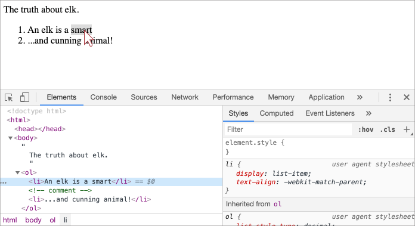
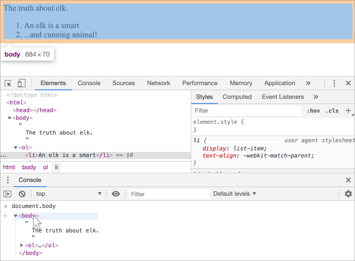

libs:
  - d3
  - domtree

---

# Alberatura DOM

<<<<<<< HEAD
La struttura portante di un documento HTML è rappresentata dai tags
<!-- The backbone of an HTML document are tags. -->

Secondo il Document Object Model (DOM), ogni tag HTML è un oggetto. I tags annidati vengono chiamati "figli" del tag che li racchiude.
<!-- According to Document Object Model (DOM), every HTML-tag is an object. Nested tags are called "children" of the enclosing one. -->

Il testo contenuto nel tag è anch'esso un'oggetto.
<!-- The text inside a tag it is an object as well. -->

Tutti questi oggetti sono accessibili usando JavaScript
<!-- All these objects are accessible using JavaScript. -->
=======
The backbone of an HTML document is tags.

According to the Document Object Model (DOM), every HTML tag is an object. Nested tags are  "children" of the enclosing one. The text inside a tag is an object as well.

All these objects are accessible using JavaScript, and we can use them to modify the page.

For example, `document.body` is the object representing the `<body>` tag.
>>>>>>> fbf443e414097e5a3a41dd1273ef9a4a3230e72c

## Un esempio di DOM

<<<<<<< HEAD
Per esempio, analizziamo il DOM di questo documento:
<!-- For instance, let's explore the DOM for this document: -->
=======
```js run
document.body.style.background = 'red'; // make the background red

setTimeout(() => document.body.style.background = '', 3000); // return back
```

Here we used `style.background` to change the background color of `document.body`, but there are many other properties, such as:

- `innerHTML` -- HTML contents of the node.
- `offsetWidth` -- the node width (in pixels)
- ...and so on.

Soon we'll learn more ways to manipulate the DOM, but first we need to know about its structure.

## An example of the DOM

Let's start with the following simple document:
>>>>>>> fbf443e414097e5a3a41dd1273ef9a4a3230e72c

```html run no-beautify
<!DOCTYPE HTML>
<html>
<head>
  <title>About elk</title>
</head>
<body>
  The truth about elk.
</body>
</html>
```

Il DOM rappresenta l'HTML sotto forma di alberatura di tag. Questo è come appare:

<div class="domtree"></div>

<script>
let node1 = {"name":"HTML","nodeType":1,"children":[{"name":"HEAD","nodeType":1,"children":[{"name":"#text","nodeType":3,"content":"\n    "},{"name":"TITLE","nodeType":1,"children":[{"name":"#text","nodeType":3,"content":"About elk"}]},{"name":"#text","nodeType":3,"content":"\n  "}]},{"name":"#text","nodeType":3,"content":"\n  "},{"name":"BODY","nodeType":1,"children":[{"name":"#text","nodeType":3,"content":"\n  The truth about elk."}]}]}

drawHtmlTree(node1, 'div.domtree', 690, 320);
</script>

```online
Nella figura qui sopra è possibile cliccare sui nodi e i rispettivi figli si apriranno/chiuderanno.
```

<<<<<<< HEAD
I tag sono chiamati *nodi elemento* (o semplicemente elementi). I tag annidati diventano figli dei tag che li contengono. Come risultato abbiamo un albero di elementi: `<html>` è alla radice, abbiamo poi `<head>` e `<body>` che sono i suoi figli, etc.
=======
Every tree node is an object.

Tags are *element nodes* (or just elements) and form the tree structure: `<html>` is at the root, then `<head>` and `<body>` are its children, etc.
>>>>>>> fbf443e414097e5a3a41dd1273ef9a4a3230e72c

Il testo all'interno degli elementi forma dei *nodi testuali*, etichettati come `#text`. Un nodo di testo contiene solo una stringa. Potrebbe non avere figli ed è sempre una foglia dell'albero.

<<<<<<< HEAD
Per esempio, il tag `<title>` contiene il testo `"About elks"`.
=======
For instance, the `<title>` tag has the text `"About elk"`.
>>>>>>> fbf443e414097e5a3a41dd1273ef9a4a3230e72c

Fai caso ai caratteri speciali nei nodi di testo:

- il ritorno a capo: `↵` (conosciuto in JavaScript come `\n`)
- lo spazio: `␣`

<<<<<<< HEAD
Spazi e ritorni a capo sono caratteri assolutamente validi, costituiscono nodi testuali e diventano parte del DOM. Ad esempio, nel caso precedente, il tag `<head>` contiene alcuni spazi prima del `<title>`, e quel testo diventa un nodo `#text` (contiene un ritorno a capo e alcuni spazi).

Esistono solo due particolari eccezioni:
1. Spazi e ritorni a capo prima del tag `<head>` sono ignorati per ragioni storiche.
2. Se inseriamo qualcosa dopo il tag `</body>` questo viene automaticamente spostato dentro il `body`, nella sua parte finale, dato che la specifica HTML richiede che tutto il contenuto sia dentro il `body`. Ecco perché non ci sono spazi dopo il tag `</body>`.

In tutti gli altri casi è molto semplice, se esistono degli spazi (così come ogni altro carattere) nel documento, allora essi diventano nodi testuali nel DOM, e se li rimuoviamo, non esisteranno più.
=======
Spaces and newlines are totally valid characters, like letters and digits. They form text nodes and become a part of the DOM. So, for instance, in the example above the `<head>` tag contains some spaces before `<title>`, and that text becomes a `#text` node (it contains a newline and some spaces only).

There are only two top-level exclusions:
1. Spaces and newlines before `<head>` are ignored for historical reasons.
2. If we put something after `</body>`, then that is automatically moved inside the `body`, at the end, as the HTML spec requires that all content must be inside `<body>`. So there can't be any spaces after `</body>`.

In other cases everything's straightforward -- if there are spaces (just like any character) in the document, then they become text nodes in the DOM, and if we remove them, then there won't be any.
>>>>>>> fbf443e414097e5a3a41dd1273ef9a4a3230e72c

Ecco un esempio in cui non esistono nodi testuali contenenti spazi:

```html no-beautify
<!DOCTYPE HTML>
<html><head><title>About elk</title></head><body>The truth about elk.</body></html>
```

<div class="domtree"></div>

<script>
let node2 = {"name":"HTML","nodeType":1,"children":[{"name":"HEAD","nodeType":1,"children":[{"name":"TITLE","nodeType":1,"children":[{"name":"#text","nodeType":3,"content":"About elk"}]}]},{"name":"BODY","nodeType":1,"children":[{"name":"#text","nodeType":3,"content":"The truth about elk."}]}]}

drawHtmlTree(node2, 'div.domtree', 690, 210);
</script>

```smart header="Gli spazi presenti ai bordi e tra i nodi testuali vuoti sono solitamente nascosti"
Gli strumenti del Browser (ne tratteremo a breve) che lavorano con il DOM non mostrano spazi all'inizio e alla fine del testo e dei nodi testuali vuoti tra più tags.
<!-- Browser tools (to be covered soon) that work with DOM usually do not show spaces at the start/end of the text and empty text nodes (line-breaks) between tags. -->

Questo succede perché essi sono solo dedicati ad abbellire l'HTML e non incidono su come questo viene mostrato (nella maggior parte dei casi).
<!-- That's because they are mainly used to decorate HTML, and do not affect how it is shown (in most cases). -->

Nelle prossime immmagini del DOM ometteremo gli spazi quando irrilevanti.
<!-- On further DOM pictures we'll sometimes omit them where they are irrelevant, to keep things short. -->
```

## Autocorrezione

<<<<<<< HEAD
Se il browser riscontra HTML malformato, lo corregge automaticamente in fase di creazione del DOM.

Ad esempio, il tag di livello più alto è sempre `<html>`. Anche se esso non è presente nel documento esisterà nel DOM, perché il browser lo creerà. Lo stesso vale per il `<body>`.
=======
If the browser encounters malformed HTML, it automatically corrects it when making the DOM.

For instance, the top tag is always `<html>`. Even if it doesn't exist in the document, it will exist in the DOM, because the browser will create it. The same goes for `<body>`.

As an example, if the HTML file is the single word `"Hello"`, the browser will wrap it into `<html>` and `<body>`, and add the required `<head>`, and the DOM will be:
>>>>>>> fbf443e414097e5a3a41dd1273ef9a4a3230e72c

Ipotizziamo che l'HTML sia costituito dalla singola parola `"Hello"`, in questo caso il browser racchiuderà la parola tra il tag `<html>` e `<body>`, aggiungendo inoltre l'obbligatorio tag `<head>`, fino a ottenere:

<div class="domtree"></div>

<script>
let node3 = {"name":"HTML","nodeType":1,"children":[{"name":"HEAD","nodeType":1,"children":[]},{"name":"BODY","nodeType":1,"children":[{"name":"#text","nodeType":3,"content":"Hello"}]}]}

drawHtmlTree(node3, 'div.domtree', 690, 150);
</script>

In fase di generazione del DOM, i browser processeranno automaticamente gli errori chiudendo i tags e via procedendo.

<<<<<<< HEAD
Il seguente documento senza tag di chiusura:
=======
A document with unclosed tags:
>>>>>>> fbf443e414097e5a3a41dd1273ef9a4a3230e72c

```html no-beautify
<p>Hello
<li>Mom
<li>and
<li>Dad
```

<<<<<<< HEAD
... Diventerà un normale DOM non appena il browser leggerà i tags e ripristinerà le parti mancanti:
=======
...will become a normal DOM as the browser reads tags and restores the missing parts:
>>>>>>> fbf443e414097e5a3a41dd1273ef9a4a3230e72c

<div class="domtree"></div>

<script>
let node4 = {"name":"HTML","nodeType":1,"children":[{"name":"HEAD","nodeType":1,"children":[]},{"name":"BODY","nodeType":1,"children":[{"name":"P","nodeType":1,"children":[{"name":"#text","nodeType":3,"content":"Hello"}]},{"name":"LI","nodeType":1,"children":[{"name":"#text","nodeType":3,"content":"Mom"}]},{"name":"LI","nodeType":1,"children":[{"name":"#text","nodeType":3,"content":"and"}]},{"name":"LI","nodeType":1,"children":[{"name":"#text","nodeType":3,"content":"Dad"}]}]}]}

drawHtmlTree(node4, 'div.domtree', 690, 360);
</script>

<<<<<<< HEAD
````warn header="Le tabelle hanno sempre il `<tbody>`"
Un interessante "caso speciale" è quello delle tabelle. Secondo le specifiche DOM le tabelle devono avere il tag `<tbody>`, ma nell'HTML può (ufficialmente) essere omesso. In questo caso il browser creerà il tag nel DOM automaticamente.
=======
````warn header="Tables always have `<tbody>`"
An interesting "special case" is tables. By the DOM specification they must have `<tbody>`, but HTML text may (officially) omit it. Then the browser creates `<tbody>` in the DOM automatically.
>>>>>>> fbf443e414097e5a3a41dd1273ef9a4a3230e72c

Per il seguente HTML:

```html no-beautify
<table id="table"><tr><td>1</td></tr></table>
```

La struttura del DOM sarà così:
<div class="domtree"></div>

<script>
let node5 = {"name":"TABLE","nodeType":1,"children":[{"name":"TBODY","nodeType":1,"children":[{"name":"TR","nodeType":1,"children":[{"name":"TD","nodeType":1,"children":[{"name":"#text","nodeType":3,"content":"1"}]}]}]}]};

drawHtmlTree(node5,  'div.domtree', 600, 200);
</script>

Visto? Il `<tbody>` è apparso dal nulla. Per evitare sorprese, dovresti ricordarti di questa cosa in futuro nel momento in cui ti troverai a lavorare con le tabelle.

## Altre tipologie di nodo

Aggiungiamo ulteriori tags e commenti alla pagina:

```html
<!DOCTYPE HTML>
<html>
<body>
  The truth about elk.
  <ol>
    <li>An elk is a smart</li>
*!*
    <!-- comment -->
*/!*
    <li>...and cunning animal!</li>
  </ol>
</body>
</html>
```

<div class="domtree"></div>

<script>
let node6 = {"name":"HTML","nodeType":1,"children":[{"name":"HEAD","nodeType":1,"children":[]},{"name":"BODY","nodeType":1,"children":[{"name":"#text","nodeType":3,"content":"\n  The truth about elk.\n    "},{"name":"OL","nodeType":1,"children":[{"name":"#text","nodeType":3,"content":"\n      "},{"name":"LI","nodeType":1,"children":[{"name":"#text","nodeType":3,"content":"An elk is a smart"}]},{"name":"#text","nodeType":3,"content":"\n      "},{"name":"#comment","nodeType":8,"content":"comment"},{"name":"#text","nodeType":3,"content":"\n      "},{"name":"LI","nodeType":1,"children":[{"name":"#text","nodeType":3,"content":"...and cunning animal!"}]},{"name":"#text","nodeType":3,"content":"\n    "}]},{"name":"#text","nodeType":3,"content":"\n  \n"}]}]};

drawHtmlTree(node6, 'div.domtree', 690, 500);
</script>

Vediamo ora un nuovo tipo di nodo -- *nodo commento*, etichettato come `#comment`.

Potremmo chiederci -- perché il commento viene aggiunto al DOM? Non incide sul risultato grafico finale. Esiste in realtà una regola -- che se qualcosa è nell'HTML, allora deve essere presente anche nell'alberatura del DOM.

**Tutto ciò che è presente nell'HTML, anche i commenti, finisce per essere parte del DOM.**

Anche la direttiva `<!DOCTYPE...>` all'inizio dell'HTML è un nodo del DOM. Nell'alberatura si trova proprio prima del tag `<html>`. Non andremo a toccare quel nodo, non viene nemmeno rappresentato sui diagrammi, ma esiste.

L'oggetto `document` che rappresenta l'intero documento è anch'esso, formalmente, un nodo del DOM.

In teoria esistono [12 tipologie di nodo](https://dom.spec.whatwg.org/#node), ma solitamente nella pratica si lavora con solo 4 di esse:

1. `document` -- il punto d'ingresso del DOM.
2. nodi elemento -- tags HTML che rappresentano i blocchi con cui costruiamo l'alberatura.
3. nodi testuali -- contengono testo.
4. commenti -- qualche volta possiamo aggiungere informazioni, non verranno mostrate, ma JS potrà leggerle dal DOM.

<<<<<<< HEAD
## Guarda tu stesso
=======
1. `document` -- the "entry point" into DOM.
2. element nodes -- HTML-tags, the tree building blocks.
3. text nodes -- contain text.
4. comments -- sometimes we can put information there, it won't be shown, but JS can read it from the DOM.
>>>>>>> fbf443e414097e5a3a41dd1273ef9a4a3230e72c

Per vedere la struttura del DOM in real-time, prova [Live DOM Viewer](http://software.hixie.ch/utilities/js/live-dom-viewer/). Inizia a scrivere e vedrai istantaneamente le modifiche aggiunte al DOM.

<<<<<<< HEAD
## Nel browser inspector
=======
To see the DOM structure in real-time, try [Live DOM Viewer](http://software.hixie.ch/utilities/js/live-dom-viewer/). Just type in the document, and it will show up as a DOM at an instant.
>>>>>>> fbf443e414097e5a3a41dd1273ef9a4a3230e72c

Un altro modo per esplorare il DOM è usare gli "Strumenti per sviluppatori" del browser. Strumenti che usamo quando sviluppiamo.

<<<<<<< HEAD
Per procedere in questo modo, apri la pagina web [elks.html](elks.html), apri "Strumenti per sviluppatori" e spostati sulla scheda "Elements".
=======
To do so, open the web page [elk.html](elk.html), turn on the browser developer tools and switch to the Elements tab.
>>>>>>> fbf443e414097e5a3a41dd1273ef9a4a3230e72c

Dovrebbe apparire così:


Puoi vedere il DOM, clicca sugli elementi e controlla i loro dettagli.

Nota che la struttura del DOM negli strumenti per sviluppatori è semplificata. I nodi testuali vengono mostrati come semplice testo e non ci sono nemmeno nodi testuali contenenti spazi vuoti. Ma va bene così, a noi interessano solo i nodi elemento.

<<<<<<< HEAD
Cliccando sul bottone <span class="devtools" style="background-position:-328px -124px"></span>, nell'angolo in alto a sinistra, avremo la possibilità di scegliere un nodo della pagina utilizzando il puntatore del mouse (o qualunque altro dispositivo a puntatore) e "ispezionarlo" (salteremo direttamente a visualizzare il nodo nella scheda Elements). Questo procedimento è ottimo nel caso in cui avessimo una pagina HTML gigantesca (con relativo DOM) e fossimo interessati a vedere il posizionamento di un particolare elemento.
=======
Clicking the <span class="devtools" style="background-position:-328px -124px"></span> button in the left-upper corner allows us to choose a node from the webpage using a mouse (or other pointer devices) and "inspect" it (scroll to it in the Elements tab). This works great when we have a huge HTML page (and corresponding huge DOM) and would like to see the place of a particular element in it.
>>>>>>> fbf443e414097e5a3a41dd1273ef9a4a3230e72c

Un altro metodo sarebbe quello di premere con il tasto destro su uno specifico elemento della pagina e cliccare poi su "Ispeziona" dal menù contestuale.



Nella parte destra degli strumenti per sviluppatori troviamo le seguenti schede:
- **Styles** -- possiamo vedere i CSS applicati all'elemento corrente, regola per regola, incluse quelle native (in grigio). Quasi tutto può essere modificato direttamente, incluse le dimensioni/margini/padding del box sottostante.
- **Computed** -- possiamo vedere il CSS applicato all'elemento per proprietà: per ognuna di esse possiamo vedere la regola che lo assegna (inclusa l'ereditarietà del CSS).
- **Event Listeners** -- possiamo vedere gli eventi registrati agli elementi del DOM (li tratteremo nella prossima parte del tutorial).
- ...E così via.

Il miglior modo per studiare è curiosare tra le varie schede e opzioni. La maggior parte dei valori è modificabile direttamente sul posto.

## Interazione con la console

Mano a mano che si procede con l'esplorazione del DOM è anche possibile giocare con un po' di JavaScript. Ad esempio: scegli un nodo ed esegui del codice per modificarlo e vederne il risultato. Alcune dritte per spostarsi tra la scheda "Elements" e la console:

- Seleziona il primo `<li>` nella scheda Elements.
- Premi il tasto `key:Esc` -- si aprirà la console proprio sotto la scheda Elements.

Ora l'ultimo elemento selezionato è disponibile come `$0`, quello precedente come `$1` etc.

Ora possiamo eseguire dei comandi. `$0.style.background = 'red'` colora di rosso lo sfondo dell'elemento selezionato della lista, in questo modo:


Al contrario, se ci troviamo nella console a abbiamo una variabile che referenzia un nodo del DOM, possiamo usare il comando `inspect(node)` per mostrarlo nel pannello Elements.

<<<<<<< HEAD
Oppure possiamo semplicemente mostrarlo nella console, come fatto qui sotto per `document.body`:
=======
Or we can just output the DOM node in the console and explore "in-place", like `document.body` below:
>>>>>>> fbf443e414097e5a3a41dd1273ef9a4a3230e72c



Questo è ovviamente a scopo di debug. Dal prossimo capitolo accederemo e modificheremo il DOM utilizzando JavaScript.

Gli strumenti per sviluppatori disponibili nel browser rappresentano un grosso aiuto nello sviluppo: possiamo navigare il DOM, sperimentare e vedere cosa non funziona.

## Riassunto

Un documento HTML/XML è rappresentato nel browser come un'alberatura DOM.

- I tags diventanto nodi elemento e formano la struttura.
- Il testo diventa nodo testuale.
- ...etc, qualunque cosa presente nell'HTML ha il suo corrispettivo nel DOM, anche i commenti.

È possibile utlizzare gli strumenti per sviluppatori per ispezionare il DOM e modificarlo manualmente.

Con questo terminiamo i concetti base, le azioni più usate e più importanti con cui iniziare. Al sito <https://developers.google.com/web/tools/chrome-devtools> è disponibile una vasta documentazione riguardo i Chrome Developer Tools. Il miglior modo per imparare questi strumenti è cliccare in giro, sperimentare e leggere: la maggior parte delle opzioni sono autoesplicative. Più avanti, una volta appresi i concetti generali, leggi la documentazione e prosegui con il resto.

<<<<<<< HEAD
I nodi del DOM hanno proprietà e metodi che permettono di navigare tra i nodi stessi, modificarli e spostarli all'interno della pagina. Approfondiremo nei prossimi capitoli.
=======
DOM nodes have properties and methods that allow us to travel between them, modify them, move around the page, and more. We'll get down to them in the next chapters.
>>>>>>> fbf443e414097e5a3a41dd1273ef9a4a3230e72c
