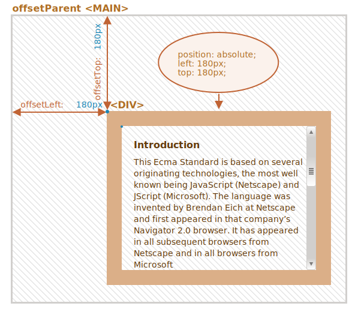
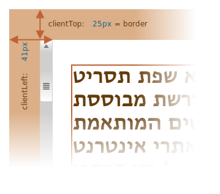
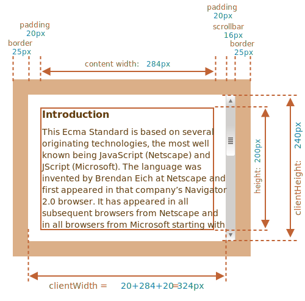

# Dimensioni dell'elemento e barra di scorrimento

Ci sono molte proprietà JavaScript che ci consentono di leggere informazioni circa la larghezza, l'altezza e altre proprietà geometriche di un elemento.

Spesso ne abbiamo bisogno quando spostiamo o posizioniamo gli elementi in JavaScript.

## Esempio dimostrativo

Useremo l'elemento indicato sotto quale esempio di tali proprietà:

```html no-beautify
<div id="example">
  ...Text...
</div>
<style>
  #example {
    width: 300px;
    height: 200px;
    border: 25px solid #E8C48F;
    padding: 20px;
    overflow: auto;
  }
</style>
```

Questo elemento possiede bordi, padding e barra di scorrimento: l'intero insieme delle proprietà. Non ci sono margini, in quanto questi non fanno parte dell'elemento stesso, e non ci sono proprietà speciali.

L'elemento si presenta così:


Potete [visualizzare il documento nella sandbox](sandbox:metric).

```smart header="Prestate attenzione alla barra di scorrimento"
L'immagine sopra rappresenta il caso più complesso, quello in cui l'elemento possiede una barra di scorrimento. Alcuni browser (non tutti) ricavano lo spazio per la barra prendendolo dall'area del contenuto (indicata sopra come "content width").

Senza la barra di scorrimento, pertanto, l'area del contenuto sarebbe `300px`, ma se la barra di scorrimento è larga `16px` (la larghezza è variabile in base al dispositivo ed al browser) allora rimane soltanto `300 - 16 = 284px`, ed è questa la misura che dovremmo tenere in considerazione. Ecco perché gli esempi di questo capitolo presumono che ci sia una barra di scorrimento. Senza questa, alcuni calcoli sarebbero più semplici.
```

```smart header="L'area del `padding-bottom` può essere occupata dal testo"
Di solito gli spazi definiti dai padding sono rappresentati vuoti nelle immagini, ma se nell'elemento c'è molto testo ed eccede l'area del contenuto, in quel caso è normale che il browser mostri il testo eccedente nel `padding-bottom`.
```

## Proprietà geometriche

Ecco un'immagine riassuntiva delle proprietà geometriche:


I valori di tali proprietà sono tecnicamente numerici, ma questi numeri sottintendono l'unità di misura pixel, stiamo parlando quindi delle dimensioni espresse in pixel.

Cominciamo ad esplorare le proprietà partendo dall'esterno dell'elemento.

## offsetParent, offsetLeft/Top

Queste proprietà sono raramente necessarie, ma sono comunque le proprietà geometriche "più esterne" e pertanto cominceremo da esse.

La proprietà `offsetParent` contiene un riferimento all'antenato più vicino, usato dal browser per il calcolo delle coordinate durante il rendering.

L'antenato più vicino è uno dei seguenti:

1. l'elemento contenitore più prossimo posizionato tramite CSS (la cui proprietà `position` sia `absolute`, `relative`, `fixed` o `sticky`),  oppure
2. `<td>`, `<th>`, `<table>`,  oppure
3. `<body>`.

Le proprietà `offsetLeft/offsetTop` forniscono le coordinate x/y relative all'angolo in alto a sinistra di `offsetParent`.

Nell'esempio di seguito il `<div>` interno ha `<main>` come `offsetParent` e `offsetLeft/offsetTop` lo spostano dall'angolo in alto a sinistra di questo (`180`):

```html run height=10
<main style="position: relative" id="main">
  <article>
    <div id="example" style="position: absolute; left: 180px; top: 180px">...</div>
  </article>
</main>
<script>
  alert(example.offsetParent.id); // main
  alert(example.offsetLeft); // 180 (nota: un numero, non una stringa "180px")
  alert(example.offsetTop); // 180
</script>
```



Ci sono alcune circostanze in cui `offsetParent` è `null`:

1. Per gli elementi nascosti (`display:none` oppure non inseriti nel documento).
2. Per `<body>` e `<html>`.
3. Per gli elementi con `position:fixed`.

## offsetWidth/Height

Adesso occupiamoci dell'elemento stesso.

Queste due proprietà sono le più semplici. Forniscono la larghezza e l'altezza "esterne" dell'elemento, o, in altre parole, le sue dimensioni bordi compresi.


In riferimento al nostro esempio:

- `offsetWidth = 390` -- la larghezza esterna, risultante dalla larghezza interna (la proprietà CSS `width` pari a `300px`) più i padding (`2 * 20px`) ed i bordi (`2 * 25px`).
- `offsetHeight = 290` -- l'altezza esterna.

````smart header="Le proprietà geometriche valgono zero/null per gli elementi nascosti"
Le proprietà geometriche sono calcolate solo per gli elementi visibili.

Se un elemento (o uno dei suoi antenati) ha `display:none` o non è nel documento, allora tutte le proprietà geometriche valgono zero (o `null` per `offsetParent`).

<<<<<<< HEAD
Per esempio, `offsetParent` vale `null`, e `offsetWidth`, `offsetHeight` sono `0` quando abbiamo creato un elemento, ma non lo abbiamo ancora inserito nel documento, o esso (o un suo antenato) ha `display:none`.
=======
For example, `offsetParent` is `null`, and `offsetWidth`, `offsetHeight` are `0` when we created an element, but haven't inserted it into the document yet, or it (or its ancestor) has `display:none`.
>>>>>>> 8d9ecb724c7df59774d1e5ffb5e5167740b7d321

Possiamo servirci di questa particolarità per verificare se un elemento è nascosto, in questo modo:

```js
function isHidden(elem) {
  return !elem.offsetWidth && !elem.offsetHeight;
}
```

<<<<<<< HEAD
Si noti che questa funzione `isHidden` restituisce `true` anche per gli elementi che sono presenti sullo schermo, ma hanno dimensioni pari a zero (come un `<div>` vuoto).
=======
Please note that such `isHidden` returns `true` for elements that are on-screen, but have zero sizes.
>>>>>>> 8d04d0d2db97276dbb2b451c30a7bd3e05d65831
````

## clientTop/Left

I bordi fanno parte dell'elemento.

Per misurarli abbiamo a disposizione le proprietà `clientTop` e `clientLeft`.

Nel nostro esempio:

- `clientLeft = 25` -- larghezza bordo sinistro
- `clientTop = 25` -- larghezza bordo superiore


...ma per essere precisi, queste proprietà non indicano la dimensione del bordo, piuttosto le coordinate relative del lato interno rispetto al lato esterno.

Qual è la differenza?

La differenza è percepibile quando il testo del documento è da destra verso sinistra (se il sistema operativo è in lingua araba o ebraica). In quel caso la barra di scorrimento non è a destra, ma a sinistra, e quindi `clientLeft` include anche la larghezza della barra.

In questa ipotesi `clientLeft` non sarebbe `25`, ma, considerata la larghezza della barra di scorrimento, sarebbe `25 + 16 = 41`.

A seguire l'esempio in ebraico:



## clientWidth/Height

Queste proprietà forniscono la dimensione dell'area dentro i bordi dell'elemento.

Includono l'area del contenuto ed i padding ma non la barra di scorrimento:



Nell'immagine sopra soffermiamo prima l'attenzione su `clientHeight`.

Non c'è una barra di scorrimento orizzontale, pertanto equivale esattamente alla somma di quanto è compreso tra i bordi: la misura dell'altezza espressa nei CSS `200px` più il padding superiore e quello inferiore (`2 * 20px`) per un totale di `240px`.

Esaminiamo ora `clientWidth`, in questo caso l'area del contenuto non coincide con i `300px` espressi nei CSS, ma è `284px`, perché la barra di scorrimento occupa `16px`. La somma è quindi `284px` più i padding sinistro e destro, per un totale di `324px`.

**Se non ci sono padding, allora `clientWidth/Height` coincidono esattamente con l'area del contenuto (content width) all'interno dei bordi e delle barre di scorrimento (se presenti).**


In assenza di padding, dunque, possiamo usare `clientWidth/clientHeight` per ricavare la dimensione dell'area del contenuto.

## scrollWidth/Height

Queste proprietà sono come `clientWidth/clientHeight`, ma includono anche le parti (non visibili) fuori dall'area di scorrimento:


Nell'immagine sopra:

- `scrollHeight = 723` -- è l'intera altezza del contenuto, include le parti fuori dall'area visibile di scorrimento.
- `scrollWidth = 324` -- è l'intera larghezza, dal momento che non c'è barra di scorrimento orizzontale equivale a `clientWidth`.

Possiamo servirci di queste proprietà per espandere l'elemento fino alla sua larghezza/altezza completa.

In questo modo:

```js
// espande l'elemento fino alla sua altezza completa
element.style.height = `${element.scrollHeight}px`;
```

```online
Premi il pulsante per espandere l'elemento:

<div id="element" style="width:300px;height:200px; padding: 0;overflow: auto; border:1px solid black;">text text text text text text text text text text text text text text text text text text text text text text text text text text text text text text text text text text text text text text text text text text text text text text text text text text text text text text text text text text text text text text text text text text text text text text text text text text text text text text text text text text text text text text text text text text text text text text text text text text text text text text text text text text text text text text text text text text text text text text text text text text text text text text text text text text text text text text text text text text text text</div>

<button style="padding:0" onclick="element.style.height = `${element.scrollHeight}px`">element.style.height = `${element.scrollHeight}px`</button>
```

## scrollLeft/scrollTop

Le proprietà `scrollLeft/scrollTop` sono la larghezza/altezza delle parti di un elemento nascoste e fuori dall'area visibile di scorrimento.

Nell'immagine sotto possiamo osservare la rappresentazione di `scrollHeight` e `scrollTop` per un blocco soggetto a scorrimento verticale.


In altre parole, con `scrollTop` si intende "quanto l'elemento è stato fatto scorrere verso l'alto".

````smart header="`scrollLeft/scrollTop` possono essere modificate"
La maggior parte delle proprietà geometriche trattate sono in sola lettura, ma `scrollLeft/scrollTop` possono essere modificate, e il browser farà scorrere il contenuto.

```online
Nell'elemento sottostante ogni clic esegue il codice `elem.scrollTop += 10`. Ciò comporta lo scorrimento del contenuto verso il basso di `10px`.

<div onclick="this.scrollTop+=10" style="cursor:pointer;border:1px solid black;width:100px;height:80px;overflow:auto">Click<br>Me<br>1<br>2<br>3<br>4<br>5<br>6<br>7<br>8<br>9</div>
```

Impostare `scrollTop` a `0` o su un grande valore, come `1e9`, farà sì che l'elemento scorrerà rispettivamente verso l'estremità superiore o inferiore.
````

## Non ricavare la larghezza o l'altezza dai CSS

Abbiamo appena trattato le proprietà geometriche degli elementi DOM che usiamo per ricavare larghezza, altezza e per calcolare le distanze.

Ma come abbiamo imparato dal capitolo <info:styles-and-classes>, possiamo ottenere la larghezza e l'altezza CSS tramite `getComputedStyle`.

Dunque, perché non leggere la larghezza di un elemento con `getComputedStyle` in questo modo?

```js run
let elem = document.body;

alert( getComputedStyle(elem).width ); // mostra la larghezza CSS per elem
```

Perché invece dovremmo usare le proprietà geometriche? Ci sono due ragioni:

1. La prima, le proprietà CSS `width/height` dipendono da un'altra proprietà: `box-sizing` che definisce "cosa siano" la larghezza e l'altezza CSS. Una modifica in `box-sizing` per scopi riguardanti i CSS possono rompere un JavaScript che fa affidamento su questa.
2. La seconda, le proprietà CSS `width/height` possono valere `auto`, ad esempio per un elemento inline:

    ```html run
    <span id="elem">Hello!</span>

    <script>
    *!*
      alert( getComputedStyle(elem).width ); // auto
    */!*
    </script>
    ```

    Dal punto di vista dei CSS, `width:auto` è perfettamente normale, ma in JavaScript abbiamo bisogno di un'esatta dimensione in `px` da usare nei calcoli. In questo caso, quindi, la larghezza CSS è inutile.

Ma c'è un'altra ragione: la barra di scorrimento. Talvolta un codice che funziona bene senza barra di scorrimento, con questa diventa difettoso, perché la barra di scorrimento su alcuni browser ricava il suo spazio dall'area del contenuto. La larghezza effettiva per il contenuto, dunque, è *minore* della larghezza CSS e `clientWidth/clientHeight` ne tengono conto.

...Ma con `getComputedStyle(elem).width` la situazione è differente. Alcuni browser (es. Chrome) restituiscono la larghezza interna effettiva, meno la barra di scorrimento, mentre altri (es. Firefox) la larghezza CSS (ignorando la barra di scorrimento). Queste inconsistenze cross-browser costituiscono il motivo per il quale non usare `getComputedStyle` ma piuttosto fare affidamento sulle proprietà geometriche.

```online
Se il tuo browser ricava lo spazio per la barra di scorrimento dall'area del contenuto (la maggior parte dei browser per Windows lo fa), allora puoi testarlo qui di seguito.

[iframe src="cssWidthScroll" link border=1]

L'elemento con il testo ha una dichiarazione CSS `width:300px`.

Sul sistema operativo Windows i browser Firefox, Chrome, Edge ricavano lo spazio per la barra di scorrimento allo stesso modo. Ma Firefox mostra `300px`, mentre Chrome e Edge mostrano un valore minore. Questo perché Firefox restituisce la larghezza CSS e gli altri browser restituiscono la larghezza "reale".
```
Si noti che la discrepanza descritta riguarda solo la lettura di `getComputedStyle(...).width` tramite JavaScript, dal punto di vista visuale non ci sono differenze.

## Riepilogo

Gli elementi hanno le seguenti proprietà geometriche:

- `offsetParent` -- è l'antenato più vicino posizionato (cioè con proprietà `position` diversa da `static`), oppure `td`, `th`, `table`, `body`.
- `offsetLeft/offsetTop` -- le coordinate relative all'angolo in alto a sinistra di `offsetParent`.
- `offsetWidth/offsetHeight` -- la larghezza/altezza "esterne" di un elemento bordi inclusi.
- `clientLeft/clientTop` -- le distanze dell'angolo esterno superiore sinistro dall'angolo interno (contenuto + padding) superiore sinistro. Per le lingue da sinistra verso destra corrispondono sempre alla larghezza dei bordi superiore e sinistro. Per le lingue da destra verso sinistra la barra di scorrimento verticale è a sinistra, quindi `clientLeft` include anche la larghezza della barra.
- `clientWidth/clientHeight` -- la larghezza/altezza del contenuto, padding inclusi ma senza la barra di scorrimento.
- `scrollWidth/scrollHeight` -- la larghezza/altezza del contenuto, proprio come `clientWidth/clientHeight`, ma comprende anche la parte di un elemento nascosta e fuori dall'area visibile di scorrimento.
- `scrollLeft/scrollTop` -- la larghezza/altezza della parte superiore di un elemento fuori dall'area visibile di scorrimento, partendo dal suo angolo in alto a sinistra.

Tutte le proprietà sono in sola lettura tranne `scrollLeft/scrollTop` che, se modificate, fanno scorrere il contenuto nel browser.
