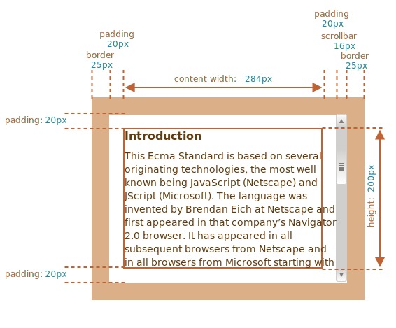
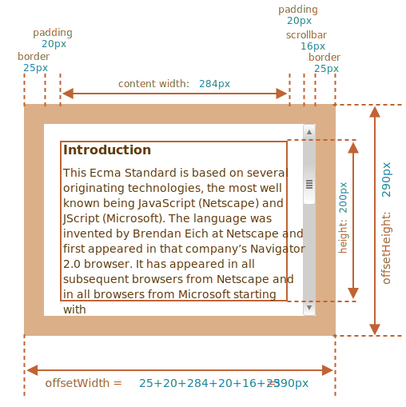

# Dimensioni dell'elemento e barra di scorrimento

Ci sono molte proprietà JavaScript che ci consentono di leggere informazioni circa la larghezza, l'altezza di un elemento e le altre caratteristiche geometriche.

Spesso ne abbiamo bisogno quando spostiamo o posizioniamo gli elementi in JavaScript.

## Esempio dimostrativo

Useremo l'elemento indicato a seguire quale esempio di tali proprietà:

```html no-beautify
<div id="example">
  ...Text...
</div>
<style>
  #example {
    width: 300px;
    height: 200px;
    border: 25px solid #E8C48F;
    padding: 20px;              
    overflow: auto;             
  }
</style>
```

Questo elemento possiede bordi, padding e barra di scorrimento: l'intero insieme delle proprietà. Non ci sono margini, in quanto questi non fanno parte dell'elemento stesso, e non ci sono proprietà speciali.

L'elemento si presenta così:



Potete [visualizzare il documento nella sandbox](sandbox:metric).

```smart header="Prestate attenzione alla barra di scorrimento"
L'immagine sopra rappresenta il caso più complesso in cui l'elemento ha una barra di scorrimento. Alcuni browser (non tutti) ricavano lo spazio per la barra prendendolo dall'area del contenuto (indicata sopra come "content width").

Senza la barra di scorrimento, pertanto, l'area del contenuto sarebbe `300px`, ma se la barra di scorrimento è larga `16px` (la larghezza è variabile in base al dispositivo ed al browser) allora rimane soltanto `300 - 16 = 284px`, ed è questa la misura che dovremmo tenere in considerazione. Ecco perché gli esempi di questo capitolo presumono che ci sia una barra di scorrimento. Senza questa, alcuni calcoli sono più semplici.
```

```smart header="L'area del `padding-bottom` può essere riempita dal testo"
Di solito gli spazi definiti dai padding sono rappresentati vuoti nelle immagini, ma se nell'elemento c'è molto testo ed eccede l'area del contenuto, in quel caso è normale che il browser mostri il testo eccedente nel `padding-bottom`.
```

## Proprietà geometriche

Ecco un'immagine riassuntiva delle proprietà geometriche:


I valori di tali proprietà sono tecnicamente numerici, ma questi numeri sottintendono l'unità di misura pixel, stiamo parlando quindi delle dimensioni espresse in pixel.

Cominciamo ad esplorare le proprietà partendo dall'esterno dell'elemento.

## offsetParent, offsetLeft/Top

Queste proprietà sono raramente necessarie, ma sono comunque le proprietà geometriche "più esterne" e pertanto cominceremo da esse.

La proprietà `offsetParent` contiene un riferimento all'antenato più vicino, usato dal browser per il calcolo delle coordinate durante il rendering.

L'antenato più vicino è uno dei seguenti:

1. l'elemento contenitore più prossimo posizionato tramite CSS (la cui proprietà `position` sia `absolute`, `relative`, `fixed` o `sticky`),  oppure
2. `<td>`, `<th>`, `<table>`,  oppure
3. `<body>`.

Le proprietà `offsetLeft/offsetTop` forniscono le coordinate x/y relative all'angolo in alto a sinistra di `offsetParent`.

Nell'esempio di seguito il `<div>` interno ha `<main>` come `offsetParent` e `offsetLeft/offsetTop` lo spostano dall'angolo in alto a sinistra di questo (`180`):

```html run height=10
<main style="position: relative" id="main">
  <article>
    <div id="example" style="position: absolute; left: 180px; top: 180px">...</div>
  </article>
</main>
<script>
  alert(example.offsetParent.id); // main
  alert(example.offsetLeft); // 180 (nota: un numero, non una stringa "180px")
  alert(example.offsetTop); // 180
</script>
```


Ci sono alcune circostanze in cui `offsetParent` è `null`:

1. Per gli elementi nascosti (`display:none` oppure non inserito nel documento).
2. Per `<body>` e `<html>`.
3. Per gli elementi con `position:fixed`.

## offsetWidth/Height

Adesso occupiamoci dell'elemento stesso.

Queste due proprietà sono le più semplici. Forniscono la larghezza e l'altezza "esterne" dell'elemento, o, in altre parole, le sue dimensioni bordi compresi.



In riferimento al nostro esempio:

- `offsetWidth = 390` -- la larghezza esterna, risultante dalla larghezza interna (la proprietà CSS `width` pari a `300px`) più i padding (`2 * 20px`) ed i bordi (`2 * 25px`).
- `offsetHeight = 290` -- l'altezza esterna.

````smart header="Le proprietà geometriche valgono zero/null per gli elementi nascosti"
Le proprietà geometriche sono calcolate solo per gli elementi visibili.

Se un elemento (o uno dei suoi antenati) ha `display:none` o non è nel documento, allora tutte le proprietà geometriche valgono zero (o `null` per `offsetParent`).

Per esempio, `offsetParent` vale `null`, e `offsetWidth`, `offsetHeight` sono `0` quando abbiamo creato un elemento, ma non lo abbiamo ancora inserito nel documento, o esso (o un suo antenato) ha `display:none`.

Possiamo servirci di questa particolarità per verificare se un elemento è nascosto, in questo modo:

```js
function isHidden(elem) {
  return !elem.offsetWidth && !elem.offsetHeight;
}
```

Si noti che questa funzione `isHidden` restituisce `true` anche per gli elementi che sono presenti sullo schermo, ma hanno dimensioni pari a zero (come un `<div>` vuoto).
````

## clientTop/Left

I bordi fanno parte dell'elemento.

Per misurarli abbiamo a disposizione le proprietà `clientTop` e `clientLeft`.

Nel nostro esempio:

- `clientLeft = 25` -- larghezza bordo sinistro
- `clientTop = 25` -- larghezza bordo superiore


...ma per essere precisi, queste proprietà non indicano la dimensione del bordo, piuttosto le coordinate relative del lato interno rispetto al lato esterno.

Qual è la differenza?

La differenza è percepibile quando il testo del documento è da destra verso sinistra (se il sistema operativo è in lingua araba o ebraica). In quel caso la barra di scorrimento non è a destra, ma a sinistra, e quindi `clientLeft` include anche la larghezza della barra.

In questa ipotesi `clientLeft` non sarebbe `25`, ma, considerata la larghezza della barra di scorrimento, sarebbe `25 + 16 = 41`.

A seguire l'esempio in ebraico:


## clientWidth/Height

Queste proprietà forniscono la dimensione dell'area dentro i bordi dell'elemento.

Includono l'area del contenuto ed i padding ma non la barra di scorrimento:


Nell'immagine sopra soffermiamo prima l'attenzione su `clientHeight`.

Non c'è una barra di scorrimento orizzontale, pertanto equivale esattamente alla somma di quanto è compreso tra i bordi: la misura dell'altezza espressa nei CSS `200px` più il padding superiore e quello inferiore (`2 * 20px`) per un totale di `240px`.

Esaminiamo ora `clientWidth`, in questo caso l'area del contenuto non coincide con i `300px` espressi nei CSS, ma è `284px`, perché la barra di scorrimento occupa `16px`. La somma è quindi `284px` più i padding sinistro e destro, per un totale di `324px`.

**Se non ci sono padding, allora `clientWidth/Height` coincidono esattamente con l'area del contenuto (content width) all'interno dei bordi e delle barre di scorrimento (se presenti).**


In assenza di padding, dunque, possiamo usare `clientWidth/clientHeight` per ricavare la dimensione dell'area del contenuto.

## scrollWidth/Height

Queste proprietà sono come `clientWidth/clientHeight`, ma includono anche le parti nascoste dallo scorrimento:


On the picture above:

- `scrollHeight = 723` -- is the full inner height of the content area including the scrolled out parts.
- `scrollWidth = 324` -- is the full inner width, here we have no horizontal scroll, so it equals `clientWidth`.

We can use these properties to expand the element wide to its full width/height.

Like this:

```js
// expand the element to the full content height
element.style.height = `${element.scrollHeight}px`;
```

```online
Click the button to expand the element:

<div id="element" style="width:300px;height:200px; padding: 0;overflow: auto; border:1px solid black;">text text text text text text text text text text text text text text text text text text text text text text text text text text text text text text text text text text text text text text text text text text text text text text text text text text text text text text text text text text text text text text text text text text text text text text text text text text text text text text text text text text text text text text text text text text text text text text text text text text text text text text text text text text text text text text text text text text text text text text text text text text text text text text text text text text text text text text text text text text text text</div>

<button style="padding:0" onclick="element.style.height = `${element.scrollHeight}px`">element.style.height = `${element.scrollHeight}px`</button>
```

## scrollLeft/scrollTop

Properties `scrollLeft/scrollTop` are the width/height of the hidden, scrolled out part of the element.

On the picture below we can see `scrollHeight` and `scrollTop` for a block with a vertical scroll.


In other words, `scrollTop` is "how much is scrolled up".

````smart header="`scrollLeft/scrollTop` can be modified"
Most of the geometry properties here are read-only, but `scrollLeft/scrollTop` can be changed, and the browser will scroll the element.

```online
If you click the element below, the code `elem.scrollTop += 10` executes. That makes the element content scroll `10px` down.

<div onclick="this.scrollTop+=10" style="cursor:pointer;border:1px solid black;width:100px;height:80px;overflow:auto">Click<br>Me<br>1<br>2<br>3<br>4<br>5<br>6<br>7<br>8<br>9</div>
```

Setting `scrollTop` to `0` or a big value, such as `1e9` will make the element scroll to the very top/bottom respectively.
````

## Don't take width/height from CSS

We've just covered geometry properties of DOM elements, that can be used to get widths, heights and calculate distances.

But as we know from the chapter <info:styles-and-classes>, we can read CSS-height and width using `getComputedStyle`.

So why not to read the width of an element with `getComputedStyle`, like this?

```js run
let elem = document.body;

alert( getComputedStyle(elem).width ); // show CSS width for elem
```

Why should we use geometry properties instead? There are two reasons:

1. First, CSS `width/height` depend on another property: `box-sizing` that defines "what is" CSS width and height. A change in `box-sizing` for CSS purposes may break such JavaScript.
2. Second, CSS `width/height` may be `auto`, for instance for an inline element:

    ```html run
    <span id="elem">Hello!</span>

    <script>
    *!*
      alert( getComputedStyle(elem).width ); // auto
    */!*
    </script>
    ```

    From the CSS standpoint, `width:auto` is perfectly normal, but in JavaScript we need an exact size in `px` that we can use in calculations. So here CSS width is useless.

And there's one more reason: a scrollbar. Sometimes the code that works fine without a scrollbar becomes buggy with it, because a scrollbar takes the space from the content in some browsers. So the real width available for the content is *less* than CSS width. And `clientWidth/clientHeight` take that into account.

...But with `getComputedStyle(elem).width` the situation is different. Some browsers (e.g. Chrome) return the real inner width, minus the scrollbar, and some of them (e.g. Firefox) -- CSS width (ignore the scrollbar). Such cross-browser differences is the reason not to use `getComputedStyle`, but rather rely on geometry properties.

```online
If your browser reserves the space for a scrollbar (most browsers for Windows do), then you can test it below.

[iframe src="cssWidthScroll" link border=1]

The element with text has CSS `width:300px`.

On a Desktop Windows OS, Firefox, Chrome, Edge all reserve the space for the scrollbar. But  Firefox shows `300px`, while Chrome and Edge show less. That's because Firefox returns the CSS width and other browsers return the "real" width.
```

Please note that the described difference is only about reading `getComputedStyle(...).width` from JavaScript, visually everything is correct.

## Summary

Elements have the following geometry properties:

- `offsetParent` -- is the nearest positioned ancestor or `td`, `th`, `table`, `body`.
- `offsetLeft/offsetTop` -- coordinates relative to the upper-left edge of `offsetParent`.
- `offsetWidth/offsetHeight` -- "outer" width/height of an element including borders.
- `clientLeft/clientTop` -- the distances from the upper-left outer corner to the upper-left inner (content + padding) corner. For left-to-right OS they are always the widths of left/top borders. For right-to-left OS the vertical scrollbar is on the left so `clientLeft` includes its width too.
- `clientWidth/clientHeight` -- the width/height of the content including paddings, but without the scrollbar.
- `scrollWidth/scrollHeight` -- the width/height of the content, just like `clientWidth/clientHeight`, but also include scrolled-out, invisible part of the element.
- `scrollLeft/scrollTop` -- width/height of the scrolled out upper part of the element, starting from its upper-left corner.

All properties are read-only except `scrollLeft/scrollTop` that make the browser scroll the element if changed.
