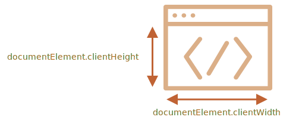

# Dimensioni e scorrimento della finestra del browser

Come scoprire la larghezza e l'altezza della finestra del browser? Come ricavare la larghezza e l'altezza totali del documento, incluse le parti fuori dall'area visibile di scorrimento? Come far scorrere la pagina tramite JavaScript?

Per questo genere di informazioni possiamo utilizzare l'elemento radice del documento `document.documentElement`, che corrisponde al tag `<html>`. Ci sono, tuttavia, ulteriori metodi e peculiarità da considerare.

## Larghezza e altezza della finestra

Per ottenere la larghezza e l'altezza della finestra, possiamo far uso delle proprietà `clientWidth/clientHeight` di `document.documentElement`:



```online
Ad esempio questo pulsante mostra l'altezza della tua finestra:

<button onclick="alert(document.documentElement.clientHeight)">alert(document.documentElement.clientHeight)</button>
```

````warn header="Non usare `window.innerWidth/innerHeight`"
I browser supportano inoltre proprietà come `window.innerWidth/innerHeight`. Sembra che facciano al nostro caso, quindi perché non usare queste?

Se esiste una barra di scorrimento ed occupa uno spazio, `clientWidth/clientHeight` forniscono la larghezza e l'altezza al netto della barra (la sottraggono). In altre parole restituiscono le dimensioni della parte visibile del documento disponibile per il contenuto.

Le proprietà `window.innerWidth/innerHeight` includono invece la barra di scorrimento.

Se la barra di scorrimento è presente ed occupa uno spazio, allora queste due linee di codice mostreranno dei valori differenti:
```js run
alert( window.innerWidth ); // larghezza della finestra comprensiva di barra di scorrimento
alert( document.documentElement.clientWidth ); // larghezza della finestra barra esclusa
```

Nella maggior parte dei casi abbiamo bisogno della larghezza della finestra *disponibile* per disegnare o posizionare qualcosa all'interno delle barre di scorrimento (se presenti), quindi dovremmo usare `documentElement.clientHeight/clientWidth`.
````

```warn header="Il `DOCTYPE` è importante"
Si noti che le proprietà geometriche ad alto livello possono funzionare in modo leggermente differente se non c'è `<!DOCTYPE HTML>` nell'HTML. Si potrebbero verificare comportamenti imprevedibili.

Nell'HTML moderno dovremmo sempre indicare il `DOCTYPE`.
```

## Larghezza e altezza del documento

Teoricamente, poiché l'elemento radice del documento è `document.documentElement` e racchiude tutto il contenuto, potremmo misurare le dimensioni totali del documento con `document.documentElement.scrollWidth/scrollHeight`.

Ma su questo elemento, per l'intera pagina, queste proprietà non funzionano come dovrebbero. In Chrome/Safari/Opera, nel caso in cui non ci sia barra di scorrimento, `documentElement.scrollHeight` può essere anche minore di `documentElement.clientHeight`! Strano, no?

Per ottenere l'altezza totale del documento in modo affidabile, dovremmo scegliere il valore maggiore tra queste proprietà:

```js run
let scrollHeight = Math.max(
  document.body.scrollHeight, document.documentElement.scrollHeight,
  document.body.offsetHeight, document.documentElement.offsetHeight,
  document.body.clientHeight, document.documentElement.clientHeight
);

alert("Altezza totale del documento, compresa la parte fuori dall'area visibile di scorrimento: " + scrollHeight);
```

Perché così? Meglio non chiedere. Queste incongruenze derivano da tempi lontani, non c'è alcuna logica.

## Ottenere il valore corrente di scorrimento [#page-scroll]

Gli elementi DOM memorizzano lo stato corrente dei loro valori di scorrimento nelle proprietà `scrollLeft/scrollTop`.

Per lo scorrimento del documento, `document.documentElement.scrollLeft/scrollTop` funzionano sulla maggioranza dei browser, ad eccezione di quelli più vecchi basati su WebKit, come Safari (bug [5991](https://bugs.webkit.org/show_bug.cgi?id=5991)), dove dovremmo usare `document.body` al posto di `document.documentElement`.

Fortunatamente, non dobbiamo ricordare affatto queste peculiarità, perché lo scorrimento del documento è disponibile anche nelle speciali proprietà `window.pageXOffset/pageYOffset`:

```js run
alert("Scorrimento corrente dall'alto: " + window.pageYOffset);
alert('Scorrimento corrente da sinistra: ' + window.pageXOffset);
```

Queste proprietà sono in sola lettura.

## Lo scorrimento con scrollTo, scrollBy, scrollIntoView [#window-scroll]

```warn
Per scorrere la pagina con JavaScript, il DOM deve essere stato completamente elaborato.

Se proviamo, ad esempio, a scorrere la pagina con uno script nella sezione `<head>`, non funzionerà.
```

I normali elementi possono essere fatti scorrere modificando `scrollTop/scrollLeft`.

Possiamo applicare lo stesso principio per la pagina usando `document.documentElement.scrollTop/scrollLeft` (tranne che per Safari, con il quale dovremmo usare invece `document.body.scrollTop/Left`).

In alternativa, c'è una soluzione più semplice ed universale: i metodi speciali [window.scrollBy(x,y)](mdn:api/Window/scrollBy) e [window.scrollTo(pageX,pageY)](mdn:api/Window/scrollTo).

- Il metodo `scrollBy(x,y)` scorre la pagina *in base alla sua posizione corrente*. Per esempio, `scrollBy(0,10)` scorre la pagina di `10px` in basso.

    ```online
    Il pulsante in basso dimostra quanto appena affermato:

    <button onclick="window.scrollBy(0,10)">window.scrollBy(0,10)</button>
    ```
- Il metodo `scrollTo(pageX,pageY)` scorre la pagina *in base alle coordinate assolute*, di modo che l'angolo superiore sinistro della parte visibile abbia le coordinate `(pageX, pageY)` relative all'angolo superiore sinistro del documento. Di fatto, è come agire sulle proprietà `scrollLeft/scrollTop`.

    Per scorrere fino all'inizio possiamo usare `scrollTo(0,0)`.

    ```online
    <button onclick="window.scrollTo(0,0)">window.scrollTo(0,0)</button>
    ```

Questi metodo godono di un supporto universale da parte di tutti i browser.

## scrollIntoView

Per completezza trattiamo anche il metodo [elem.scrollIntoView(top)](mdn:api/Element/scrollIntoView).

L'esecuzione di `elem.scrollIntoView(top)` scorre la pagina in modo da rendere visibile `elem`. Ha un solo argomento:

- Se `top=true` (è il valore predefinito), allora la pagina sarà fatta scorrere in modo che `elem` appaia nella parte alta della finestra. Il bordo superiore dell'elemento sarà allineato con la parte superiore della finestra.
- Se `top=false`, allora la pagina scorre così che `elem` appaia in basso. Il bordo inferiore dell'elemento sarà allineato con il bordo inferiore della finestra.

```online
Il pulsante in basso scorre la pagina in modo da allinearsi con il bordo superiore della finestra:

<button onclick="this.scrollIntoView()">this.scrollIntoView()</button>

Questo pulsante, invece, si allinea con il bordo inferiore:

<button onclick="this.scrollIntoView(false)">this.scrollIntoView(false)</button>
```

## Impedire lo scorrimento

Talvolta si pone la necessità di impedire lo scorrimento del documento. Per esempio in presenza di un messaggio che ricopre l'intera larghezza della pagina e che richiede immediata attenzione. In quel caso desideriamo che il visitatore interagisca prima con quel messaggio, non con il documento.

Per impedire lo scorrimento, è sufficiente ricorrere a `document.body.style.overflow = "hidden"`. La pagina rimarrà "congelata" nella sua posizione corrente di scorrimento.

```online
Prova:

<button onclick="document.body.style.overflow = 'hidden'">document.body.style.overflow = 'hidden'</button>

<button onclick="document.body.style.overflow = ''">document.body.style.overflow = ''</button>

Il primo pulsante congela lo scorrimento, il secondo invece lo ripristina.
```

Possiamo usare la stessa tecnica per congelare lo scorrimento anche di altri elementi, non solo di `document.body`.

L'inconveniente di questo approccio è che scompare la barra di scorrimento. Se questa occupava uno spazio, allora quello spazio si libererà ed il contenuto si adatterà bruscamente per riempirlo.

Può sembrare un po' strano, ma possiamo aggirare il problema se mettiamo a paragone il valore di `clientWidth` prima e dopo il congelamento. Se aumenta (la barra di scorrimento è scomparsa), allora aggiungiamo `padding` a `document.body` al posto della barra per mantenere la larghezza del contenuto inalterata.

## Riepilogo

Proprietà geometriche:

- Larghezza/altezza della parte visibile del documento (larghezza/altezza dell'area del contenuto): `document.documentElement.clientWidth/clientHeight`
- Larghezza/altezza dell'intero documento, comprese le parti fuori dall'area visibile di scorrimento:

    ```js
    let scrollHeight = Math.max(
      document.body.scrollHeight, document.documentElement.scrollHeight,
      document.body.offsetHeight, document.documentElement.offsetHeight,
      document.body.clientHeight, document.documentElement.clientHeight
    );
    ```

Scorrimento:

- Legge il valore di scorrimento corrente: `window.pageYOffset/pageXOffset`.
- Modifica il valore di scorrimento corrente:

    - `window.scrollTo(pageX,pageY)` -- scorre la pagina in base a coordinate assolute,
    - `window.scrollBy(x,y)` -- scorre la pagina in base alla sua posizione corrente,
    - `elem.scrollIntoView(top)` -- scorre la pagina per rendere visibile `elem` (allineato al bordo superiore o inferiore della finestra).
