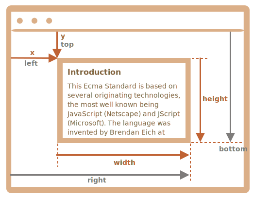

# Coordinate

Per spostare gli elementi dovremmo avere familiarità con le coordinate.

La gran parte dei metodi JavaScript ha a che fare con uno di questi due sistemi di coordinate:

1. **Coordinate relative alla finestra** - paragonabili a `position:fixed`, calcolate dal bordo superiore sinistro della finestra.
    - indicheremo queste coordinate con `clientX/clientY`, il ragionamento per tale nome diventerà evidente in seguito, quando studieremo le proprietà degli eventi.
2. **Coordinate relative al documento** - paragonabili a `position:absolute` riferito alla radice del documento, calcolate dal bordo superiore sinistro del documento.
    - le indicheremo con `pageX/pageY`.

Quando la pagina è al suo inizio, così che l'angolo superiore sinistro della finestra coincide esattamente con l'angolo superiore sinistro del documento, queste coordinate sono uguali tra loro. Ma dopo che si scorre la pagina, le coordinate relative alla finestra cambiano via via che gli elementi si spostano all'interno di questa, mentre le coordinate relative al documento rimangono invariate.

In questa immagine consideriamo un punto nel documento e mostriamo le sue coordinate prima dello scorrimento (riquadro a sinistra) e dopo di esso (riquadro a destra):


Quando il documento scorre:
- `pageY` - la coordinata relativa al documento non cambia, si prende a riferimento la parte superiore del documento (che ora fuori dall'area visibile di scorrimento).
- `clientY` - la coordinata relativa alla finestra è cambiata (la freccia è diventata più corta), dal momento che lo stesso punto è più vicino al bordo superiore della finestra.

## Le coordinate di un elemento: getBoundingClientRect

Il metodo `elem.getBoundingClientRect()` restituisce le coordinate relative alla finestra del rettangolo minimo che racchiude `elem` come oggetto della classe nativa [DOMRect](https://www.w3.org/TR/geometry-1/#domrect).

Ecco le principali proprietà di `DOMRect`:

- `x/y` -- le coordinate X/Y dell'origine rettangolo relative alla finestra,
- `width/height` -- larghezza/altezza del rettangolo (possono avere valori negativi).

Ci sono, inoltre, proprietà derivate:

- `top/bottom` -- la coordinata Y per i bordi superiore/inferiore del rettangolo,
- `left/right` -- la coordinata X per i bordi sinistro/destro del rettangolo.

```online
Clicca, per esempio, su questo pulsante per conoscere le sue coordinate relative alla finestra:

<p><input id="brTest" type="button" value="Ottieni le coordinate utilizzando button.getBoundingClientRect() per questo pulsante" onclick='showRect(this)'/></p>

<script>
function showRect(elem) {
  let r = elem.getBoundingClientRect();
  alert(`x:${r.x}
y:${r.y}
width:${r.width}
height:${r.height}
top:${r.top}
bottom:${r.bottom}
left:${r.left}
right:${r.right}
`);
}
</script>

Se scorrete la pagina e ripetete il test, noterete che quando cambia la posizione relativa alla finestra del pulsante, cambiano anche le sue coordinate relative alla finestra (`y/top/bottom` se scorri verticalmente).
```

Di seguito un'immagine descrittiva dell'output di `elem.getBoundingClientRect()`:



Come potete osservare, `x/y` e `width/height` descrivono pienamente il rettangolo. A partire da queste si possono calcolare agevolmente le proprietà derivate:

- `left = x`
- `top = y`
- `right = x + width`
- `bottom = y + height`

Nota bene:

- Le coordinate possono avere valori decimali, come `10.5`. È normale, il browser internamente usa frazioni nei calcoli. Non dobbiamo arrotondare quando assegniamo i valori a `style.left/top`.
- Le coordinate possono essere negative. Per esempio se la pagina scorre in modo che `elem` sia al di sopra del bordo della finestra, allora `elem.getBoundingClientRect().top` è negativa.

```smart header="Perché le proprietà derivate sono necessarie? Perché esistono `top/left` se ci sono già `x/y`?"
In matematica un rettangolo è definito unicamente dalla sua origine `(x,y)` e dal vettore di direzione `(width,height)`. Le proprietà aggiuntive derivate esistono quindi per comodità.

Tecnicamente è possibile per `width/height` essere negativi in base alla "direzione" del rettangolo, ad esempio per rappresentare la selezione del mouse con l'inizio e la fine contrassegnati adeguatamente.

Valori negativi per `width/height` comportano che il rettangolo abbia inizio dal suo angolo in basso a destra e si sviluppi a sinistra verso l'alto.

Ecco un rettangolo con `width` e `height` negativi (es. `width=-200`, `height=-100`):


Come potete notare, in casi del genere `left/top` non sono equivalenti a `x/y`.

Ma in pratica `elem.getBoundingClientRect()` restituisce sempre valori positivi per width/height. Qui menzioniamo i valori negativi per `width/height` solo per farvi comprendere il motivo per cui queste proprietà apparentemente duplicate in realtà non lo siano.
```

```warn header="Internet Explorer non supporta `x/y`"
Internet Explorer non supporta le proprietà `x/y` per ragioni storiche.

Possiamo quindi ricorrere ad un polyfill (aggiungendo dei getter in `DomRect.prototype`) o utilizzare semplicemente `top/left`, dal momento che, queste ultime, corrispondono sempre a `x/y` per i valori positivi di `width/height` restituiti da `elem.getBoundingClientRect()`.
```

```warn header="Le coordinate right/bottom sono differenti dalle proprietà di posizione CSS"
Ci sono delle evidenti rassomiglianze tra le coordinate relative alla finestra e `position:fixed` dei CSS.

Nel posizionamento CSS, tuttavia, la proprietà `right` indica la distanza dal bordo destro, e la proprietà `bottom` indica la distanza dal bordo in basso.

Se diamo una semplice occhiata all'immagine sopra, possiamo notare che in JavaScript non è così. Tutte le coodinate relative alla finestra sono calcolate a partire dall'angolo superiore sinistro e queste non fanno eccezione.
```

## elementFromPoint(x, y) [#elementFromPoint]

La chiamata a `document.elementFromPoint(x, y)` restituisce l'elemento più annidato alle coordinate `(x, y)` relative alla finestra.

La sintassi è:

```js
let elem = document.elementFromPoint(x, y);
```

Il codice sotto, ad esempio, evidenzia e mostra il tag dell'elemento che si trova adesso al centro della finestra:

```js run
let centerX = document.documentElement.clientWidth / 2;
let centerY = document.documentElement.clientHeight / 2;

let elem = document.elementFromPoint(centerX, centerY);

elem.style.background = "red";
alert(elem.tagName);
```

Dal momento che usa le coordinate relative alla finestra, l'elemento può variare in base alla posizione di scorrimento corrente.

````warn header="Per coordinate al di fuori della finestra `elementFromPoint` restituisce `null`"
Il metodo `document.elementFromPoint(x,y)` funziona solo se `(x,y)` sono dentro l'area visibile.

Se una delle coordinate è negativa o eccede le dimensioni della finestra, restituisce `null`.

Ecco un tipico errore che può verificarsi se non prestiamo attenzione a questa eventualità:

```js
let elem = document.elementFromPoint(x, y);
// se le coordinate sono fuori dalla finestra elem = null
*!*
elem.style.background = ''; // Error!
*/!*
```
````

## Utilizzare il posizionamento "fisso"

La maggior parte delle volte per posizionare qualcosa abbiamo bisogno delle coordinate.

Per mostrare qualcosa vicino un elemento, possiamo usare `getBoundingClientRect` per ricavare le sue coordinate e successivamente utilizzare la proprietà CSS `position` insieme a `left/top` (o `right/bottom`).

Per esempio la funzione `createMessageUnder(elem, html)` in basso, mostra un messaggio sotto `elem`:

```js
let elem = document.getElementById("coords-show-mark");

function createMessageUnder(elem, html) {
  // crea l'elemento messaggio
  let message = document.createElement('div');
  // per assegnare degli stili sarebbe preferibile usare una classe CSS
  message.style.cssText = "position:fixed; color: red";

*!*
  // assegna le coordinate, non dimenticare "px"!
  let coords = elem.getBoundingClientRect();

  message.style.left = coords.left + "px";
  message.style.top = coords.bottom + "px";
*/!*

  message.innerHTML = html;

  return message;
}

// Esempio d'uso:
// aggiunge il messaggio al documento per 5 secondi
let message = createMessageUnder(elem, 'Hello, world!');
document.body.append(message);
setTimeout(() => message.remove(), 5000);
```

```online
Clicca il pulsante per eseguire:

<button id="coords-show-mark">Pulsante con id="coords-show-mark", il messaggio apparirà sotto</button>
```

Il codice può essere modificato per mostrare il messaggio a sinistra, a destra, sopra, per applicare animazioni CSS di dissolvenza e così via. Dal momento che disponiamo di tutte le coordinate e dimensioni dell'elemento, è piuttosto semplice.

Fate attenzione, tuttavia, ad un dettaglio importante: quando la pagina scorre, il pulsante si allontana dal messaggio.

Il motivo è ovvio: il messaggio si basa su `position:fixed`, quindi rimane nello stessa posizione relativamente alla finestra mentre la pagina scorre via.

Per cambiare questo comportamento, dobbiamo usare coordinate relative al documento e `position:absolute`.

## Coordinate relative al documento [#getCoords]

Le coordinate relative al documento hanno come riferimento l'angolo superiore sinistro del documento, non della finestra.

Nei CSS, le coordinate relative alla finestra corrispondono a `position:fixed`, mentre le coordinate relative al documento sono assimilabili a `position:absolute` riferito alla radice del documento.

Possiamo usare `position:absolute` e `top/left` per posizionare qualcosa in un determinato punto del documento, in modo che rimanga lì durante lo scorrimento di pagina. Ma prima abbiamo bisogno di conoscerne le coordinate corrette.

Non esiste un metodo standard per ottenere le coordinate di un elemento relative al documento, però è facile ricavarle.

I due sistemi di coordinate sono correlati dalla formula:
- `pageY` = `clientY` + altezza della parte verticale del documento fuori dall'area visibile di scorrimento.
- `pageX` = `clientX` + larghezza della parte orizzontale del documento fuori dall'area visibile di scorrimento.

La funzione `getCoords(elem)` ricaverà le coordinate relative alla finestra da `elem.getBoundingClientRect()` ed aggiungerà a queste lo scorrimento di pagina corrente:

```js
// ottiene le coordinate relative al documento di un elemento
function getCoords(elem) {
  let box = elem.getBoundingClientRect();

  return {
    top: box.top + window.pageYOffset,
    right: box.right + window.pageXOffset,
    bottom: box.bottom + window.pageYOffset,
    left: box.left + window.pageXOffset
  };
}
```

Se nell'esempio sopra l'avessimo usata con `position:absolute`, il messaggio sarebbe rimasto vicino l'elemento durante lo scorrimento.

Ecco la funzione `createMessageUnder` adattata:

```js
function createMessageUnder(elem, html) {
  let message = document.createElement('div');
  message.style.cssText = "*!*position:absolute*/!*; color: red";

  let coords = *!*getCoords(elem);*/!*

  message.style.left = coords.left + "px";
  message.style.top = coords.bottom + "px";

  message.innerHTML = html;

  return message;
}
```

## Riepilogo

Ogni punto sulla pagina ha delle coordinate:

1. relative alla finestra -- `elem.getBoundingClientRect()`.
2. relative al documento -- `elem.getBoundingClientRect()` più lo scorrimento di pagina corrente.

Le coordinate relative alla finestra sono ottime per un utilizzo con `position:fixed` e le coordinate relative al documento vanno bene con `position:absolute`.

Entrambi i sistemi di coordinate hanno i loro vantaggi e svantaggi; ci sono circostanze in cui abbiamo bisogno dell'uno o dell'altro, proprio come per la proprietà CSS `position` `absolute` e `fixed`.
