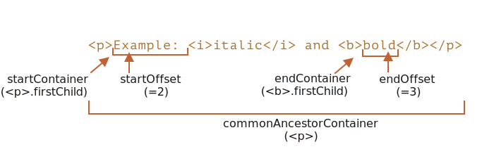

libs:
  - d3
  - domtree

---

# Selection and Range

In questo articolo affronteremoe la selezione nel documento, e la selezione nei campi di testo, come gli `<input>`.
Javascript può gestire la selezione attuale, selezionare/deselezionare interamente o parzialmente, rimuovere la parte selezionata dal documento, racchiuderla in un tag e così via. 


Puoi già utilizzare gli script già pronti nel "Riepilogo". Ma otterrai molte più informazioni leggendo tutto il capitolo. Gli oggetti sottostanti `Range` e `Selection` sono di facile comprensione, e potrai quindi farne ciò che vuoi senza dover utilizzare script già pronti. 

## Range
I concetto base della selezione è il [Range](https://dom.spec.whatwg.org/#ranges): banalmente, un paio di "punti di confine": inizio e fine del range.
Ogni punto è rappresentato come un nodo DOM genitore ed il relativo offset dal suo inizio. Se il nodo genitore è un nodo di tipo elemento, allora l'offset è il numero della posizione del nodo figlio, invece, nel caso di un nodo testuale è la posizione nel testo.

Qui di seguito un esempio:

Selezioniamo qualcosa.

Come prima cosa, possiamo creare un range (il costruttore non ha parametri):

```js
let range = new Range();
```
Quindi possiamo impostare i limiti della nostra selezione usando `range.setStart(node, offset)` e `range.setEnd(node, offset)`.

Ad esempio, considera questo frammento di HTML:

```html
<p id="p">Example: <i>italic</i> and <b>bold</b></p>
```

Questa qui è la sua struttura DOM, e come si può notare i nodi testuali rivestono per i nostri scopi un ruolo importante:

<div class="select-p-domtree"></div>

<script>
let selectPDomtree = {
  "name": "P",
  "nodeType": 1,
  "children": [{
    "name": "#text",
    "nodeType": 3,
    "content": "Example: "
  }, {
    "name": "I",
    "nodeType": 1,
    "children": [{
      "name": "#text",
      "nodeType": 3,
      "content": "italic"
    }]
  }, {
    "name": "#text",
    "nodeType": 3,
    "content": " and "
  }, {
    "name": "B",
    "nodeType": 1,
    "children": [{
      "name": "#text",
      "nodeType": 3,
      "content": "bold"
    }]
  }]
}

drawHtmlTree(selectPDomtree, 'div.select-p-domtree', 690, 320);
</script>

Selezioniamo `"Example: <i>italic</i>"`. Questi sono i primi due figli di `<p>` (contando i nodi testuali)


```html run
<p id="p">Example: <i>italic</i> and <b>bold</b></p>

<script>
*!*
  let range = new Range();

  range.setStart(p, 0);
  range.setEnd(p, 2);
*/!*

  // toString di un range ritorna sempre il suo contenuto come testo (senza i tags)
  alert(range); // Example: italic

  //applica questo range per la selezione del documento (spiegato successivamente)
  document.getSelection().addRange(range);
</script>
```

- `range.setStart(p, 0)` -- setta l'inizio sul figlio #0 di `<p>` (questo è il nodo testuale `"Example: "`).
- `range.setEnd(p, 2)` -- estende il range fino al figlio #2 di `<p>` (escluso)  (Questo è il nodo testuale `" and "`, ma essendo la fine non viene incluso, così l'ultimo nodo selezionato è `<i>`).

Qui un testo più flessibile all'interno del quale si possono provare più varianti:

```html run autorun
<p id="p">Example: <i>italic</i> and <b>bold</b></p>

From <input id="start" type="number" value=1> – To <input id="end" type="number" value=4>
<button id="button">Clicca per selezionare</button>
<script>
  button.onclick = () => {
  *!*
    let range = new Range();

    range.setStart(p, start.value);
    range.setEnd(p, end.value);
  */!*

    //Applica la selezione, spiegato dopo
    document.getSelection().removeAllRanges();
    document.getSelection().addRange(range);
  };
</script>
```
Ad esempio, selezionando da `1` a `4` restituisce il range `<i>italic</i> and <b>bold</b>`.


Non dobbiamo usare lo stesso nodo in `setStart` e `setEnd`. Un range può spaziare attraverso un serie di nodi non necessariamente correlati. La sola cosa che importa è che la fine sia effettivamente dopo l'inizio.

### Selezionare porzioni di nodi testuali

Selezioniamo parzialmente il testo, in questa maniera:


Possiamo fare anche questo, abbiamo solo bisogno di impostare l'inizio e la fine come offset relativo nei nodi testuali.

Dobbiamo creare un range che:
- cominci dalla posizione 2 in `<p>` primo figlio (prendendo tutto tranne le prime due lettere di "Ex<b>ample:</b> ")
- finisca alla posizione 3 in `<b>` primo figlio (prendendo le prime tre lettere di "<b>bol</b>d", e nient'altro):

```html run
<p id="p">Example: <i>italic</i> and <b>bold</b></p>

<script>
  let range = new Range();

  range.setStart(p.firstChild, 2);
  range.setEnd(p.querySelector('b').firstChild, 3);

  alert(range); // ample: italic and bol

  // usa questo range per la selezione (spiegato dopo)
  window.getSelection().addRange(range);
</script>
```

L'oggetto Range ha le seguenti proprietà:



- `startContainer`, `startOffset` -- nodo e offset dell'inizio,
  - nell'esempio sopra: primo nodo testuale dentro `<p>` e `2`.
- `endContainer`, `endOffset` -- nodo e offset della fine,
  - nell'esempio sopra: primo nodo testuale dentro `<b>` e `3`.
- `collapsed` -- booleano, `true` se il range comincia e finisce nello stesso punto (quindi non c'è contenuto nel range),
  - nell'esempio sopra: `false`
- `commonAncestorContainer` -- il più vicino genitore tra tutti i nodi all'interno del range,
  - nell'esempio sopra: `<p>`

## Metodi range

Ci sono una serie di metodi comodi per manipolare i range.

Imposta l'inizio del range:

- `setStart(node, offset)` imposta l'inzio su: posizione `offset` nel `node`
- `setStartBefore(node)` imposta l'inizio su: destra prima di `node`
- `setStartAfter(node)` imposta l'inizio su: destra dopo `node`

Imposta la fine del range (metodi simili):

- `setEnd(node, offset)` imposta la fine su: posizione `offset` nel `node`
- `setEndBefore(node)` imposta la fine su: destra prima di `node`
- `setEndAfter(node)` imposta la fine su: destra dopo `node`

**Come visto, `node` può essere sia un nodo testuale che un nodo elemento: per i nodi testuali `offset` salta un equivalente numero di caratteri, mentre per i nodi elemento salta altrettanti nodi figlio.**

Altri:
- `selectNode(node)` Imposta un range per selezionare l'intero `nodo`
- `selectNodeContents(node)` Imposta un range per selezionare l'intero contenuto del `nodo`
- `collapse(toStart)` se `toStart=true` imposta end=start, altrimenti imposta start=end, collassando così il range.
- `cloneRange()` crea un nuovo rage con lo stesso inizio/fine

Per manipolare il contenuto attraverso il range:

- `deleteContents()` -- rimuove il contenuto del range dal documento
- `extractContents()` -- rimuove il contenuto del range dal documento e lo restitisce come [DocumentFragment](info:modifying-document#document-fragment)
- `cloneContents()` -- clona un contenuto del range e lo ritorna come [DocumentFragment](info:modifying-document#document-fragment)
- `insertNode(node)` -- inserisce `node` nel documento all'inizio del range
- `surroundContents(node)` -- avvolge `node` attorno ad un contenuto range. Per questa azione, il range deve contenere i tag di apertura e chiusura per tutti gli elementi dentro di esso: non possono esserci range del tipo `<i>abc`.

Con questi metodi, di base, possiamo fare qualunque cosa con i nodi selezionati.

Ecco il test per vederli in azione:

```html run autorun height=260
Click buttons to run methods on the selection, "resetExample" to reset it.

<p id="p">Example: <i>italic</i> and <b>bold</b></p>

<p id="result"></p>
<script>
  let range = new Range();

  // Ogni metodo mostrato è rappresentato qui:
  let methods = {
    deleteContents() {
      range.deleteContents()
    },
    extractContents() {
      let content = range.extractContents();
      result.innerHTML = "";
      result.append("extracted: ", content);
    },
    cloneContents() {
      let content = range.cloneContents();
      result.innerHTML = "";
      result.append("cloned: ", content);
    },
    insertNode() {
      let newNode = document.createElement('u');
      newNode.innerHTML = "NEW NODE";
      range.insertNode(newNode);
    },
    surroundContents() {
      let newNode = document.createElement('u');
      try {
        range.surroundContents(newNode);
      } catch(e) { alert(e) }
    },
    resetExample() {
      p.innerHTML = `Example: <i>italic</i> and <b>bold</b>`;
      result.innerHTML = "";

      range.setStart(p.firstChild, 2);
      range.setEnd(p.querySelector('b').firstChild, 3);

      window.getSelection().removeAllRanges();  
      window.getSelection().addRange(range);  
    }
  };

  for(let method in methods) {
    document.write(`<div><button onclick="methods.${method}()">${method}</button></div>`);
  }

  methods.resetExample();
</script>
```

Ci sono anche metodi per confrontare i range, ma vengono usati raramente. Nel caso ne avessi bisogno puoi fare riferimento a [spec](https://dom.spec.whatwg.org/#interface-range) o su [MDN manual](mdn:/api/Range).


## Selection

`Range` è un oggetto generico per la gestione i range di selezione. Possiamo creare questi oggetti, passarli in giro -- da soli non selezionano nulla visivamente.

La selezione del documento è rappresentata da un oggetto `Selection`, che si può ottenere come `window.getSelection()` o tramite `document.getSelection()`.


Una selezione può includere zero o più range. Almeno così dice la [Specifica della API Selection](https://www.w3.org/TR/selection-api/).
In pratica tuttavia, solamente Firefox permette di selezionare range multipli nel documento attraverso la combinazione di tasti `key:Ctrl+click` (`key:Cmd+click` su  Mac).

Qui potete vedere uno screenshot di una selezione con 3 range, fatta su Firefox:


Gli altri browser supportano al massimo 1 range. Come possiamo vedere, alcuni dei metodi di  `Selection` implicano che possono esserci molti range, ma di nuovo, i tutti i browser eccetti Firefox, ce ne possono essere un massimo di 1.

## Proprietà di Selection

In modo simile a un range, una selezione ha un inizio, chiamato "anchor", e una fine, chiamata "focus".

Le principali proprietà di selection sono:

- `anchorNode` -- il nodo dove comincia la selezione,
- `anchorOffset` -- l'offset in `anchorNode` dove comincia la selezione,
- `focusNode` -- il nodo dove finisce la selezione,
- `focusOffset` -- l' offset in `focusNode` dove finisce la selezione,
- `isCollapsed` -- `true` se la selezione non seleziona nulla (range vuoto) o non esiste.
- `rangeCount` -- conto dei range nella selezione, massimo `1` per tutti i browser, eccetto Firefox.

````smart header="La fine della selezione può stare nel documento prima dell'inizio"
Ci sono tanti modi per selezionare il contenuto, dipende dallo user agent: mouse, hotkeys, tap sullo schermo, etc.

Alcuni di essi, come il mouse, permette che la selezione stessa possa essere creata nelle due direzioni: "da sinistra a destra" e da "destra a sinistra".

Se l'inizio (anchor) della selezione nel documento va prima della fine (focus), si dice che questa selezione ha una direzione "forward" (in avanti)

Ad esempio, se l'utente comincia la selezione con il mouse andando da "Example" to "italic":


Diversamente, se la selezione va dalla fine di "italic" fino a "Example", la selezione ha una selezione "backward" (all'indietro), il suo focus sarà prima dell'anchor:


Questo è diverso dagli oggetti `Range` i quali sono sempre direzionati in avanti: l'inizio del range non può essere dopo la sua fine.
````

## Eventi di Selection

Ci sono eventi nei quali si può tenere traccia della selezione:

- `elem.onselectstart` -- quando una selezione comincia su `elem`, per esempio, l'utente comincia a muovere il mouse tenendo il pulsante premuto.
    - Il prevent dell'azione di default, fa in modo che la selezione non cominci.
- `document.onselectionchange` -- ogni volta che una selezione viene modificata.
    - Nota bene: questo gestore può essere impostato solo su un `document`.

### Demo di tracciamento per Selection

Ecco una piccola demo che mostra i limiti, (intesi come confini), della Selection, dinamicamente al variare di essa:

```html run height=80
<p id="p">Select me: <i>italic</i> and <b>bold</b></p>

From <input id="from" disabled> – To <input id="to" disabled>
<script>
  document.onselectionchange = function() {
    let {anchorNode, anchorOffset, focusNode, focusOffset} = document.getSelection();

    from.value = `${anchorNode && anchorNode.data}:${anchorOffset}`;
    to.value = `${focusNode && focusNode.data}:${focusOffset}`;
  };
</script>
```

### Demo ottenimento della selezione

Per ottenere l'intera selezione:
- Come testo: è sufficiente chiamare `document.getSelection().toString()`.
- Come nodo DOM: ottenere il range sottostante e chiamare i relativi metodi `cloneContents()` (solo il primo range nel caso non venga supportata la selezione multirange di Firefox).

Ecco la demo per ottenere sia la selezione di testo che di nodi DOM:

```html run height=100
<p id="p">Select me: <i>italic</i> and <b>bold</b></p>

Cloned: <span id="cloned"></span>
<br>
As text: <span id="astext"></span>

<script>
  document.onselectionchange = function() {
    let selection = document.getSelection();

    cloned.innerHTML = astext.innerHTML = "";

    // Clona i nodi a partire dal range (qui viene supportata la multiselezione)
    for (let i = 0; i < selection.rangeCount; i++) {
      cloned.append(selection.getRangeAt(i).cloneContents());
    }

    // Ottiene come testo
    astext.innerHTML += selection;
  };
</script>
```

## Metodi di selezione

I metodi di selezione per aggiungere/rimuovere i range:

- `getRangeAt(i)` -- ottiene il range numero i, partendo da '0'. In tutti i browser, tranne Firefox, viene usato solo `0`.
- `addRange(range)` -- aggiunge `range` alla selezione. Tutti i browser, eccetto Firefox ingnorano la chiamata,se la selezione ha già un range associato.
- `removeRange(range)` -- Rimuove `range` dalla selezione.
- `removeAllRanges()` -- Rimuove tutti i range.
- `empty()` -- alias per `removeAllRanges`.

Inoltre, ci sono metodi di utilità per manipolare direttamente il renge di selezione, senza `Range`:

- `collapse(node, offset)` -- sostituisce il range selezionato con uno nuovo che cominica da `node`, alla posizione `offset`.
- `setPosition(node, offset)` -- alias di `collapse`.
- `collapseToStart()` - collassa (sostitusce con un nodo vuoto) all'inizio della selezionet,
- `collapseToEnd()` - collassa alla fine della selezione,
- `extend(node, offset)` - muove ilk focus della selezione al nodo `node`, alla posione `offset`,
- `setBaseAndExtent(anchorNode, anchorOffset, focusNode, focusOffset)` - sostiuisce il range selezionato con l'inizio dato `anchorNode/anchorOffset` e la fine `focusNode/focusOffset`. Tutto il conteuto in mezzo viene selezionato.
- `selectAllChildren(node)` -- seleziona tutti i figli di `node`.
- `deleteFromDocument()` -- rimuove il contenuto selezionato dal documento.
- `containsNode(node, allowPartialContainment = false)` -- controlla se la selezione contiene `node` (parzialmente se il secondo argomento è `true`)

Così per tanti task possiamo chiamare i metodi `Selection`, senza dover accedere ai oggertti `Range` sottostanti.

Per esempio, selezionando l'intero contenuto del paragrafo `<p>`:

```html run
<p id="p">Select me: <i>italic</i> and <b>bold</b></p>

<script>
  // seleziona dal figlio #0 di <p> all'ultimo figlio
  document.getSelection().setBaseAndExtent(p, 0, p, p.childNodes.length);
</script>
```
Stessa cosa utilizzando però i range:

```html run
<p id="p">Select me: <i>italic</i> and <b>bold</b></p>

<script>
  let range = new Range();
  range.selectNodeContents(p); // o anche  selectNode(p) per selezionare il tag <p>

  document.getSelection().removeAllRanges(); // pulisce la selezione se esiste
  document.getSelection().addRange(range);
</script>
```

```smart header="Per selezionare, prima rimuovere la selezione esistente."
Nel caso in cui ci fosse già una selezione, prima rimuoverla tramite `removeAllRanges()`. Quindi aggiungere i range. Altrimenti, tutti i browser, eccetto Firefox, ignorerano i nuovi range.

L'eccezione a questa regola sono i metodi di selezione, che sostituiscono la selezione esistente, come `setBaseAndExtent`.
```

## Selezione nei controlli form

Gli elementi dei form, come `input` e `textarea` forniscono [API speciali per la selezione](https://html.spec.whatwg.org/#textFieldSelection), senza l'ausilio di `Selection` o `Range` objects. Dato che un valore di input è testo puro, e non HTML, ciò non è necessario per questo tipo di oggetti, dato che è tutto semplificato.

Propretà:
- `input.selectionStart` -- posizione dell'inzio della selezione (scrivibile),
- `input.selectionEnd` -- posizione della fine  della selezione (scrivibile),
- `input.selectionDirection` -- direzione della selezione, un valore tra: "forward", "backward" o "none" (se, ad esempio, selezuonato attraverso un doppio click del mouse),

Eventi:
- `input.onselect` -- triggers quando qualcosa viene selezionato.

Metodi:

- `input.select()` -- selezione tutto nel controllo di testo (può essere una `textarea` invece che `input`),
- `input.setSelectionRange(start, end, [direction])` -- cambia la selezione per andare dalla poisizione `start` fino a `end`, nella data direzione (opzionale).
- `input.setRangeText(replacement, [start], [end], [selectionMode])` -- sostituisce un range di testo con il nuovo testo.

    Se forniti, gli argomenti opzionali `start` ed `end`, impostano l'inzio e la fine del range, altrimenti viene usata la selezione dell'utente.

   L'ultimo arigomento, `selectionMode`, determina come la selezione verrà impostata dopo che il testo verrà rimpiazzato. Ivalori possibili sono:

    - `"select"` -- il nuovo testo inseirito verrà selezionato.
    - `"start"` -- il range di selezione collasserà subito prima del testo inserito (il cursore verrà posizionato subito prima di esso).
    - `"end"` -- il range di selezione collassa subito prima del testo inserito (il curosre verrà posizionato alla sua destra).
    - `"preserve"` -- tenta di preservare la selezione. Questo è il comportamendo predefinito.

Vediamo quiesti metodi in azione.

### Esempio: tenere traccia della selezione

Per esempio, questo codice usa l'evento `onselect` per tenere traccia della selezione:

```html run autorun
<textarea id="area" style="width:80%;height:60px">
Selecting in this text updates values below.
</textarea>
<br>
From <input id="from" disabled> – To <input id="to" disabled>

<script>
  area.onselect = function() {
    from.value = area.selectionStart;
    to.value = area.selectionEnd;
  };
</script>
```

Nota bene:
- `onselect` viene triggerato quando viene selezionato qualcosa, ma non quando la selezione viene rimossa.
- l'evento `document.onselectionchange` non dovrebbe triggerare per selezioni dentro un controllo form, secondo le [specifiche](https://w3c.github.io/selection-api/#dfn-selectionchange), dal momento che non è correlato alla selezione e range del `document`. Alcuni browser lo generano, ma non possiamo farci affidamento.


### Esempio: muovere il cursore

Possiamo modificare `selectionStart` e `selectionEnd`, che impostano la selezione.

Un importante caso limite è quando `selectionStart` and `selectionEnd` sono uguali. Questo non è esattamente la poszione del cursore. Oppure, riformulando, quando non c'è nulla di selezionato, la selezione è collassata nella posizione del cursore.

Così, impostando, `selectionStart` e `selectionEnd` allo stesso valore, muoviamo il cursore.

Ad esempiio:

```html run autorun
<textarea id="area" style="width:80%;height:60px">
Focus on me, the cursor will be at position 10.
</textarea>

<script>
  area.onfocus = () => {
    // setTimeout a zero per eseguirlo subito dopo il che il "focus" viene completato.
    setTimeout(() => {
      // Possiamo impostare qualunque selezione
      // se start=end, il cursore è esattamente in quel punto
      area.selectionStart = area.selectionEnd = 10;
    });
  };
</script>
```

### Esempio: modifica della selezione

Per modificare il contenuto della selezione, possiamo usare il metodo `input.setRangeText()`. Di sicuro, possiamo leggere `selectionStart/End` e, conoscendo la selzione, cambiare la corrispondente sottostringa di `value`, ma `setRangeText` è molto più potente e spesso più coveniente.

Questo è un metodo inqualche maniera complesso. Nella sua forma più semplice con un solo argomento sostituisce il range selezionato dall'utente e rimuove la selezione.

Per esempio, qui la selezione del'utente verrà avvolta da `*...*`:

```html run autorun
<input id="input" style="width:200px" value="Select here and click the button">
<button id="button">Avvolge la selezione tra asterischi *...*</button>

<script>
button.onclick = () => {
  if (input.selectionStart == input.selectionEnd) {
    return; // nessuna selezione
  }

  let selected = input.value.slice(input.selectionStart, input.selectionEnd);
  input.setRangeText(`*${selected}*`);
};
</script>
```

Con più argomenti, possiamo impostare uno `start` ed `end` del range.

In questo esempio troviamo `"THIS"` nel campo di testo, lo sostituiamo e manteniamo la selezione sul testo sostituito:

```html run autorun
<input id="input" style="width:200px" value="Replace THIS in text">
<button id="button">Sostituisce THIS</button>

<script>
button.onclick = () => {
  let pos = input.value.indexOf("THIS");
  if (pos >= 0) {
    input.setRangeText("*THIS*", pos, pos + 4, "select");
    input.focus(); // focus per mantenere la selezione visibile
  }
};
</script>
```

### Esempio: inserimento sul cursore

Se non c'è nulla di  selezionato, o se `start` ed `end` sono gli stessi in `setRangeText`, allora il nuovo testo verrà solo inserito e non verrà rimosso nulla.

Possiamo anche inserire qualcosa "al cursore" usando `setRangeText`.

Qui c'è un pulsante che inserisce `"HELLO"` sul cursore, posizionandolo immediatamente dopo. Se la selezione non è vuota, allora verrà sostituita (possiamo riconoscerla confrontando `selectionStart!=selectionEnd` o facendo qualcos'altro):

```html run autorun
<input id="input" style="width:200px" value="Text Text Text Text Text">
<button id="button">Inserisce "HELLO" sul cursore</button>

<script>
  button.onclick = () => {
    input.setRangeText("HELLO", input.selectionStart, input.selectionEnd, "end");
    input.focus();
  };    
</script>
```


## Rendere non selezionabile 

Per rendere qualcosa non selezionabile, ci sono tre modi:

1. Utilizzare la proprietà CSS `user-select: none`.

    ```html run
    <style>
    #elem {
      user-select: none;
    }
    </style>
    <div>Selectable <div id="elem">Unselectable</div> Selectable</div>
    ```

    Questo non peremette alla selezione di cominciare su `elem`. Ma l'utente può cominciare la selezione ovunque, ed includere `elem` al suo interno.

    Quindi `elem` diverrà parte di `document.getSelection()`, e così la selezione c'è, ma il suo contenuto viene generalmente ignorato nel copia-incolla.


2. Prevenire l'azione predefinita sugli eventi `onselectstart` o `mousedown`.

    ```html run
    <div>Selectable <div id="elem">Unselectable</div> Selectable</div>

    <script>
      elem.onselectstart = () => false;
    </script>
    ```

    Questo impedisce la selezione su `elem`, ma il visitatore può comincciare la selezione su un altro elemento e quandi estendere la selezione su `elem`.

    Questo è comodo quando c'è un altro gestore di eventi nella stessa azione, che triggera la selezione (ad esempio `mousedown`). Così disabilitamo la selezione onde evitare conflitti, permettendo ancora che i contenuti `elem` possanon essere copiati.

3. Possiamo anche pulire la selezione successivamente dopo che sia avvenuta tramite `document.getSelection().empty()`. Questa cosa è usata raramente, dato che causa intermittenze non volute sulla selezione che compare-scompare.

## Riferiemnti

- [Specifiche DOM: Range](https://dom.spec.whatwg.org/#ranges)
- [Selection API](https://www.w3.org/TR/selection-api/#dom-globaleventhandlers-onselectstart)
- [Specifiche HTML: APIs per il controllo delle selezioni sul testo](https://html.spec.whatwg.org/multipage/form-control-infrastructure.html#textFieldSelection)


## Conclusioni

Abbiamo afforntato due differenti API per le selezioni:

1. Per i documenti: oggetti `Selection` e `Range`.
2. Per gli `input`, `textarea`: proprietà e moetodi aggiuntivi.

La seconda API è molto semplice, dato che lavora con i testi.

I codici pronti più usati sono probabilmente:     
1. Ottenere la selezione:
    ```js
    let selection = document.getSelection();

    let cloned = /* element to clone the selected nodes to */;

    // quindi applica i metodi Range su selection.getRangeAt(0)
    // oppure, come qui, a tutti i range per supportare la multiselezione
    for (let i = 0; i < selection.rangeCount; i++) {
      cloned.append(selection.getRangeAt(i).cloneContents());
    }
    ```
2. Impostare la selezione:
    ```js
    let selection = document.getSelection();

    // directly:
    selection.setBaseAndExtent(...from...to...);

    // o possiamo creare una range e:
    selection.removeAllRanges();
    selection.addRange(range);
    ```

E finalmente, in relazione al cursore. La poszione del cursore negli elementi editabili, come `<textarea>` è sempre all'inizio o alla fine della selezione. Possiamo usarla per ottenere la posizione corrente del cursore o per mouvere il cursore impostando `elem.selectionStart` e `elem.selectionEnd`.
