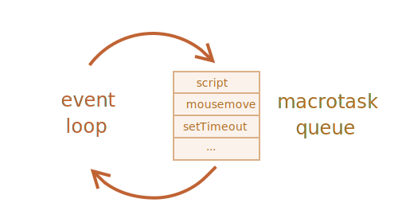

# Event loop: microtasks e macrotasks

Il flusso di esecuzione di Javascript, cos&igrave come quello di Node.js, sono basati sull' *event loop*.

Comprendere come un event loop lavora &egrave; importante per le ottimizzazioni, ed a volte, anche per creare delle architetture migliori.

In questo capitolo affronteremo i dettagli teorici su come funziona, dopodich&egrave; prenderemo in esame alcune applicazioni pratiche.

## Event Loop

Il concetto di *event loop* &egrave; molto semplice. Esiste un loop infinito nel quale il motore di Javascript rimane in attesa di un task (operazione) da eseguire, lo esegue, dopodich&egrave; si rimette in attesa per altri tasks. (in sleep, inattivo o dormiente, ma pronto per essere di nuovo richiamato). 

Questo, &egrave; a grandi linee, l'algoritmo del motore:
1. Fino a quando ci sono task:
    - eseguili, cominciando da quello meno recente.
2. Rimani in attesa fino a quando non c'&egrave; un altro task da eseguire, quindi vai al passo 1.

Questa &egrave; una esposizione di quello che vediamo quando navighiamo una pagina. Il motore di Javascript non fa nulla per la maggior parte del tempo, e va in esecuzione quando si attiva uno script/handler/evento.

Esempio di tasks:

- Quando uno script esterno `<script src="...">` viene caricato (load), il task è quello di eseguirlo.
- Quando un utente sposta il puntatore del mouse, il task &egrave; quello di fare il dispatch dell'evento `mousemove` ed eseguirne eventuali handlers (gestori).
- Quando è scaduto il tempo per `setTimeout` già schedulato, il task è quello di eseguirne la callback.
- ...e cos&igrave; via.

I task vengono impostati -- il motore li gestisce -- quindi rimane in attesa per altri tasks (nel frattempo rimane in sleep, consumando risorse della CPU prossime allo zero).

Però potrebbe succedere che mentre il motore è occupato, arrivi un task, in questo caso, questo viene messo in coda.

I task formano una coda, la cosiddetta "macrotask queue" (termine mutuato V8, il motore Javascript di Chrome e di Node.js):



Ad esempio, se mentre il motore è occupato nell'esecuzione di uno `script`, l'utente muove il mouse generando un `mousemove`, e magari nello stesso istante è scaduto il tempo di un `setTimeout`, questi task formano una queue (una coda di esecuzione) come illustrato nella figura di sopra.

I task dalla coda vengono processati sulla base del "first come – first served", cioè secondo l'ordine che il primo arrivato sarà il primo ad essere servito (FIFO). 
Quando il motere del browser avrà terminato con lo `script`, gestirà l'evento `mousemove`, quindi si occuper&agrave; del gestore del `setTimeout` (la callback), e cos&igrave;

Fino a qui abbastanza semplice, giusto?

Ancora due dettagli:
1. Il rendering non avviene mai quando il motore sta eseguendo un task. Non importa se questo impiega molto tempo. I cambiamenti al DOM vengono renderizzati (ridisegnati sul browser) solo dopo che il task viene completato.
2. Se un task impiega troppo tempo, il browsere non puiò eseguire altri taskm, processare eventi utente, e così dopo un certo periodo di tempo viene scaturito un alert di "Pagina bloccata"(Page Unresponsive) che ci suggerisce di terminare il task con l'intera pagina. Questo succede in concomitanza di una serie di calcoli complessi, o degli errori di programmazione che portano ad un loop infinito.

Questa era la teoria. Adesso vediamo come applicare questi concetti.

## Caso d'uso 1: Spezzettamento di task affamati di CPU (processi intensivi)

Poniamo il caso che abbiamo un task affamato di CPU.

Per esempio, la syntax-highlighting (usata per colorare ed evidenziare gli esempi del codice in questa pagina) è abbastanza pesante per la CPU.
Per evidenziare il codice, compie delle analisi, crea molti elementi colorati, e li aggiunge al documento -- un testo di grosse dimensioni può impiegare molto tempo.

Mentre il motore &egrave; occupato con l'evidenziatura, non pu&ograve; fare le altre cose relative al DOM, processare gli eventi dell'utente, etc. pu&ograve; persino causare "singhiozzamenti" al pc o addirittura "inchiodarlo", la qual cosa &egrave; inaccettabile.

Possiamo quindi tirarci fuori da questo tipo di problemi, spezzettando i task grossi in piccoli pezzi. Evidenzia le prime 100 righe, quindi schedula un `setTimeout` (con zero-delay) con altre 100 righe, e così via.

Per dimostrare questo tipo di approccio, per amore della semplicità, invece di evidenziare una sintassi, prendiamo una funzione che conti i numeri da `1` a `1000000000`

Se esegui il codice sotto, il motore si inchioder&agrave; per qualche istante. Per il JS server-side (lato server) questo è chiaramente visibile, e se lo stai eseguendo nella finestra del browser, prova a cliccare gli altri pulsanti -- potrei notare che non verrà gestito nessun altro evento fino a quando il conto non sarà terminato.

```js run
let i = 0;

let start = Date.now();

function count() {
  //fa un lavoro pesante!
  for (let j = 0; j < 1e9; j++) {
    i++;
  }
  alert(`Completato in ${(Date.now() - start)} millisecondi`);
}

count();
```

Il browser potrebbe anche mostrare l'avviso "lo script sta impiegando troppo tempo" the script takes too long".


Ora, dividiamo l'operazione usando un `setTimeout` annidato:

```js run
let i = 0;

let start = Date.now();

function count() {
  //fai una parte del lavoro pesante (*)
  do {
    i++;
  } while (i % 1e6 != 0);

  if (i == 1e9) {
    alert(`Completato in ${(Date.now() - start)} ms`);
  } else {
    setTimeout(count);//schedula la nuova chiamata a count (**)
  }
}
count();
```

Adesso l'interfaccia del browser &egrave; pienamente funzionante, anche durante il processo di "conteggio".

Una singola esecuzione di `count` fa una parte dell'operazione `(*)`, e rischedula se stessa `(**)` se necessario:

1. La prima esecuzione conta: `i=1...1000000`.
2. La seconda esecuzione conta: `i=1000001..2000000`.
3. ...e cos&igrave; via.

Ora, se arriva un nuovo task da eseguire mentre il motore &egrave; occupato ad eseguire il passo 1 (ad esempio un evento `onclick`), quest'ultimo viene messo in coda e viene eseguito subito dopo il completamento del passo 1, e subito prima del passo successivo. Questi periodici "ritorni" all'event loop tra una esecuzione di  `count` e l'altra, fornisce abbastanza "aria" al motore Javascript per occuparsi di qualcos'altro, ad esempio per reagire alle azioni degli utenti.

La cosa ragguardevole è che entrambe le varianti -- con e senza la divsione del lavoro di `setTimeout` -- sono comparabili in termini di tempo. Complessivamente, non esiste molta differenza nel tempo di conteggio.

Per renderli un po' pi&ugrave; facciamo un miglioramento.

Posizioneremo la schedualzione all'inizio del `count()`:


```js run
let i = 0;
let start = Date.now();
function count() {
  //posizioniamo la schedulazione all'inizio
  if (i < 1e9 - 1e6) {
    setTimeout(count);//scheduliamo la chiamata successiva
  }

  do {
    i++;
  } while (i % 1e6 != 0);

  if (i == 1e9) {
    alert(`Completato in ${(Date.now() - start)} ms`);
  }
}
count();
```

Adesso quando cominciamo con `count()` e vediamo che abbiamo bisogno di richiamarlo più `count()`, lo scheduliamo subito, prima di fare il lavoro.

Se lo esegui, &egrave; facile notare che impiega meno tempo in modo significativo.


Perch&egrave;?  

Semplice: come ben sai, c'&egrave; un ritardo minimo di 4ms all'interno del browser per molte chiamate annidate di `setTimeout`. Anche se noi lo settiamo `0`, sar&agrave; di `4ms`  (o qualcosa in pi&ugrave). Quindi, prima lo scheduliamo, più veloce sar&agrave; l'esecuzione. 
Alla fine, abbiamo diviso un task affamato di CPU in porzioni - e adesso non bloccher&agrave; l'interfaccia utente. E il suo tempo di esecuzione complessivo non &egrave; tanto pi&ugrave; lungo.

## Caso d'uso 2: Indicazione dei progressi di una operazione

Un altro beneficio di dividere task pesanti per gli script del browser è che possiamo mostrare i progressi di completamento.

Solitamente il browser renderizza dopo che il codice in esecuzine viene completato. Non importa se il task impiega tanto tempo. Le modifice al DOM vengono mostrate solo dopo che il task è terminato.

Da una parte, questo &egrave; grandioso, perch&egrave; la nostra fuznione pu&ograve; molti elementi, aggiungerli uno alla volta al documento e cambiarne gli stili -- il visitatore non vorrebbe mai vedere uno stadio "intermedio", incompleto. Una cosa importante, giusto?

Qui c'&egrave; la demo, i cambiamenti a `i` non verrano mostrati fino a quando la funzione nno termina, cos&igrave; vedremo solamente l'ultimo valore:

```html run
<div id="progress"></div>

<script>

  function count() {
    for (let i = 0; i < 1e6; i++) {
      i++;
      progress.innerHTML = i;
    }
  }

  count();
</script>
```

...Per&ograve; potremmo volere mostrare qualcosa durante il task, ad esempio una barra di progresso.

Se noi dividiamo il task pesante in pezzi usando `setTimeout`, allora tra essi, verranno mostrate le variazioni.

Questo sembra più carino:

```html run
<div id="progress"></div>

<script>
  let i = 0;

  function count() {

    // fai un pezzo di lavoro pesante (*)
    do {
      i++;
      progress.innerHTML = i;
    } while (i % 1e3 != 0);

    if (i < 1e7) {
      setTimeout(count);
    }

  }

  count();
</script>
```

Adesso il `<div>` mostra via via, valori crescenti di `i`,come se fosse una sorta di barra di caricamento.


## Caso d'uso 3: fare qualcosa dopo l'evento

In un gestore di evento, potremmo decidere di postporre alcune azioni, fino a che l'evento non risalga i vari livelli di stack (bubbling up) e non venga gestito su tutti questi livelli.
Possiamo farlo, avvolgendo (wrapping) il codice all'interno dei `setTimeout` a ritardo zero.

Nel capitolo <info:dispatch-events> abbiamo visto un esempio: dell'evento custom  `menu-open`, viene fatto il dispatch dentro `setTimeout`, cos&igrave; che esso viene richiamato dopo che l'evento click è stto del tutto gestito.


```js
menu.onclick = function() {
  // ...

  //crea un evento custom con l'elemento dati cliccato sul menu'
  let customEvent = new CustomEvent("menu-open", {
    bubbles: true
  });

  //dispatch dell'evento custom in maniera asincrona
  setTimeout(() => menu.dispatchEvent(customEvent));
};
```

## Macrotasks e Microtasks


insieme ai *macrotasks*, descritti in questo capitolo, esistono i *microtasks*, menzionati nel capitolo <info:microtask-queue>.

Microtasks provengono esclusivamente dal nostro codice. Solitamente vengono creati dalle promises: una esecuzione di un gestore `.then/catch/finally` diventa un  microtask. I microtasks vengono usati anche "sotto copertura" dagli `await`, dato che anche questi sono solo un'altra forma di gestione delle promise.

C'&egrave; anche una funzione speciale `queueMicrotask(func)` che accoda `func`per l'esecuzione nella coda dei microtask.

**Immediatamente dopo ogni *macrotask*, il motore esegue tutti i task dalla coda  *microtask* queue, prima di ricominciare a eseguire ogni altro macrotask o renderizzare o qualunque altra cosa.**

Per esempio, guardate questo:

```js run
setTimeout(() => alert("timeout"));

Promise.resolve()
  .then(() => alert("promise"));

alert("code");
```

Che sta succedendo all'ordine qui?

1. `code` viene mostrato prima, dato che è &egrave; un chiamata regolare e sincrona.
2. `promise` viene mostrato per secondo, perch&egrave; `.then` passa attraverso la coda di microtask, e viene eseguito dopo il codice corrente.
3. `timeout` viene mostrato come ultimo perch&egrave; è anhe questo un microtask.

L'immagine pi&ugrave; esausitva di un event loop &egrave; è questa:


**Tutti i microtasks vengono completati prima di ogni altra gestione degli eventi o rendering o qualunque altro macrotask che prende parte nell'esecuzione**

Questo &egrave; importante perch&egrave; garantisce che l'ambiente applicativo rimanga intatto (nessuna modifica alle coordinate del puntatore del mouse, nessun dato dalle reti, etc) tra i microtasks.

Se volessimo eseguire una funzione in maniera asincrona (dopo il codice in esecuzione), ma prima che avvengano cambiamenti nella finestra del browser, o nuvi eventi vengano gestiti, potremmo schedularla con `queueMicrotask`.

Questo qui un esempio con la "conteggio barra di progresso", del tutto simi a quella precedente, ma vengono usati `queueMicrotask` invece di `setTimeout`.
Come puoi vedere che renderizza alla fine. Esattamente come se fosse del codice sincrono:

```html run
<div id="progress"></div>

<script>
  let i = 0;

  function count() {
    //faccio un pezzetto di lavoro pesante (*)
    do {
      i++;
      progress.innerHTML = i;
    } while (i % 1e3 != 0);

    if (i < 1e6) {
      queueMicrotask(count);  
    }
  }

  count();
</script>
```

## Conclusioni

L'immagine pi&ugrave; esausitva di un event loop &egrave; questa:


Il più dettagliato algoritmo dell'event loop (sebbene ancora semplicistico rispetto alla [specification](https://html.spec.whatwg.org/multipage/webappapis.html#event-loop-processing-model)):

1. Rimuovi dalla coda ed esegui, il più vecchio task dalla coda dei *macrotask*  (ad esempio "script").
2. Eseguit tutti i *microtasks*:
    - Se la cosa dei microtask non è vuota:
        - Rimuovi dalla coda ed esegui il più vecchio dei microtask.
3. Renderizza le modifiche se ve ne sono.
4. Se la coda dei macrotask è vuota, vai in sleep fino al prossimo  macrotask.
5. Vai al passo 1.

Per schedulare un nuovo *macrotask*:
- Use zero delayed `setTimeout(f)`.

Questo potrebbe essere usato per divitere task di calcolopesante in pezzi, di modo che tra questi, il browser possa eseguire altre operazioni.

Inoltre, vengono usati nei gestori degli eventi per schedulre una azione dopo che l'evento è stato del tutto gestito (bubbling completato)

Per schedulare un nuovo *microtask*
- Usa `queueMicrotask(f)`.
- Anche i gestori promise passando attraverso la coda dei microtask.

Non ci sono gestori UI o di networking tra i microtask: vengono eseguiti immediatamente uno dopo l'altro

Quindi uno potrebbe volere che la coda `queueMicrotask` eseguisse una funzione in maniera asincrona, ma manntenendo il contesto dell'ambiente.

```smart header="Web Workers"
Per lunghi calcoli pesanti che non possono bloccare l'event loop, possiamo usare i [Web Workers](https://html.spec.whatwg.org/multipage/workers.html).

Che è un modo per eseguire del codice in un altro thread parallelo.

I Web Workers possono scambiarsi messaggi con il processo principale, ma hanno le loro variabili ed i loro event loop.

I Web Workers non hanno accesso al DOM, quindi sono adatti principalmente per i calcoli, per usare contemporaneamente più cores CPU.
```
