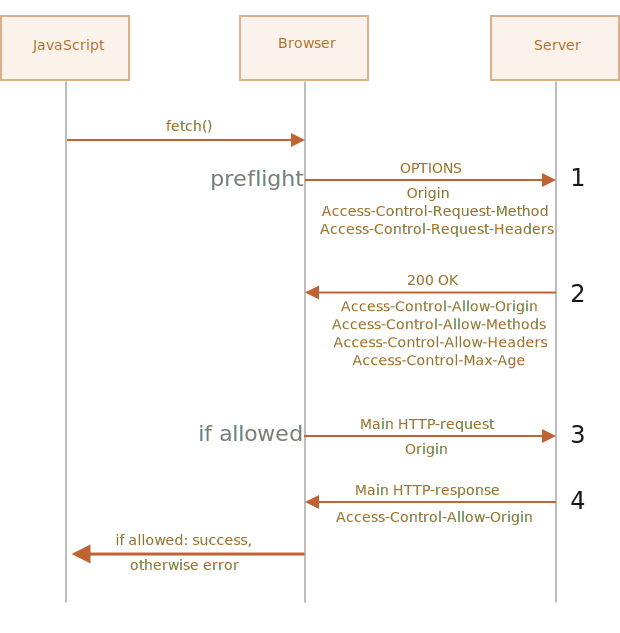

# Fetch: Cross-Origin Requests

Se noi inviamo una richiesta `fetch` al di fuori del nostro sito, è probabile che la richiesta fallirà.

Per esempio, potremmo provare con `http://example.com`:

```js run async
try {
  await fetch('http://example.com');
} catch(err) {
  alert(err); // fetch fallita!
}
```

La richiest fetch è fallita, come supponevamo.

Il concetto chiave è l'*origin* -- la tripletta di valori dominio/porta/protocollo.

Cross-origin requests -- sono le richieste inviate ad un altro dominio (o anche un sottodominio), protocollo o porta - queste richieste necessitano di speciali headers server-side.

Questa policy è chiamata "CORS": Cross-Origin Resource Sharing.

<<<<<<< HEAD
## Perché CORS è necessaria? Una breve storia

CORS è pensata per proteggere internet dagli hackers malvagi.
=======
## Why is CORS needed? A brief history

CORS exists to protect the internet from evil hackers.
>>>>>>> e92bb83e995dfea982dcdc5065036646bfca13f0

Davvero! Facciamo una breve digressione storica.

**Per molti anni uno script da un sito non poteva accedere al contenuto di un altro sito.**

Questa semplice ma potente regola era una delle fondamenta della sicurezza di internet. Per esempio uno script malevolo dal sito `hacker.com` non avrebbe potuto accedere alla mailbox di un utente sul sito `gmail.com`. Le persone erano al sicuro.

JavaScript inoltre non aveva alcun metodo particolare per eseguire richieste remote a quel tempo. Era ancora un linguaggio utile solo a decorare le pagine web.

Ma gli sviluppatori web necessitavano di più potere! Una serie di trucchi furono inventati per arginare queste limitazioni ed eseguire richieste remote ad altri siti web.

### Utilizzando i forms

Un modo per comunicare con un altro server era eseguire l'invio di un `<form>`. L'utente sottometteva il form in un `<iframe>`, così da restare nella pagina corrente, come ad esempio:

```html
<!-- form target -->
*!*
<iframe name="iframe"></iframe>
*/!*

<!-- un form può essere generato in modo dinamico ed inviato da JavaScript -->
*!*
<form target="iframe" method="POST" action="http://another.com/…">
*/!*
  ...
</form>
```

Così era possibile eseguire richieste GET/POST ad un altro sito, anche senza metodi specifici per le richieste di rete, dato che i forms possono inviare i dati ovunque. Ma poiché è vietato accedere al contenuto di un `<iframe> `da un altro sito, non è possibile leggere la risposta.

Per essere precisi, era presente un trucco per arginare questo problema, richiedendo script speciali sia nell'iframe che nella pagina. Quindi la comunicazione con l'iframe era tecnicamente possibile, ma in questo momento non ha senso entrare nei dettagli e quindi lasciamo che questi dinosauri riposino in pace.

### Utilizzando gli scripts

Un altro trucco era l'uso del tag `script`. Uno script può avere qualunque `src` e con qualunque dominio, come ad esempio `<script src="http://another.com/…">`. È quindi possibile eseguire uno script da qualunque sito.

Ad esempio un sito, come `another.com`, potrebbe esporre dati per questo tipo di accesso, utilizzando un protocollo chiamato "JSONP (JSON with padding)".

Ecco come funziona.

Diciamo che, sul nostro sito, dobbiamo ottenere le informazioni sul tempo da `http://another.com`:

1. Per prima cosa, dichiariamo una funzione globale che accetti i dati, ad esempio `gotWeather`.

    ```js
    // 1. Dichiariamo la funzione per processare i dati meteo
    function gotWeather({ temperature, humidity }) {
      alert(`temperatura: ${temperature}, umidità: ${humidity}`);
    }
    ```
2. Successivamente scriviamo un tag `<script>` con `src="http://another.com/weather.json?callback=gotWeather"`, usando il nome della funzione come valore del parametro `callback` dell'url.

    ```js
    let script = document.createElement('script');
    script.src = `http://another.com/weather.json?callback=gotWeather`;
    document.body.append(script);
    ```
3. Il server remoto `another.com` genererà dinamicamente uno script che chiamerà `gotWeather(...)` con i dati che vogliamo ricevere.
    ```js
    // La risposta attesa da server dovrebbe essere ad esempio:
    gotWeather({
      temperature: 25,
      humidity: 78
    });
    ```
4. Quando lo script remoto sarà caricato ed eseguito, `gotWeather` verrà eseguita e, poiché è la nostra funzione, otterremo i dati.

La soluzione funziona e non viola la sicurezza, dato che che entrambe le parti consento il passaggio dei dati in questa modalità. E quando entrambe le parti acconsento, non si tratta di un hack. Esistono ancora servizi che forniscono tale accesso, poiché funziona anche con browser molto vecchi.

Dopo un po', arrivarono nei browser i metodi JavaScript per le richieste di networking.

<<<<<<< HEAD
Inizialmente le cross-origin requeste erano proibite. Ma dopo lunghe discussioni, le cross-origin requests furono consentite, ma qualsiasi funzionalità richiede una esplicità autorizzazione dal serve, indicate per mezzo di speciali headers.
=======
At first, cross-origin requests were forbidden. But as a result of long discussions, cross-origin requests were allowed, but with any new capabilities requiring an explicit allowance by the server, expressed in special headers.
>>>>>>> e92bb83e995dfea982dcdc5065036646bfca13f0

## Simple requests

Ci sono due tipi di cross-origin requests:

1. Simple requests.
2. Tutte le altre.

Le Simple Requests sono le più semplici da realizzare e quindi inizieremo da queste.

Una [simple request](http://www.w3.org/TR/cors/#terminology) è una richiesta che soddisfa due condizioni:

1. [Simple method](http://www.w3.org/TR/cors/#simple-method): GET, POST or HEAD
2. [Simple headers](http://www.w3.org/TR/cors/#simple-header) -- gli unici custom headers consentiti sono:
    - `Accept`,
    - `Accept-Language`,
    - `Content-Language`,
    - `Content-Type` con il valore `application/x-www-form-urlencoded`, `multipart/form-data` o `text/plain`.

Ogni altra request è considerata "non-simple". Per esempio, una request con il metodo `PUT`o con l'HTTP-header `API-Key` non rispettano queste limitazioni.

**La sostanziale differenza è che una "simple request" può essere fatta con un `<form>` o un tag `<script>`, senza alcun metodo speciale.**

Quindi, anche un server molto vecchio dovrebbe essere in grado di accettare una simple request.

Differentemente, requests con headers non-standard o ad esempio con metodo `DELETE` non possono essere create in questo modo. Per molto tempo JavaScript non è stato in grado di fare tali request. Quindi un server più vecchio può presumere che questo tipo di richieste provengono solo da fonti privilegiate, "perché una pagina web non sarebbe in grado di inviarle".

Quando proviamo a fare una non-simple request, il browser invia una speciale request "preflight" che chiede al server -- accetti questo tipo di richieste cross-origin, o no?

E, a meno che il server non confermi espliciamente con degli headers, la non-simple request non sarà inviata.

Andiamo ad analizzare i dettagli.

## CORS per le simple requests

Se una request è cross-origin, il browser aggiunge sempre una header `Origin` ad essa.

Per esempio, se richiediamo `https://anywhere.com/request` da `https://javascript.info/page`, le headers dovrebbero essere:

```http
GET /request
Host: anywhere.com
*!*
Origin: https://javascript.info
*/!*
...
```

Come potrai notare, l'header `Origin` contiene esattamente l'origine (dominio/protocollo/porta), senza il path.

Il server può valutare quindi l'header `Origin` e, se il server è autorizzato ad accettare questo tipo di request, aggiunge uno speciale header  `Access-Control-Allow-Origin` alla response. Questo header dovrebbe contenere le origin autorizzate (nel nostro caso `https://javascript.info`), o un asterisco `*`. Quindi la response ha esito positivo, altrimenti verrà comunicato un errore.

<<<<<<< HEAD
Il browser gioca un ruolo di mediatore che garantisce tra le parti:
1. Assicura che il contenuto `Origin` è inviato con una cross-origin request.
2. Controlla se esiste il permesso `Access-Control-Allow-Origin` nel response, e quindi in questo caso JavaScript sarà autorizzato ad accedere alla response, altrimenti fallirà con un errore.
=======
The browser plays the role of a trusted mediator here:
1. It ensures that the correct `Origin` is sent with a cross-origin request.
2. It checks for permitting `Access-Control-Allow-Origin` in the response, if it exists, then JavaScript is allowed to access the response, otherwise it fails with an error.
>>>>>>> e92bb83e995dfea982dcdc5065036646bfca13f0


Ecco un esempio di una risposta autorizzata dal server:
```http
200 OK
Content-Type:text/html; charset=UTF-8
*!*
Access-Control-Allow-Origin: https://javascript.info
*/!*
```

## Response headers

Per le cross-origin request, di default JavaScript può solo accedere alle così dette "simple" response headers:

- `Cache-Control`
- `Content-Language`
- `Content-Type`
- `Expires`
- `Last-Modified`
- `Pragma`

L'accesso ad ogni altra response header causerà un errore.

<<<<<<< HEAD
```smart header="Nota bene: nessuna `Content-Length`"
Nota che nella lista non è contemplata l'header `Content-Length`!
=======
```smart
There's no `Content-Length` header in the list!
>>>>>>> e92bb83e995dfea982dcdc5065036646bfca13f0

Questa header contiene la dimensione completa del response. Così, se dovessimo scaricare qualcosa e desidereremmo tracciare la percentuale di progresso, sarebbe necessario un permesso addizionale per accedere a questo header (come potrai vedere sotto).
```

Per garantire l'accesso a JavaScript ad ogni altro response header, il server deve inviare l'header `Access-Control-Expose-Headers`. Esso contiene una lista separata da virgole dei nomi delle non-simple header alle quali è possibile accedere.

Per esempio:

```http
200 OK
Content-Type:text/html; charset=UTF-8
Content-Length: 12345
API-Key: 2c9de507f2c54aa1
Access-Control-Allow-Origin: https://javascript.info
*!*
Access-Control-Expose-Headers: Content-Length,API-Key
*/!*
```

Con l'header `Access-Control-Expose-Headers`, lo script è autorizzato a leggere le headers `Content-Length` e `API-Key` della response.

## "Non-simple" requests

Noi possiamo usare ogni HTTP-method: non solo `GET/POST`, ma anche `PATCH`, `DELETE` e gli altri.

<<<<<<< HEAD
Fino a qualche tempo fa nessuno avrebbe potuto supporre che una pagina web fosse in grado di fare tali richieste. Quindi potrebbe esistere qualche webservices che tratta un metodo non-standard come: "Non è un browser!". 
=======
Some time ago no one could even imagine that a webpage could make such requests. So there may still exist webservices that treat a non-standard method as a signal: "That's not a browser". They can take it into account when checking access rights.
>>>>>>> e92bb83e995dfea982dcdc5065036646bfca13f0

Così, per evitare fraintendimenti, ogni "non-simple" request -- che tempo fa non sarebbero stati possibili, il browser non esegue direttamente queste request. Prima invia una richiesta, chiamata "preflight", per richiedere il permesso.

Una preflight request usa il method `OPTIONS`, nessun body e due headers:

<<<<<<< HEAD
- `Access-Control-Request-Method` che indica il method della non-simple request.
- `Access-Control-Request-Headers` che contiene una lista, separata da virgole, delle non-simple HTTP-headers della request.
=======
- `Access-Control-Request-Method` header has the method of the non-simple request.
- `Access-Control-Request-Headers` header provides a comma-separated list of its non-simple HTTP-headers.
>>>>>>> e92bb83e995dfea982dcdc5065036646bfca13f0

Se il server accetta di servire la request, invia una risposta con un body vuoto, uno status 200 e le headers:

- `Access-Control-Allow-Methods` con il method autorizzato.
- `Access-Control-Allow-Headers` con la lista delle headers autorizzate.
- Inoltre, l'header `Access-Control-Max-Age` può specificare il numero di secondi di cache dei permessi. Così facendo il browser non necessita di ulteriori invii preflight per le seguenti requests che soddisfano i permessi concessi.



Vediamo come funziona passo dopo passo, ad esempio, per una cross-origin request `PATCH` (questo method viene spesso utilizzato per aggiornare i dati):

```js
let response = await fetch('https://site.com/service.json', {
  method: 'PATCH',
  headers: {
    'Content-Type': 'application/json',
    'API-Key': 'secret'
  }
});
```

Ci sono tre ragioni per le quali la request non è di tipo simple (uno solo sarebbe cmq sufficiente):
- Method `PATCH`
- `Content-Type` non è tra: `application/x-www-form-urlencoded`, `multipart/form-data`, `text/plain`.
- "Non-simple" `API-Key` header.

### Step 1 (preflight request)

Prior to sending such request, the browser, on its own, sends a preflight request that looks like this:
Prima di inviare tale request, il browser, da solo, invia una  preflight request come questa:

```http
OPTIONS /service.json
Host: site.com
Origin: https://javascript.info
Access-Control-Request-Method: PATCH
Access-Control-Request-Headers: Content-Type,API-Key
```

- Method: `OPTIONS`.
- Il percorso - esattamente lo stesso della request principale: `/service.json`.
- Cross-origin special headers:
    - `Origin` -- l'origine della request.
    - `Access-Control-Request-Method` -- method della request.
    - `Access-Control-Request-Headers` -- la lista, separata da virgole, delle "non-simple" headers.

### Step 2 (preflight response)

Il server dovrebbe rispondere con uno status 200 e le headers:
- `Access-Control-Allow-Methods: PATCH`
- `Access-Control-Allow-Headers: Content-Type,API-Key`.

Ciò consentirà le comunicazioni future, altrimenti verrà generato un errore.

Se il server prevede altri metodi e headers, ha senso consentirli in anticipo aggiungendo all'elenco:

```http
200 OK
Access-Control-Allow-Methods: PUT,PATCH,DELETE
Access-Control-Allow-Headers: API-Key,Content-Type,If-Modified-Since,Cache-Control
Access-Control-Max-Age: 86400
```

<<<<<<< HEAD
Adesso il browser può valutare che `PATCH` è presente in `Access-Control-Allow-Methods` e `Content-Type,API-Key` sono nella lista di `Access-Control-Allow-Headers`, così può inviare la richiesta principale.
=======
Now the browser can see that `PATCH` is in `Access-Control-Allow-Methods` and `Content-Type,API-Key` are in the list `Access-Control-Allow-Headers`, so it sends out the main request.
>>>>>>> e92bb83e995dfea982dcdc5065036646bfca13f0

Inoltre, la preflight response viene memorizzata nella cache per il tempo indicato, specificato dall'intestazione `Access-Control-Max-Age` (86400 secondi, un giorno), e quindi le richieste successive non causeranno un preflight. Supponendo che le successive request si adattino alle autorizzazioni memorizzate nella cache, queste verranno inviate direttamente.

### Step 3 (request principale)

Quando la preflight ha successo, il browser può eseguire la request principale. L'algoritmo è a questo punto lo stesso utilizzato per le simple requests.

La request principale ha l'header `Origin` (perché è cross-origin):

```http
PATCH /service.json
Host: site.com
Content-Type: application/json
API-Key: secret
Origin: https://javascript.info
```

### Step 4 (response alla request principale)

Il server non dovrebbe dimenticare di aggiungere l'header `Access-Control-Allow-Origin` al response. Una preflight con successo non è sufficiente a riguardo:

```http
Access-Control-Allow-Origin: https://javascript.info
```

A questo punto JavaScript è abilitato a leggere la responde della request principale fatta al server.

```smart
Le request preflight lavorano "sotto il cofano", e sono invisibili a JavaScript.

JavaScript riceverà soltanto la response alla request principale o un errore in caso il server non conceda i permessi.
```

## Credenziali

Una cross-origin request per impostazione predefinita non fornisce credenziali (cookie o autenticazione HTTP).

That's uncommon for HTTP-requests. Usually, a request to `http://site.com` is accompanied by all cookies from that domain. But cross-origin requests made by JavaScript methods are an exception.

Questo è insolito per le HTTP-request. Di solito, una request a `http://site.com` è accompagnata da tutti i cookie di quel dominio. Ma le cross-origin requests fatte con metodi JavaScript sono un'eccezione.

Per esempio, `fetch('http://another.com')` non invia alcun cookies, anche quelli (!) che appartengono al dominio `another.com`.

Perché?

<<<<<<< HEAD
Perché una request con credenziali offre molto più potere che una senza. Se consentito, garantisce a JavaScript il pieno potere di agire per conto dell'utente e accedere alle informazioni riservate utilizzando le proprie credenziali.
=======
That's because a request with credentials is much more powerful than without them. If allowed, it grants JavaScript the full power to act on behalf of the user and access sensitive information using their credentials.
>>>>>>> e92bb83e995dfea982dcdc5065036646bfca13f0

Il server si fida davvero tanto dello script? Proprio per questo deve consentire esplicitamente le richieste con credenziali con un'header aggiuntiva.

Per inviare credenziali con `fetch`, abbiamo bisogno di aggiungere la option `credentials: "include"`,come ad esempio:

```js
fetch('http://another.com', {
  credentials: "include"
});
```

<<<<<<< HEAD
Così facendo `fetch` invierà i cookies provenienti da `another.com` senza richiesta a quel sito.
=======
Now `fetch` sends cookies originating from `another.com` without request to that site.
>>>>>>> e92bb83e995dfea982dcdc5065036646bfca13f0

Se il server consentirà di accettare la request *con credentials*, aggiungerà un header `Access-Control-Allow-Credentials: true` alla response, in aggiunta a `Access-Control-Allow-Origin`.

For example:

```http
200 OK
Access-Control-Allow-Origin: https://javascript.info
Access-Control-Allow-Credentials: true
```

<<<<<<< HEAD
Nota bene: `Access-Control-Allow-Origin` non può essere usato con `*` per le requests con credenziali. Ci deve essere esattamente l'origine, come sopra indicato. Questa è un'ulteriore misura di sicurezza, per garantire che il server sappia davvero chi è autorizzato a fare tali richieste.
=======
Please note: `Access-Control-Allow-Origin` is prohibited from using a star `*` for requests with credentials. Like shown above, it must provide the exact origin there. That's an additional safety measure, to ensure that the server really knows who it trusts to make such requests.
>>>>>>> e92bb83e995dfea982dcdc5065036646bfca13f0

## Riepilogo

<<<<<<< HEAD
Dal punto di vista del browser, ci sono più tipi di cross-origin requests: le "simple" e tutte le altre.
=======
From the browser point of view, there are two kinds of cross-origin requests: "simple" and all the others.
>>>>>>> e92bb83e995dfea982dcdc5065036646bfca13f0

[Simple requests](http://www.w3.org/TR/cors/#terminology) devono soddisfare le seguenti condizioni:
- Method: GET, POST or HEAD.
- Headers -- che possiamo settare:
    - `Accept`
    - `Accept-Language`
    - `Content-Language`
    - `Content-Type` con i valori `application/x-www-form-urlencoded`, `multipart/form-data` or `text/plain`.

La sostanziale differenza è che le simple requests erano fattibili sin dal passato per mezzo di tags `<form>` o `<script>`, mentre le non-simple erano impossibli per i browsers per lungo tempo.

Quindi, la differenza pratica è che le simple request vengono inviate immediatamente con header `Origin`, mentre per le altre il browser fa una richiesta preliminare di "preflight ", chiedendo il permesso al server.

**Per le simple requests:**

- → Il browser invia l'header `Origin` indicando appunto l'origine.
- ← Per le requests senza credenziali (non inviate di default), il server dovrebbe settare:
    - `Access-Control-Allow-Origin` a `*` o indicando qualche valore in `Origin`
- ← Per le requests con credenziali, il server dovrebbe settare:
    - `Access-Control-Allow-Origin` allora stesso valore di `Origin`
    - `Access-Control-Allow-Credentials` a `true`

Inoltre, per farantire l'accesso a JavaScript ad ogni response headers tranne `Cache-Control`,  `Content-Language`, `Content-Type`, `Expires`, `Last-Modified` o `Pragma`, il server dovrebbe elencare  le headers autorizzare nell'header `Access-Control-Expose-Headers`.

**Per le non-simple requests, una request "preflight" preliminare è inviata prima della request principale:**

<<<<<<< HEAD
- → Il browser invia una request `OPTIONS` allo stesso url, con le headers:
    - `Access-Control-Request-Method` con il method della request.
    - `Access-Control-Request-Headers` con la lista delle non-simple requested headers.
- ← Il server dovrebbe rispondere con uno status 200 e headers:
    - `Access-Control-Allow-Methods` con la lista dei method consentiti,
    - `Access-Control-Allow-Headers` con la lista delle headers consentite,
    - `Access-Control-Max-Age` con il numero di secondi di cache dei permessi.
- Quindi quando la request principale è inviata viene applcato lo schema previsto per le simple request.
=======
- → The browser sends `OPTIONS` request to the same URL, with headers:
    - `Access-Control-Request-Method` has requested method.
    - `Access-Control-Request-Headers` lists non-simple requested headers.
- ← The server should respond with status 200 and headers:
    - `Access-Control-Allow-Methods` with a list of allowed methods,
    - `Access-Control-Allow-Headers` with a list of allowed headers,
    - `Access-Control-Max-Age` with a number of seconds to cache permissions.
- Then the actual request is sent, the previous "simple" scheme is applied.
>>>>>>> e92bb83e995dfea982dcdc5065036646bfca13f0
