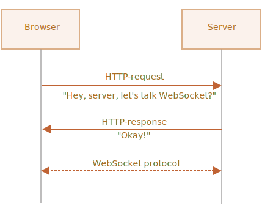

# WebSocket

<<<<<<< HEAD
Il protocollo `WebSocket`, descritto nelle specifiche [RFC 6455](http://tools.ietf.org/html/rfc6455) fornisce un mezzo di scambio dati tra server e browser utilizzando una connessione persistente. I dati vengono scambiati in entrambe le direzioni come dei "pacchetti" (packets), senza la necessità di interrompere la connessione o di creare nuovi headers-HTTP per le richieste successive.
=======
The `WebSocket` protocol, described in the specification [RFC 6455](https://datatracker.ietf.org/doc/html/rfc6455) provides a way to exchange data between browser and server via a persistent connection. The data can be passed in both directions as "packets", without breaking the connection and additional HTTP-requests.
>>>>>>> 8d04d0d2db97276dbb2b451c30a7bd3e05d65831

I WebSocket sono particolarmente adatti per servizi che richiedono scambi continui di dati, come ad esempio giochi online, sistemi di trading in real-time e così via.

## Un semplice esempio

Per aprire una connessione websocket, dobbiamo creare un `new WebSocket` utilizzando nell'url il protocollo speciale `ws`:

```js
let socket = new WebSocket("ws://javascript.info");
```
C'è anche il protocollo criptato `wss://`, utilizzato per i websockets HTTPS

```smart header="Scegli sempre `wss://`"
Il protocollo `wss://` non solo è criptato, ma è anche più affidabile.


Questo perché i dati del `ws://` non sono criptati, visibili per qualunque intermediario. Server proxy molto vecchi, che non riconoscono l'implementazione WebSocket, potrebbero notare i suoi headers, per così dire, "strani" e decidere di interrompere la connessione.

Invece, `wss://` è una connessione over TLS  (lo stesso di HTTPS che è HTTP over TLS), TLS cripta il dato prima di inviarlo e lo decripta in ricezione. Così i dati passano attraverso i proxy in maniera criptata e non potendone vedere il contenuto lo lasciano passare.
```

Appena creato il socket, dovremmo rimanere in ascolto su di esso per gli eventi. Ce ne sono 4:
- **`open`** -- connessione stabilita (established connection),
- **`message`** -- dati ricevuti (data received),
- **`error`** -- errore websocket (websocket error),
- **`close`** -- connessione chiusa (connection closed).

...E nel caso volessimo inviare qualcosa al server, allora abbiamo il metodo `socket.send(data)` che si occupa di questo.

Un esempio:

```js run
let socket = new WebSocket("wss://javascript.info/article/websocket/demo/hello");

socket.onopen = function(e) {
  alert("[open] Connessione stabilita");
  alert("Invio al server");
  socket.send("Il mio nome è John");
};

socket.onmessage = function(event) {
  alert(`[message] Ricezione dati dal server: ${event.data}`);
};

socket.onclose = function(event) {
  if (event.wasClean) {  
    alert(`[close] Connessione chiusa con successo, code=${event.code} reason=${event.reason}`);
  } else {
    // e.g. processo del server terminato o connessione già
    // in questo caso event.code solitamente è 1006
    alert('[close] Connection morta.');
  }
};

socket.onerror = function(error) {
  alert(`[error] ${error.message}`);
};
```

A scopo dimostrativo, c'è un piccolo server funzionante [server.js](demo/server.js) scritto in Node.js, per l'esempio qui sopra. Risponde con "Hello from server, John", attende 5 secondi e poi chiude la connessione.

Quindi vedrai gli eventi `open` -> `message` -> `close`.

Questo è tutto, possiamo già parlare di WebSocket. Abbastanza semplice, no?

Adesso approfondiamo un po'.


## Aprire un WebSocket

Non appena viene istanziato `new WebSocket(url)`, il websocket tenta immediatamente di stabilire una connessione.

Durante la connessione, il browser (utilizzando degli headers appositi) chiede al server: "Supporti i WebSocket?" e se il server risponde "Si", allora la conversazione continua con il protocollo WebSocket, che non è per nulla HTTP.



Questo è un esempio di headers impostati dal browser per la richiesta di `new WebSocket("wss://javascript.info/chat")`.


```
GET /chat
Host: javascript.info
Origin: https://javascript.info
Connection: Upgrade
Upgrade: websocket
Sec-WebSocket-Key: Iv8io/9s+lYFgZWcXczP8Q==
Sec-WebSocket-Version: 13
```

- `Origin` -- l'origine della pagina del client, ad esempio:  `https://javascript.info`. Gli oggetti WebSocket sono per loro natura cross-origin. Non vi sono headers particolari o altre limitazioni. I server di vecchia data non gestiscono i WebSocket in nessun modo, quindi non ci sono problemi di compatibilità. Ma l'header `Origin` è importante, dal momento che permette al server di decidere se parlare o meno con quel sito.
- `Connection: Upgrade` -- indica che il client vuole cambiare protocollo di comunicazione.
- `Upgrade: websocket` -- il protocollo richiesto è "websocket".
- `Sec-WebSocket-Key` -- una chiave casuale generata dal browser per sicurezza.
- `Sec-WebSocket-Version` -- versione di protocollo del WebSocket, 13 è quella corrente.

```smart header="L'handsnake del WebSocket non può essere emulato."
Non è possibile utilizzare  `XMLHttpRequest` oppure `fetch` per fare questo tipo di richieste HTTP, dal momento che a JavaScript non è premessa la creazione di questi headers.
```
Se il server acconsente allo switch in WebSocket, dovrebbe rispondere con un codice 101:

```
101 Switching Protocols
Upgrade: websocket
Connection: Upgrade
Sec-WebSocket-Accept: hsBlbuDTkk24srzEOTBUlZAlC2g=
```

Qui `Sec-WebSocket-Accept` è `Sec-WebSocket-Key` ricodificato usando un algoritmo speciale. Il browser lo usa per assicurarsi che la risposta sia corrispondente alla richiesta.

In seguito, i dati vengono trasferiti usando il protocollo WebSocket, presto ne vedremo la struttura ("frames"). E questo non ha niente a che vedere con HTTP.

### Estensioni e subprotocolli

Ci possono essere gli headers aggiuntivi `Sec-WebSocket-Extensions` e `Sec-WebSocket-Protocol` i quali descrivo estensioni e subprotocolli.

Ad esempio:

- `Sec-WebSocket-Extensions: deflate-frame` significa che il browser supporta la compressione dei dati. Una estensione è un qualcosa di collegato al trasferimento dei dati, delle una funzionalità che estende il protocollo WebSocket. L'header `Sec-WebSocket-Extensions`, invece, viene inviato in automatico dal browser, con la lista di tutte le estensioni che può supportare.

- `Sec-WebSocket-Protocol: soap, wamp` significa che non vogliamo trasferire qualunque tipo di dato, ma solamente dati con protocollo [SOAP](http://en.wikipedia.org/wiki/SOAP) oppure WAMP ("The WebSocket Application Messaging Protocol"). I subprotocolli dei WebSocket sono registrati nel [catalogo IANA ](http://www.iana.org/assignments/websocket/websocket.xml).


Questi headers aggiuntivi vengono settati da noi, per dire al server quali sottoprotocolli supporta il nostro codice, utilizzando il secondo parametro (opzionale) di `new WebSocket`. Questo sarebbe l'array dei subprotocolli se, ad esempio, volessimo usare  SOAP o WAMP:


```js
let socket = new WebSocket("wss://javascript.info/chat", ["soap", "wamp"]);
```

Il server potrebbe rispondere con una lista di protocolli ed estensioni che autorizza all'uso.

Per esempio, la richiesta:

```
GET /chat
Host: javascript.info
Upgrade: websocket
Connection: Upgrade
Origin: https://javascript.info
Sec-WebSocket-Key: Iv8io/9s+lYFgZWcXczP8Q==
Sec-WebSocket-Version: 13
*!*
Sec-WebSocket-Extensions: deflate-frame
Sec-WebSocket-Protocol: soap, wamp
*/!*
```

Risposta:

```
101 Switching Protocols
Upgrade: websocket
Connection: Upgrade
Sec-WebSocket-Accept: hsBlbuDTkk24srzEOTBUlZAlC2g=
*!*
Sec-WebSocket-Extensions: deflate-frame
Sec-WebSocket-Protocol: soap
*/!*
```
Qui il server risponde che supporta l'estensione "deflate-frame", e solamente SOAP tra i subprotocolli richiesti.

## Trasferimento dati

La comunicazione WebSocket è basata sui cosiddetti "frames" -- frammenti di dati, che possono essere inviati da entrambe le parti e possono essere di tipi differenti.

- "text frames" -- contengono dati in formato testuale che le parti inviano gli uni agli altri.
- "binary data frames" -- contengono dati in formato binario che la parti inviano gli uni agli altri.
- "ping/pong frames" vengono usati per controllare la connessione, inviati dal server, il browser risponde vi risponde automaticamente.
- ci sono anche i "connection close frame" e altri frames di servizio.

**Il metodo WebSocket `.send()` può inviare sia dati binari che testuali.**

Una chiamata `socket.send(body)` permette che il `body` possa essere sia in formato stringa che binario, incluso `Blob`, `ArrayBuffer`, etc. Non sono richieste configurazioni: basta inviarli in uno di questi formati.

**Quando riceviamo il dato, il testo arriva sempre come stringa. Per il formato binario possiamo scegliere tra i formati `Blob` e `ArrayBuffer`.**

Questo è settato dalla proprietà `socket.bufferType`, di default è `"blob"`, così i dati binari arrivano come oggetti `Blob`.

[Blob](info:blob) è un oggetto binario di alto livello, si integra direttamente con `<a>`, `` e altri tag, così è un default puro. Ma per operazioni binarie, per accedere ai singoli data bytes, possiamo cambiarlo in`"arraybuffer"`:


```js
socket.binaryType = "arraybuffer";
socket.onmessage = (event) => {
  // event.data is either a string (if text) or arraybuffer (if binary)
};
```

## Rate limiting

Immagina che la nostra app abbia tantissimi dati da inviare. Ma che l'utente abbia una connessione molto lenta, magari internet su rete mobile e fuori città.
Potremmo chiamare `socket.send(data)` in continuazione. Però i dati verranno bufferizzati (immagazzinati) in memoria ed inviati solo quando una connessione abbastanza veloce lo permetterà.

La proprietà `socket.bufferedAmount` immagazzina i dati che sono bufferizzati in un dato momento, in attesa di inviarli tramite la rete.

Possiamo esaminarlo per vedere se il socket è attualmente disponibile per la trasmissione.

```js
// ogni 100ms esaminiamo il socket ed inviamo altri dati
// ma solamente se quelli precedenti sono stati inviati
setInterval(() => {
  if (socket.bufferedAmount == 0) {
    socket.send(moreData());
  }
}, 100);
```


## Chiusura della connessione

Normalmente, quando una delle parti desidera chiudere una connessione (sia il browser che il server hanno ognuno gli stessi diritti), inviano un "connection close frame", un frame di chiusura connessione con un codice numerico e una descrizione testuale della motivazione.

Il metodo per farlo è:
```js
socket.close([code], [reason]);
```

- `code` è un codice specifico del WebSocket (opzionale)
- `reason` è una stringa che descrive la motivazione della chiusura (opzionale)

Le altre parti ottengono il codice e la motivazione all'interno dell'handler `close`, ad esempio:

```js
// la parte che chiude:
socket.close(1000, "Work complete");

// l'altra parte
socket.onclose = event => {
  // event.code === 1000
  // event.reason === "Lavoro terminato"
  // event.wasClean === true (chiusura pulita)
};
```
I valori più comuni sono:

- `1000` -- predefinito, chiusura normale (usato se non viene fornito alcun `code`),
- `1006` -- non c'è modo di settare questo codice manualmente, indica che la connessione è stata persa (frame di chiusura non presente).

Esistono altri codice come:

- `1001` -- la parte non risulta raggiungibile, ad esempio, il server si sta spegnendo o il browser ha chiuso la pagina,
- `1009` -- il messaggio è troppo grande per essere processato,
- `1011` -- errore non previsto nel server,
- ...e così via.

La lista completa si trova nel documento [RFC6455, §7.4.1](https://tools.ietf.org/html/rfc6455#section-7.4.1).

I codici WebSocket sono in qualche modo assimilabili ai codici HTTP, ma diversi. In particolare, ogni codice inferiore a `1000` è riservato, ci sarà quindi un errore se tenteremo di settarne uno.

```js
// in caso di connessione interrotta
socket.onclose = event => {
  // event.code === 1006
  // event.reason === ""
  // event.wasClean === false (nessun frame di chiusura)
};
```


## stato della connessione

Per ottenere lo stato della connessione, inoltre, c'è la proprietà `socket.readyState` con i valori:

- **`0`** -- "CONNECTING": la connessione non è stato ancora stabilita,
- **`1`** -- "OPEN": in comunicazione,
- **`2`** -- "CLOSING": connessione in chiusura,
- **`3`** -- "CLOSED": connessione chiusa.


## Esempio di chat

Prendiamo in esame un esempio di chat usando le WebSocket API del browser e il modulo Node.js WebSocket <https://github.com/websockets/ws>. Soffermeremo la nostra attenzione sulla parte client, ma quella server è altrettanto semplice.

HTML: abbiamo bisogno di un tag `<form>` per inviare i messaggi e di un tag `<div>` per i messaggi in arrivo:

```html
<!-- message form -->
<form name="publish">
  <input type="text" name="message">
  <input type="submit" value="Send">
</form>

<!-- div con i messaggi -->
<div id="messages"></div>
```

Da JavaScript vogliamo tre cose:
1. Aprire la connessione.
2. Gestire il form con l'invio -- `socket.send(message)` per il messaggio.
3. Gestire il messaggio in arrivo -- accodarlo all'elemento `div#messages`.

Ecco il codice:

```js
let socket = new WebSocket("wss://javascript.info/article/websocket/chat/ws");

// invio del messaggio dal form
document.forms.publish.onsubmit = function() {
  let outgoingMessage = this.message.value;

  socket.send(outgoingMessage);
  return false;
};

// messaggio ricevuto - mostra il messaggio su div#messages
socket.onmessage = function(event) {
  let message = event.data;

  let messageElem = document.createElement('div');
  messageElem.textContent = message;
  document.getElementById('messages').prepend(messageElem);
}
```Il codice server-side va un pochino oltre i nostri scopi. Qui useremo Node.js, ma non siamo obbligati. Le altre piattaforme hanno i loro mezzi per lavorare con i WebSocket.

L'algoritmo server-side:

1. Crea `clients = new Set()` -- un set di sockets.
2. Per ogni weboscket accettato, questo viene aggiunto`clients.add(socket)` e configura il listener all'evento `message` per riceverne i messaggi.
3. Quando viene ricevuto un messaggio: itera tutti i clients ed invia il messaggio ad ognuno.
4. Quando una connessione viene chiusa: `clients.delete(socket)`.

```js
const ws = new require('ws');
const wss = new ws.Server({noServer: true});

const clients = new Set();

http.createServer((req, res) => {
  // qui gestiamo solamente le connessioni websocket
  // in progetti veri dovremmo avere anche fare con altro codice per gestire richieste che non non-websocket
  wss.handleUpgrade(req, req.socket, Buffer.alloc(0), onSocketConnect);
});

function onSocketConnect(ws) {
  clients.add(ws);

  ws.on('message', function(message) {
    message = message.slice(0, 50); // lunghezza massima dei messaggi di 50

    for(let client of clients) {
      client.send(message);
    }
  });

  ws.on('close', function() {
    clients.delete(ws);
  });
}
```


Ecco l'esempio funzionante:

[iframe src="chat" height="100" zip]

Puoi anche scaricarlo (pulsante in alto a destra nell'iframe) ed eseguirlo localmente. Solamente non dimenticare di installare [Node.js](https://nodejs.org/en/) e di fare partire `npm install ws` prima di avviarlo.

## Riepilogo

WebSocket sono una maniera moderna di avere connessioni persistenti browser-server.

- WebSockets non hanno le limitazioni cross-origin.
- sono ben supportati dai browser.
- Possono inviare e ricevere dati in formato stringa o in formato binario.

Le API sono semplici.

Metodi:
- `socket.send(data)`,
- `socket.close([code], [reason])`.

Eventi:
- `open`,
- `message`,
- `error`,
- `close`.

I WebSocket di per sè non includono la riconnessione, l'autenticazione e molti altri meccanismi di alto livello. Per quello, ci sono una infinità di librerie, ma è anche possibile implementare queste funzionalità manualmente.

A volte, per integrare i WebSocket in progetti già esistenti,la gente esegue un WebSocket server in parallelo con il server HTTP principale, e condividono un unico database. Le richieste ai WebSocket usano `wss://ws.site.com`, un sottodominio (subdomain) che conduce al server WebSocket, mentre `https://site.com` va al server HTTP principale.

Sicuramente, sono possibili altre modalità di integrazione.
