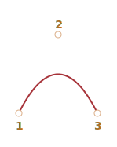

# Curve di Bezier

Le curve di Bezier sono utilizzate in computer grafica per disegnare forme, per animazioni CSS ed in molti altri posti.

Sono veramente molto semplici, vale la pena studiarle per poi trovarsi a proprio agio nel mondo della grafica vettoriale e con animazioni avanzate.

<<<<<<< HEAD
## Punti di controllo
=======
```smart header="Some theory, please"
This article provides a theoretical, but very needed insight into what Bezier curves are, while [the next one](info:css-animations#bezier-curve) shows how we can use them for CSS animations.

Please take your time to read and understand the concept, it'll serve you well.
```

## Control points
>>>>>>> 30a5d5e2a7c3504c9afd5028f83f4a696e60aede

Una [curva di Bezier](https://en.wikipedia.org/wiki/B%C3%A9zier_curve) è composta da punti di controllo.

Possono essercene 2, 3, 4 o più.

Ad esempio, una curva a due punti:


Una curva a tre punti:



Una curva a quattro punti:


Guardando da vicino queste curve, possiamo subito notare:

1. **I punti non sono sempre nella curva.** Questo è perfettamente normale, più avanti vedremo come viene costruita la curva.
2. **Il grado della curva equivale al numero di punti meno uno**.
Con due punti avremo una curva lineare (una retta), con tre punti, avremo una curva di grado due (una parabola), con quattro punti, avremo una curva di grado tre.
3. **Una curva è sempre definita internamente all'[inviluppo convesso](https://en.wikipedia.org/wiki/Convex_hull) dei punti di controllo:**

     

Proprio grazie a quest'ultima proprietà, in computer grafica è possibile ottimizzare i test di intersezione. Se due inviluppi convessi non si intersecano, allora neanche le curve lo fanno. Quindi le verifiche sugli inviluppi convessi possono dare degli esiti più rapidi nella verifica della "non intersezione". La verifica di intersezione tra inviluppi convessi è molto più semplice, poiché questi sono rettangoli, triangoli e cosi via (vedi la figura sopra), le quali sono figure molto più semplici rispetto alle curve.

**In grafica, ll principale vantaggio delle curve di Bezier è che muovendo i punti, le curve cambiano *in maniera piuttosto intuitiva*.**

Provate a giocare con i punti di controllo in questo esempio:

[iframe src="demo.svg?nocpath=1&p=0,0,0.5,0,0.5,1,1,1" height=370]

**Come puoi notare, la curva si estende lungo le linee tangenziali 1 -> 2 e 3 -> 4.**

Dopo aver fatto un po' di pratica diventa ovvio come posizionare i punti per ottenere la curva desiderata. E connettendo diverse curve possiamo ottenere praticamente qualsiasi cosa.

Qui vediamo alcuni esempi:

  

## L'algoritmo di De Casteljau's

Esiste una formula matematica per la definizione delle curve di Bezier, ma la vederemo tra un po', perché [l'algoritmo di De Casteljau's](https://en.wikipedia.org/wiki/De_Casteljau%27s_algorithm) è identico e dimostra a livello visivo come vengono definite.

Come prima cosa, vediamo l'esempio con 3 punti.

Qui vediamo la dimostrazione, seguita dalla spiegazione.

I punti di controllo (1,2 e 3) possono essere mossi utilizzando il mouse. Premete il pulsante "Play" per avviare l'esempio.

[iframe src="demo.svg?p=0,0,0.5,1,1,0&animate=1" height=370]

**L'algoritmo di De Casteljau's per la costruzione di una curva di Bezier a 3 punti:**

1. Traccia i punti di controllo. Nella dimostrazione vista sopra, questi sono etichettati come: `1`, `2`, `3`.
2. Traccia le semirette che congiungono i punti di controllo 1 -> 2 -> 3. Nella dimostrazione vista sopra questi sono di colore <span style="color:#825E28">marrone</span>.
3. Il parametro `t` passa da `0` a `1`. Nell'esempio sopra questo cresce con passi di `0.05`: il ciclo esegue `0, 0.05, 0.1, 0.15, ... 0.95, 1`.

    Per ognuno dei valori assunti da `t`:

    - Per ogni segmento <span style="color:#825E28">marrone</span> prendiamo un punto localizzato in maniera proporzionale fra `t` ed il suo inizio. Poiché ci sono due segmenti, avremo due punti.

        Ad esempio, per `t=0`, entrambi i punti si troverano all'inizio del segmento, per `t=0.25`, si troveranno al 25% della lunghezza del segmento, per 50% (al centro), per `t=1`, alla fine del segmento.

    - Collega i punti. Nella figura sotto, i segmenti collegati sono colorati di <span style="color:#167490">blu</span>.


| For `t=0.25`             | For `t=0.5`            |
| ------------------------ | ---------------------- |
|    |  |

4. Ora nel segmento <span style="color:#167490">blu</span>, prende un punto alla stessa distanza proporzionale `t`. Quindi, per `t=0.25` (immagine a sinistra) avremo un punto alla fine del quarto sinistro del segmento, per `t=0.5` (la figura di destra), lo avremo a metà del segmento. Nelle figure sopra, questo punto è <span style="color:red">rosso</span>.

5. Poiché `t` viene valutato da `0` fino a `1`, ogni valore che assume, aggiunge un punto alla curva. L'insieme di questi punti definisce la curva di Bezier. Nella figura è la parabola rossa.

Quello appena descritto, è il processo che si applica per 3 punti. Ma il procedimento è uguale anche con 4 punti.

Qui vediamo la dimostrazione con 4 punti (i punti possono essere mossi utilizzando il mouse):

[iframe src="demo.svg?p=0,0,0.5,0,0.5,1,1,1&animate=1" height=370]

L'algoritmo applicato per 4 punti:

- Connette i punti di controllo con i segmenti: 1 -> 2, 2 -> 3, 3 -> 4. Ci saranno 3 segmenti <span style="color:#825E28">marrone</span>.
- Per ogni valore di `t` nell'intervallo da `0` a `1`:
    - Tracciamo i punti nel segmento ad una distanza `t` partendo dall'inizio. Questi punti vengono connessi, in questo modo avremo due <span style="color:#0A0">segmenti verdi</span>.
    - Su questi segmenti, tracciamo i punti in base al valore di `t`. Avremo cosi un <span style="color:#167490">segmento blu</span>.
    - Nel segmento blu, tracciamo un punto in base al valore di `t`. Nell'esempio sopra è <span style="color:red">rosso</span>.
- L'insieme di questi punti forma la curva.

L'algoritmo è ricorsivo, e può essere quindi generalizzato per un qualsiasi numero di punti di controllo.

Dato un numero N di punti di controllo:

1. Li colleghiamo per ottenere i primi N-1 segmenti.
2. Successivamente, per ogni valore di `t` nell'intervallo `0`-`1`, tracciamo un punto su ogni segmento ad una distanza `t` e li colleghiamo. Avremo cosi N-2 segmenti.
3. Ripetiamo il passaggio 2, fino a rimanere con un solo punto.

I punti ottenuti definiscono la curva.

```online
**Esegui e metti in pausa gli esempi per vedere con più chiarezza i segmenti e come vengono costruite le curve.**
```


La curva equivalente alla formula `y=1/t`:

[iframe src="demo.svg?p=0,0,0,0.75,0.25,1,1,1&animate=1" height=370]

Anche i punti di controllo a zig-zag funzionano:

[iframe src="demo.svg?p=0,0,1,0.5,0,0.5,1,1&animate=1" height=370]

E' anche possibile definire un cappio:

[iframe src="demo.svg?p=0,0,1,0.5,0,1,0.5,0&animate=1" height=370]

Una curva di Bezier acuta (certo, è possibile fare anche questo):

[iframe src="demo.svg?p=0,0,1,1,0,1,1,0&animate=1" height=370]

```online
Se c'è ancora qualcosa di poco chiaro riguardo l'algoritmo descritto, riguardate gli esempi interattivi visti sopra, per capire come viene costruita la curva.
```

Poiché l'algoritmo è ricorsivo, possiamo definire curve di Bezier di qualsiasi grado, ad esempio utilizzando 5,6 o più punti di controllo. Ma nella pratica l'utilizzo di molti punti è poco utile. Solitamente 2-3 punti sono più che sufficienti, è sempre possibile unire diverse curve per ottenerne di più complesse. In questo modo lo sviluppo ed i calcoli non si complicheranno troppo.

```smart header="Come tracciare una curva con i punti forniti?"
Per definire una curva di Bezier, vengono utilizzando i punti di controllo. Come abbiamo visto, questi non sono all'interno della curva stessa, ad eccezione del primo ed ultimo.

Talvolta abbiamo un altro compito: tracciare una curva *attraverso molti punti*, cosicché questi vadano a formare una curva "morbida".. Questa attività è definita [interpolazione](https://en.wikipedia.org/wiki/Interpolation), ma non la vedremo qui.

Esistono delle formule matematiche per questo tipo di curve, ad esempio il [polinomio di Lagrange](https://en.wikipedia.org/wiki/Lagrange_polynomial). In computer grafica viene utilizzata spesso la [spline interpolation](https://en.wikipedia.org/wiki/Spline_interpolation), per costruire curve più "morbide" connettendo molti punti.
```


## Matematica

Una curva di Bezier può essere descritta utilizzando una formula matematica.

Come abbiamo visto, non c'è alcun bisogno di conoscerla, la maggior parte degli sviluppatori tracciano le curve selezionando i punti di controllo con il mouse. Ma se vi interessa il lato matematico, eccovi accontentati.

Date le coordinate dei punti di controllo <code>P<sub>i</sub></code>: il primo punto di controllo ha coordinate <code>P<sub>1</sub> = (x<sub>1</sub>, y<sub>1</sub>)</code>, il secondo: <code>P<sub>2</sub> = (x<sub>2</sub>, y<sub>2</sub>)</code>, e cosi via, le coordinate della curva sono descritte dall'equazione dipendente da `t` nell'intervallo `[0,1]`.

- La formula per una curva a 2 punti:

    <code>P = (1-t)P<sub>1</sub> + tP<sub>2</sub></code>
- Per 3 punti di controllo:

    <code>P = (1−t)<sup>2</sup>P<sub>1</sub> + 2(1−t)tP<sub>2</sub> + t<sup>2</sup>P<sub>3</sub></code>
- Per 4 punti di controllo:

    <code>P = (1−t)<sup>3</sup>P<sub>1</sub> + 3(1−t)<sup>2</sup>tP<sub>2</sub>  +3(1−t)t<sup>2</sup>P<sub>3</sub> + t<sup>3</sup>P<sub>4</sub></code>


Queste sono equazioni vettoriali. In altre parole, possiamo utilizzare i valori `x` ed `y` piuttosto di `P` per ottenere le coordinate corrispondenti.

Ad esempio, la curva a 3 punti è formata dai punti `(x,y)` calcolati come:

- <code>x = (1−t)<sup>2</sup>x<sub>1</sub> + 2(1−t)tx<sub>2</sub> + t<sup>2</sup>x<sub>3</sub></code>
- <code>y = (1−t)<sup>2</sup>y<sub>1</sub> + 2(1−t)ty<sub>2</sub> + t<sup>2</sup>y<sub>3</sub></code>

Piuttosto di <code>x<sub>1</sub>, y<sub>1</sub>, x<sub>2</sub>, y<sub>2</sub>, x<sub>3</sub>, y<sub>3</sub></code> dovremo inserire le coordinate di 3 punti di controllo, e successivamente, mentre `t` si sposta nell'intervallo `0`-`1`, per ogni valore di `t` avremo il corrispondente `(x,y)` della curva.

Ad esempio, se i punti di controllo sono `(0,0)`, `(0.5, 1)` e `(1, 0)`, le corrispondenti equazioni saranno:

- <code>x = (1−t)<sup>2</sup> * 0 + 2(1−t)t * 0.5 + t<sup>2</sup> * 1 = (1-t)t + t<sup>2</sup> = t</code>
- <code>y = (1−t)<sup>2</sup> * 0 + 2(1−t)t * 1 + t<sup>2</sup> * 0 = 2(1-t)t = –2t<sup>2</sup> + 2t</code>

Ora, mentre `t` cresce da `0` a `1`, l'insieme dei valori `(x,y)` per ogni `t` definirà la curva per quel punto di controllo.

## Riepilogo

Le curve di Bezier sono definite da punti di controllo.

Abbiamo visto due definizioni delle curve di Bezier:

1. Utilizzando un algoritmo: l'algoritmo di De Casteljau's.
2. Utilizzando una formula matematica.

Le curve di Bezier hanno delle ottime proprietà, tra cui:

- Possiamo definire delle curve "morbide" con il semplice utilizzo del mouse, spostando i punti di controllo.
- Forme complesse possono essere ottenute mettendo insieme più curve di Bezier.

Utilizzo:

- In computer grafica, modellazione, ed editor di grafica vettoriale. I font sono descritti tramite curve di Bezier.
- Nello sviluppo web, per la grafica su Canvas e nel formato SVG. Comunque, gli esempi interattivi visti sopra sono scritti in SVG. In realtà sono un unico documento SVG che accetta diversi punti come parametri. Potete aprirli una finestra separata e vederne il codice sorgente: [demo.svg](demo.svg?p=0,0,1,0.5,0,0.5,1,1&animate=1).
- Nelle animazioni CSS per descrivere il percorso e la velocità dell'animazione.
