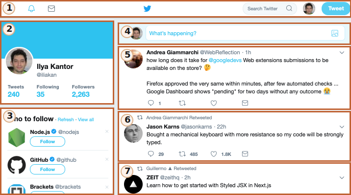

# In alto, nell'orbita terrestre

Questa sezione descrive un insieme di moderni standard per descrivere i "web components".

Ad oggi, questi standards sono ancora in fase di sviluppo. Quindi, alcune funzionalità sono ben supportate ed integrate nell'attuale standard HTML/DOM, mentre altre sono ancora allo stadio Draft. Possiamo provare gli esempi in qualunque browser, ma Google Chrome è probabilmente il più aggiornato con queste funzionalità. Ed indovinate un po', ciò è dato dal fatto che dietro a molti dei concetti relativi a queste specifiche ci siano le realtà che ruotano attorno a Google.

## Cosa c'è in comune tra...

L'idea generale del componente non è nulla di nuovo. Viene usato dappertutto, ed in tantissimi frameworks.

Prima di spostarci nei dettagli di implementazione, però, diamo un'occhiata a questa grandiosa conquista dell'umanità:

Questa è la Stazione Spaziale Internazionale (ISS).

E così è come è fatta dentro (approssimativamente):

La Stazione Spaziale Internazionale:
- Consta di moltissimi componenti.
- Ogni componente, a sua volta, contiene all'interno tanti componenti e dettagli, ancora più piccoli.
- I componenti sono molto complessi, e molto più complicati della maggior parte dei siti web.
- I componenti vengono sviluppati a livello internazionale, da team di paesi differenti, che parlando lingue differenti.

...E questa cosa vola, mantenendo delle persone in vita nello spazio!

Come vengono creati delle strutture così complesse?

Quali principi possiamo prendere in prestito, per rendere il nostro sviluppo affidabile e scalabile allo stesso modo? O almeno, per quanto possibile, avvicinarci un po'.

## Architettura di un componente

La ben nota regola per sviluppare del software complesso è: non sviluppare software complesso.

Se qualcosa diventa complesso, dividerlo in parti più semplici e connetterli nella maniera più ovvia.

**Un buon architetto è colui che può rendere cose complesse, semplici.**

Possiamo dividere visivamente, l'interfaccia utente in componenti: ognuno di essi ha la propria posizione nella pagina, può "fare" un compito ben preciso, ed è separato dagli altri.

Guardiamo un sito web, per esempio Twitter.

Possiamo dividerlo abbastanza naturalmente in componenti:

1. Barra di navigazione superiore.
2. Informazioni utente.
3. Suggerimenti di utenti da seguire.
4. Form di invio.
5. (e inoltre 6, 7) sono messaggi.

I componenti possono avere sottocomponenti, per esempio i messaggi possono essere parte di un componente "lista di messaggi" di livello superiore. Una immagine di un utente può essere, essa stessa, un componente, e così via.

Come possiamo decidere, cosa sia un componente? Ciò arriva dall'intuizione, l'esperienza ed il senso comune. Solitamente è una entità separata a livello visivo, che possiamo descrivere in termini di "cosa fa" e di "come interagisce" con la pagina. Nell'esempio precedente, la pagina è divisa in blocchi, ognuno dei quali gioca un ruolo, quindi è logico farne dei componenti.

Un componente ha:
- Una propria classe JavaScript
- Una struttura DOM, gestita esclusivamente dalla sua classe, ed il codice esterno non può accedervi (principio di "incapsulamento").
- Stili CSS, da applicare al componente.
- API: eventi, metodi della classe etc, per poter interagire con altri componenti.

Ancora una volta, il concetto di "componente" nen è niente di speciale.

Ci sono una serie di frameworks e metodi di sviluppo per costruirli, ognuno con le proprie "fantastiche e super attraenti" caratteristiche. Solitamente, vengono usate classi CSS e convenzioni specifiche per trasmettere la "sensazione di framework", scoping CSS ed incapsulamento del DOM.

I "Web components" forniscono capacità built-in nel browser per questo, quindi non abbiamo più bisogno di emularli.

- [Custom elements](https://html.spec.whatwg.org/multipage/custom-elements.html#custom-elements) -- per definire elementi HTML personalizzati.
- [Shadow DOM](https://dom.spec.whatwg.org/#shadow-trees) -- per creare un DOM interno e visibile solo al componente stesso, ma nascosto agli altri.
- [CSS Scoping](https://drafts.csswg.org/css-scoping/) -- per dichiarare stili applicabili esclusivamente dentro lo Shadow DOM del componente.
- [Event retargeting](https://dom.spec.whatwg.org/#retarget) altre funzionalità minori per rendere i componenti personalizzati più adatti allo sviluppo.

Nel prossimo capitolo entreremo nei dettagli dei "Custom Elements", una funzionalità fondamentale e ben supportata dei web component, ottima anche anche usata da sola.
